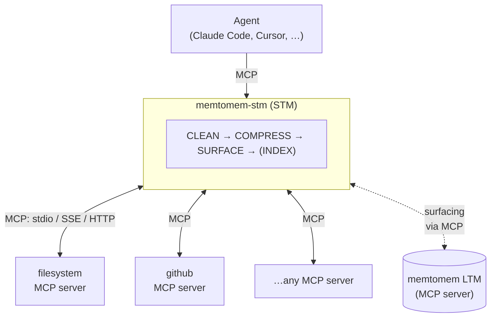

# memtomem-stm

**Official website & docs: [https://memtomem.com](https://memtomem.com)**

[](https://pypi.org/project/memtomem-stm/)
[](https://python.org)
[](LICENSE)
[](CLA.md)

> 🚧 **Alpha** — APIs and defaults may change between 0.1.x releases. Feedback and issue reports are especially welcome: [Issues](https://github.com/memtomem/memtomem-stm/issues) · [Discussions](https://github.com/memtomem/memtomem-stm/discussions).

Spend fewer tokens. Remember more. Ship faster.

memtomem-stm is an MCP proxy that typically **cuts token usage by 20–80%** and gives your agent **memory across sessions** — with no changes to your upstream MCP servers.

It sits between your AI agent and its upstream MCP servers, compressing tool responses, caching repeated calls, and automatically surfacing relevant context from prior sessions via a memtomem LTM server.

**What memtomem-stm does:**
- **Cuts token spend on repeated reads** — compresses and caches tool responses, so the agent doesn't re-pay for the same file or search result. Works with Claude Code, Cursor, Claude Desktop, or any MCP client.
- **Carries context across sessions** — surfaces prior decisions from memtomem LTM automatically, so the agent picks up where it left off rather than re-discovering what it already knew.
- **Drops in front of any MCP server** — adds compression, caching, and observability as a proxy layer, without changes to upstream code.



> The **INDEX** stage requires a `FileIndexer` engine, and the bundled
> `mms` server wires none **by design** — `auto_index` and `extraction`
> config is inert in the default deployment; enabling them logs an
> `inert` warning at startup but does not write back to LTM. The hooks
> are library-mode only: pass `index_engine=` when constructing
> `ProxyManager` yourself (see
> [docs/configuration.md](https://github.com/memtomem/memtomem-stm/blob/main/docs/configuration.md)).
> [#288](https://github.com/memtomem/memtomem-stm/issues/288) has the
> history.

## Installation

```bash
pip install memtomem-stm
```

Or with [uv](https://docs.astral.sh/uv/):

```bash
uv tool install memtomem-stm     # install mms / memtomem-stm as global CLI tools
uvx memtomem-stm --help          # or run without installing
uv pip install memtomem-stm      # or install into the active environment
```

memtomem-stm is **independent**: it has no Python-level dependency on memtomem core. To enable proactive memory surfacing, point STM at a running memtomem MCP server (or any compatible MCP server) — communication happens entirely through the MCP protocol.

## Quick Start

`mms` is the short alias for `memtomem-stm-proxy` — both commands are identical, use whichever you prefer.

### 1. Add an upstream MCP server

For first-time setup, run the guided wizard — it prompts for name/prefix/command, optionally probes the server, and then offers to register STM with Claude Code (or generate `.mcp.json`) in the same flow:

```bash
mms init
```

Or add servers non-interactively:

```bash
mms add filesystem \
  --command npx \
  --args "-y @modelcontextprotocol/server-filesystem /home/user/projects" \
  --prefix fs
```

`--prefix` is required: it's the namespace under which the upstream server's tools will appear (e.g. `fs__read_file`). Repeat for each MCP server you want to proxy.

If you've already configured MCP servers in Claude Desktop, Claude Code, or a project `.mcp.json`, `mms add --import` (alias `--from-clients`) reuses the init wizard to bulk-select them — skipping anything already registered. Moving behind the proxy is reversible: imports capture where each entry came from, and `mms eject NAME` restores it to its host client if you later want to stop proxying it (see [docs/cli.md](https://github.com/memtomem/memtomem-stm/blob/main/docs/cli.md#eject)).

```bash
mms list      # show what you've added
mms status    # show full config + connectivity
```

### 2. Connect your AI client to STM

`mms init` ends with a 3-way prompt — pick option 1 and it shells out to `claude mcp add` for you. If you skipped that step or want to register with a different client later, run:

```bash
mms register
```

To register manually, use `claude` directly:

```bash
claude mcp add mms -s user -- mms
```

Or add it to a JSON MCP config for Cursor / Windsurf / Claude Desktop / Gemini:

```json
{
  "mcpServers": {
    "mms": {
      "command": "mms"
    }
  }
}
```

> **Why `mms` and not `memtomem-stm`?** Either name works (the three
> entry points are interchangeable), but the MCP client composes proxied
> tool names as `mcp__<server>__<prefix>__<tool>`. The short alias
> `mms` (3 chars) saves 9 bytes vs `memtomem-stm` (12 chars), which is
> exactly enough headroom to keep upstreams with long tool names under
> the 64-char MCP limit. If you registered under a different name and
> want the `mms add` overflow check (#261) to match exactly, export
> `MMS_CLIENT_SERVER_NAME=<name>` in your shell — otherwise the default
> assumption is conservative and at worst causes a few false-positive
> warnings on borderline prefixes.

### 3. Use the proxied tools

Your agent now sees proxied tools (`fs__read_file`, `gh__search_repositories`, etc.). The CLEAN / COMPRESS / SURFACE stages run automatically — responses are cleaned, compressed, cached, and (when an LTM server is configured) enriched with relevant memories. The INDEX stage (auto_index / extraction) is currently inactive in the standalone server; see [#288](https://github.com/memtomem/memtomem-stm/issues/288).

To check connectivity and surfacing readiness from your shell, run
`mms status` or `mms health`. If you want the agent to call operator-facing MCP
tools such as `stm_proxy_stats`, start STM with
`MEMTOMEM_STM_ADVERTISE_OBSERVABILITY_TOOLS=true`.

## What STM proxies — and what it doesn't

STM is an MCP proxy: it sees a tool call only if the client routes that call through the MCP protocol. Coverage depends on **how your client invokes the tool**, not on what the tool does.

**STM sees:** any MCP server you register with `mms add` — every tool under the `mcp__<server>__<prefix>__<tool>` namespace — plus LTM surfacing calls to a configured memtomem server.

**STM does NOT see through the MCP proxy path:**
- **Claude Code's built-in tools** — `Read`, `Write`, `Edit`, `Bash`, `Grep`, `Glob`, `WebFetch`. They run inside the client and never reach an MCP server, so their token spend is invisible to STM and unaffected by compression or caching.
- **Cursor / Windsurf / Claude Desktop built-ins** — same principle: anything the client provides natively bypasses the MCP layer.
- **Sub-agent built-in calls** — the parent's MCP wiring is inherited, but built-in tool calls inside an `Agent` / `Task` invocation stay client-internal.

For Claude Code, `mms hook` is an optional PostToolUse bridge for that
client-internal path. It can append LTM surfacing context for read-like
built-ins (`Read`, `Grep`, `Glob`, `Bash`) and, when explicitly enabled with
`MEMTOMEM_STM_HOOK__COMPRESSION__ENABLED=1`, compress built-in `Bash` stdout
through `updatedToolOutput`. This is separate from the MCP proxy: `Write`,
`Edit`, and other mutation tools stay out of the surfacing path, and the hook
always fails open to the original tool output.

**STM does NOT write back to LTM at runtime.** The bundled `mms` server constructs the proxy without a `FileIndexer` engine by design, so the INDEX stage (`auto_index`, `extraction`) is inert even when enabled in `stm_proxy.json` — a warning is logged at startup. Surfacing *reads* from LTM via MCP; runtime *writes* are library-mode only — callers embedding STM as a library can pass `index_engine=` to `ProxyManager` themselves ([#288](https://github.com/memtomem/memtomem-stm/issues/288) has the history).

To bring file or shell operations under STM, register an MCP server that exposes them (the [filesystem example](#1-add-an-upstream-mcp-server) above is the most common case) and steer the agent toward the proxied alias instead of the built-in. This is the same boundary every MCP proxy lives within — it's not specific to STM.

## Project-scoped MCPs (`mms project` + `mms import`)

A second tier of management lets you decide *which MCP servers a given project sees*, separately from the STM proxy gateway config. State lives in a new dotdir, `~/.mms/`:

- `mms import --from claude-code` — pull existing MCP definitions out of `~/.claude.json`, `~/.cursor/mcp.json`, `~/.codex/config.toml`, or Claude Desktop's config into `~/.mms/registry.toml` (secrets redacted in `--plan`, written verbatim under `--apply`).
- `mms project init` — create a `<project>/.mms/project.toml` marker (commit-recommended).
- `mms project enable filesystem github` — declare which MCPs that project wants visible.
- `mms project list` / `mms project show` — inspect the index and the current project.

`~/.mms/` is intentionally separate from `~/.memtomem/` — STM proxy bootstrap (`stm_proxy.json`) and mms project state (`registry.toml`) are *fully disjoint* in W1: `mms add` writes only `stm_proxy.json`, `mms import --apply` writes only `registry.toml`. See [docs/cli.md](https://github.com/memtomem/memtomem-stm/blob/main/docs/cli.md) for the full reference.

## Tutorial notebooks

> **Try it without wiring into your AI client first.** A [quickstart Jupyter notebook](notebooks/01_quickstart_proxy_setup.ipynb) registers an upstream MCP server, calls a proxied tool, and reads `stm_proxy_stats` end-to-end. Clone the repo, `uv sync`, and `uv run jupyter lab notebooks/` — no external services needed.

## Key Features

- 🗜️ **Typically 20–80% fewer tokens per tool call** — 10 compression strategies with auto-selection by content type, query-aware budget, and zero-loss progressive delivery → [docs/compression.md](https://github.com/memtomem/memtomem-stm/blob/main/docs/compression.md)
- 🧠 **Your agent remembers** — proactive memory surfacing from prior sessions, gated by relevance threshold, rate limit, dedup, and circuit breaker → [docs/surfacing.md](https://github.com/memtomem/memtomem-stm/blob/main/docs/surfacing.md)
- 💾 **Repeated calls are free** — response cache with TTL and eviction; surfacing re-applied on cache hit so injected memories stay fresh → [docs/caching.md](https://github.com/memtomem/memtomem-stm/blob/main/docs/caching.md)
- 🛡️ **Production-safe** — circuit breaker, retry with backoff, write-tool skip, query cooldown, dedup, sensitive content auto-detection, Langfuse tracing, horizontal scaling via `PendingStore`

## Documentation

| Guide | Topic |
|-------|-------|
| [Surfacing](https://github.com/memtomem/memtomem-stm/blob/main/docs/surfacing.md) | How agents recall prior context automatically |
| [Compression](https://github.com/memtomem/memtomem-stm/blob/main/docs/compression.md) | All 10 strategies — pick the right one for your content |
| [Caching](https://github.com/memtomem/memtomem-stm/blob/main/docs/caching.md) | Skip repeated work with response caching |
| [Configuration](https://github.com/memtomem/memtomem-stm/blob/main/docs/configuration.md) | Tune settings without touching code |
| [Selection telemetry](https://github.com/memtomem/memtomem-stm/blob/main/docs/selection-telemetry.md) | Opt-in JSONL log of tool selection + execution outcomes |
| [CLI](https://github.com/memtomem/memtomem-stm/blob/main/docs/cli.md) | CLI commands, host sync, hooks, daemon, and MCP tools |

STM advertises four model-facing MCP tools by default. Eight observability and
admin tools (`stm_proxy_stats`, `stm_surfacing_stats`, `stm_index_stats`, etc.)
are hidden unless `MEMTOMEM_STM_ADVERTISE_OBSERVABILITY_TOOLS=true` is set,
which keeps eager-loading clients from paying schema tokens for rarely used
operator tools.

## Development

```bash
uv sync                                                    # install dev deps
uv run pytest -m "not ollama and not bench_qa_meta and not bench_qa_llm_judge and not bench_qa_sweep"   # tests (CI filter)
uv run ruff check src && uv run ruff format --check src    # lint (required)
uv run mypy src                                            # typecheck (advisory)
```

CI runs the same commands on every PR via `.github/workflows/ci.yml`. Lint (`ruff check` + `ruff format --check`) and tests must pass; mypy is advisory.

## License

[Apache License 2.0](LICENSE). Contributions are accepted under the terms of the [Contributor License Agreement](CLA.md).
