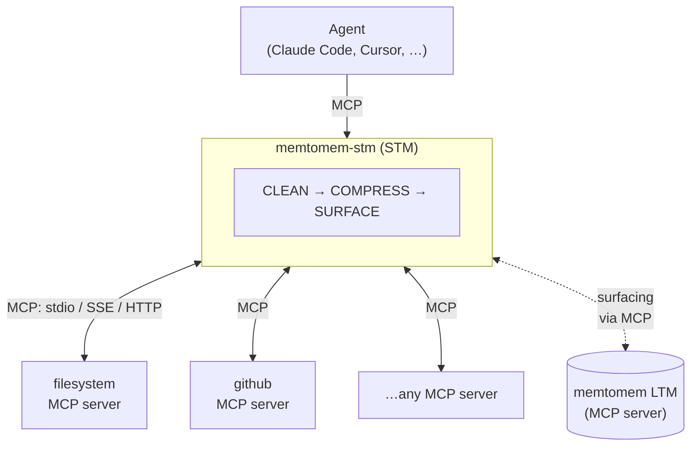

# memtomem-stm

**Official website & docs: [https://memtomem.com](https://memtomem.com)**

[](https://pypi.org/project/memtomem-stm/)
[](https://python.org)
[](LICENSE)
[](CLA.md)

> 🚧 **Alpha** — APIs and defaults may change between 0.1.x releases. Feedback and issue reports are especially welcome: [Issues](https://github.com/memtomem/memtomem-stm/issues) · [Discussions](https://github.com/memtomem/memtomem-stm/discussions).

Spend fewer tokens. Remember more. Ship faster.

memtomem-stm is an MCP proxy that can substantially reduce the model-visible
size of large tool responses and gives your agent **memory across sessions** —
with no changes to your upstream MCP servers. The actual reduction depends on
response shape, compression strategy, and whether the call travels through
MCP; verify it against your workload with the repository's deterministic
`bench_qa` suite.

It sits between your AI agent and its upstream MCP servers, compressing tool responses, caching repeated calls, and automatically surfacing relevant context from prior sessions via a memtomem LTM server.

**What memtomem-stm does:**
- **Cuts token spend on repeated reads** — compresses and caches tool responses, so the agent doesn't re-pay for the same file or search result. Works with Claude Code, Cursor, Claude Desktop, or any MCP client.
- **Carries context across sessions** — surfaces prior decisions from memtomem LTM automatically, so the agent picks up where it left off rather than re-discovering what it already knew.
- **Drops in front of any MCP server** — adds compression, caching, and observability as a proxy layer, without changes to upstream code.



## Installation

```bash
pip install memtomem-stm
```

Or with [uv](https://docs.astral.sh/uv/):

```bash
uv tool install memtomem-stm     # install mms / memtomem-stm as global CLI tools
uvx memtomem-stm --help          # or run without installing
uv pip install memtomem-stm      # or install into the active environment
```

memtomem-stm is **independent**: it has no Python-level dependency on memtomem core. To enable proactive memory surfacing, point STM at a running memtomem MCP server (or any compatible MCP server) — communication happens entirely through the MCP protocol.

| Connected LTM capability | STM behavior |
| --- | --- |
| No core | Proxying, compression, and caching remain available; LTM surfacing is disabled |
| No `context_compose` advertisement, or schema 0/1 | Legacy `mem_search` surfacing |
| `context_compose` schema 2 | Optional scoped Pinned Context composition |
| `context_compose` schema 3+ | Pinned composition plus adjacent context-window chunks |
| `candidate_propose` schema 1+ | Optional review-first proposal submission |

Core 0.3.8 is the tested legacy baseline, 0.3.9 first advertises schema 2, and
0.3.10 first advertises schema 3. Runtime behavior always follows the advertised
capability, not the package version.

## Quick Start

All three installed commands—`mms`, `memtomem-stm`, and
`memtomem-stm-proxy`—resolve to the same CLI and MCP server entrypoint. The
shortest first-success path is:

```bash
mms init --demo --client auto  # no-network read-only first-success path
mms doctor    # exit 0 (WARNs allowed) means the proxy setup is usable
```

Without the wizard, add an upstream and register STM explicitly:

```bash
mms add filesystem \
  --command npx \
  --args "-y @modelcontextprotocol/server-filesystem /home/user/projects" \
  --prefix fs
mms register
mms doctor
```

Your client should now list a proxied tool such as `fs__read_file`. An LTM
warning is expected when no memtomem server is configured; it disables memory
surfacing only, not proxying, compression, or caching.

Continue with the complete
[Getting Started guide](https://github.com/memtomem/memtomem-stm/blob/main/docs/getting-started.md),
including manual client registration, imports, verification, and next steps.
Korean-speaking Claude Code and Codex CLI users can follow the
[한국어 바이브코딩 시작 가이드](https://github.com/memtomem/memtomem-stm/blob/main/docs/guides/vibe-coding-getting-started-ko.md).

## What STM proxies — and what it doesn't

STM is an MCP proxy: it sees a tool call only if the client routes that call through the MCP protocol. Coverage depends on **how your client invokes the tool**, not on what the tool does.

**STM sees:** any MCP server you register with `mms add` — every tool under the `mcp__<server>__<prefix>__<tool>` namespace — plus LTM surfacing calls to a configured memtomem server.

**STM does NOT see through the MCP proxy path:**
- **Claude Code's built-in tools** — `Read`, `Write`, `Edit`, `Bash`, `Grep`, `Glob`, `WebFetch`. They run inside the client and never reach an MCP server, so their token spend is invisible to STM and unaffected by compression or caching.
- **Cursor / Windsurf / Claude Desktop built-ins** — same principle: anything the client provides natively bypasses the MCP layer.
- **Sub-agent built-in calls** — the parent's MCP wiring is inherited, but built-in tool calls inside an `Agent` / `Task` invocation stay client-internal.

`mms hook` is an optional PostToolUse bridge for that client-internal path,
available for Claude Code, Codex CLI, Cursor, and Kimi Code. Claude and Codex
can receive surfaced LTM context; Cursor and Kimi are metrics-only. Claude can
also opt into guarded Bash compression. Native calls still do not gain proxy
response caching, upstream retries, progressive reads, or general MCP routing,
and the hook always fails open. See the
[native-hook guide](https://github.com/memtomem/memtomem-stm/blob/main/docs/guides/native-hooks.md)
for the capability matrix, installation paths, daemon behavior, and privacy.

For multi-agent fleets, standalone surfacing can opt into the same daemon with
`MEMTOMEM_STM_SURFACING__USE_DAEMON=true`, avoiding one private LTM child per
agent while keeping proxy feedback, caching, and tuning local.

**STM does not automatically write tool responses back to LTM.** Surfacing
reads from LTM via MCP. The opt-in review-first formation integration may
submit an explicit pending candidate to a capable core, but it cannot create
durable memory before core-side approval.

To bring file or shell operations under STM, register an MCP server that exposes
them and steer the agent toward the proxied alias instead of the built-in. This
is the same boundary every MCP proxy lives within—not one specific to STM.

## Project-scoped MCPs (`mms project` + `mms import`)

A separate registry lets a project select which MCP definitions it wants to
expose. `~/.mms/registry.toml` and project `.mms/project.toml` files remain
independent of STM's `~/.memtomem/stm_proxy.json`. Preview the additive route
plan with `mms project route`, then use `mms project route --apply` to copy the
selected stdio definitions into the proxy with provenance and conflict checks. See
[Project-Scoped MCP Management](https://github.com/memtomem/memtomem-stm/blob/main/docs/guides/project-scoped-mcps.md).

## Tutorial notebooks

> **Try it without wiring into your AI client first.** A [quickstart Jupyter notebook](notebooks/01_quickstart_proxy_setup.ipynb) registers an upstream MCP server, calls a proxied tool, and reads `stm_proxy_stats` end-to-end. Clone the repo, `uv sync`, and `uv run jupyter lab notebooks/` — no external services needed.

## Documentation

| Guide | Topic |
|-------|-------|
| [Getting started](https://github.com/memtomem/memtomem-stm/blob/main/docs/getting-started.md) | Install → register → doctor → first proxied tool |
| [한국어 바이브코딩 시작 가이드](https://github.com/memtomem/memtomem-stm/blob/main/docs/guides/vibe-coding-getting-started-ko.md) | Claude Code·Codex CLI 설치 → 연결 → 첫 proxied tool |
| [Operations](https://github.com/memtomem/memtomem-stm/blob/main/docs/guides/operations.md) | Diagnose setup, upstreams, surfacing, and hooks |
| [Native hooks](https://github.com/memtomem/memtomem-stm/blob/main/docs/guides/native-hooks.md) | Host capabilities, installation, daemon, and metrics |
| [Surfacing](https://github.com/memtomem/memtomem-stm/blob/main/docs/surfacing.md) | How agents recall prior context automatically |
| [Compression](https://github.com/memtomem/memtomem-stm/blob/main/docs/compression.md) | All 10 strategies — pick the right one for your content |
| [Caching](https://github.com/memtomem/memtomem-stm/blob/main/docs/caching.md) | Skip repeated work with response caching |
| [Configuration](https://github.com/memtomem/memtomem-stm/blob/main/docs/configuration.md) | Configuration sources and reference map |
| [Selection telemetry](https://github.com/memtomem/memtomem-stm/blob/main/docs/selection-telemetry.md) | Opt-in JSONL log of tool selection + execution outcomes |
| [Use cases](https://github.com/memtomem/memtomem-stm/blob/main/docs/use-cases.md) | Reproducible scenarios and honest measurement boundaries |
| [Reviewed project resume](https://github.com/memtomem/memtomem-stm/blob/main/docs/guides/reviewed-memory-resume.md) | Project-local Pinned Context, visible adjacent context, and optional review-first memory |
| [CLI](https://github.com/memtomem/memtomem-stm/blob/main/docs/cli.md) | Command-family and MCP-tool reference map |

STM advertises four model-facing MCP tools by default. Eight observability and
admin tools (`stm_proxy_stats`, `stm_surfacing_stats`, etc.)
are hidden unless `MEMTOMEM_STM_ADVERTISE_OBSERVABILITY_TOOLS=true` is set,
which keeps eager-loading clients from paying schema tokens for rarely used
operator tools.

## Compatibility & deprecation policy

memtomem-stm is alpha (0.x): behavior and defaults may change between minor
releases while the design settles — defaults have flipped before (e.g.
`injection_mode` `prepend` → `append` in 0.1.24). Every such change is flagged
inline in [CHANGELOG.md](https://github.com/memtomem/memtomem-stm/blob/main/CHANGELOG.md)
with a `**Behavior change**:` marker and — for releases after 0.1.31 — is also
summarized up front in that release's **Upgrade notes** block; skim that block
before upgrading (older releases record behavior changes inline only).
Machine-readable surfaces (`--json` output shapes, exit codes) only change
with an Upgrade notes entry; additive keys may appear at any time, so parse by
key, not by shape equality. Deprecated CLI commands or flags keep working with
a warning for at least one minor release before removal.

## Development

```bash
uv sync                                                    # install dev deps
uv run pytest -m "not bench_qa_meta and not bench_qa_llm_judge and not bench_qa_sweep and not bench_qa_drift and not bench_qa_perf"   # tests (CI filter)
uv run ruff check src && uv run ruff format --check src    # lint (required)
uv run mypy src                                            # typecheck (required)
```

CI runs the same commands on every PR via `.github/workflows/ci.yml`. Lint (`ruff check` + `ruff format --check`), mypy, and tests must pass.

## License

[Apache License 2.0](LICENSE). Contributions are accepted under the terms of the [Contributor License Agreement](CLA.md).
