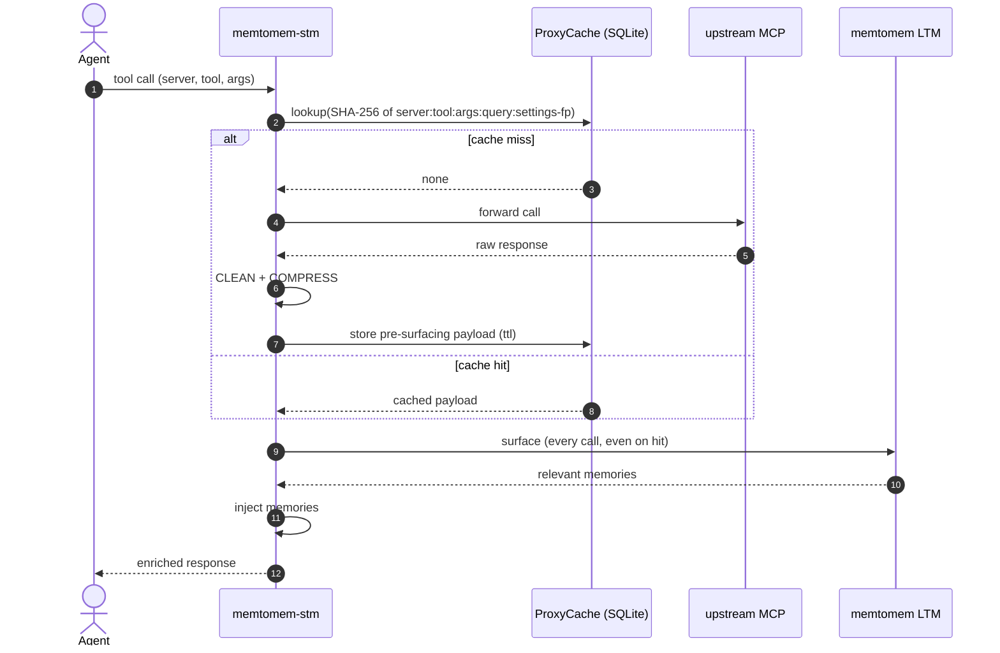

# Response Caching & Auto-Indexing

For the file-backed schema and configuration-source boundary, see the
[Proxy Configuration Reference](reference/proxy-config.md).

## Response Cache

Proxied tool responses are cached in SQLite to avoid repeated upstream calls:



The key insight: **the cache stores pre-surfacing content**. Surfacing runs on every cache hit so injected memories stay fresh even when the upstream payload was cached hours ago.

```json
{
  "cache": {
    "enabled": true,
    "db_path": "~/.memtomem/proxy_cache.db",
    "default_ttl_seconds": 3600,
    "max_entries": 10000,
    "tool_annotation_policy": "conservative"
  }
}
```

Key details:

- Cache key = SHA-256 over `server`, `tool`, `args` (argument order independent), the call's `_context_query`, and a fingerprint of the settings that shape the stored body — the resolved per-tool compression settings plus the `min_result_retention`, `max_upstream_chars`, and `relevance_scorer` globals. The stored body is the *shaped + compressed* response — compression is query-aware (BM25 relevance budgets) and config-dependent — so the same tool+args under a different query context, or after a shaping/compression-setting change (hot reload included), gets its own entry instead of being served a body produced for someone else's query or under old settings. The flip side: callers that pass a different `_context_query` on every call re-fetch instead of hitting the cache.
- **Key-schema upgrades purge the cache once** — rows written under an older key derivation are unreachable by any new lookup, so on first start after an upgrade that changes the key shape the cache is emptied (tracked via SQLite `user_version`). One-time cold start; entries repopulate on use.
- **Pre-surfacing content is cached** — surfacing is re-applied on cache hit, so memories stay fresh
- **Mutating tools are not cached** — the cache is on by default for *every* tool of *every* upstream, so without a gate a write tool (`create_*` / `send_*` / `write_*` / `delete_*`) called twice with identical args within the TTL would be served the first call's cached success *without re-executing the side effect*. The `tool_annotation_policy` gates eligibility on the upstream tool's MCP annotations (`readOnlyHint` / `destructiveHint`):
  - `conservative` (default) — cache everything except tools that self-declare as writers (`readOnlyHint: false` or `destructiveHint: true`). Keeps caching for read-only and un-annotated tools. A tool declaring *both* `readOnlyHint: true` and `destructiveHint: true` is contradictory and is deliberately treated as a writer — the MCP spec scopes `destructiveHint` to `readOnlyHint: false` tools, but distrusting a self-contradiction only costs a cache slot, while trusting it could replay a side effect; use a per-tool `cache: true` to opt such a tool back in.
  - `strict` — cache only tools that explicitly declare `readOnlyHint: true` (un-annotated tools default to may-mutate per the MCP spec).
  - `ignore` — pre-gate behavior; cache every tool regardless of annotations.

  **New config files are created with an explicit `"tool_annotation_policy": "strict"`** — `mms init`, `mms add` (when no config exists yet), and `mms add --from-clients` all write it. The schema default stays `conservative` so an existing config without the key keeps its behavior; loading such a file (and `mms config validate`) emits a one-line advisory pointing at the migration. Under `strict`, the per-tool / per-server `cache: true` override below is the **allowlist**: it opts a known-read-only tool whose upstream omits annotations back into caching.
- **Annotations stay fresh at runtime** — the proxy subscribes to `notifications/tools/list_changed` on every upstream session. When an upstream re-declares its tools mid-connection, the advertised snapshot is re-fetched and any tool whose eligibility flipped toward may-mutate — or that disappeared from the list — has its existing cache rows invalidated, so a pre-flip row can't be served after the flip (or once the annotations move back). Explicit `cache` overrides still win: a tool forced in with `cache: true` is never auto-invalidated. Upstreams that change annotations *without* emitting `list_changed` are picked up on the next reconnect, as before.
- **Per-tool / per-server cache override** — set `cache: true|false` on a `tool_overrides` entry or on an `UpstreamServerConfig` to force a tool/server in or out of the cache, overriding the annotation policy (precedence: tool > server > policy). Use `cache: false` for a volatile read tool or a writer on an upstream that omits annotations; `cache: true` to re-enable caching for a tool an upstream mis-annotates — under the `strict` policy this is the supported allowlist for un-annotated read-only tools (no separate allowlist setting exists).
- **Per-tool / per-server TTL override** — set `cache_ttl_seconds` on a `tool_overrides` entry or on an `UpstreamServerConfig` to override how long that tool's/server's responses stay cached, independent of the on/off `cache` gate (precedence: tool > server > global `cache.default_ttl_seconds`). `null` (default) inherits the next level down — at the tool/server level `null` means *inherit*, not *never expires*. A positive value sets the TTL in seconds; `0` disables caching for that tool/server — while the resolved TTL is `≤ 0` the lookup is bypassed, so a stale row is never served (mirroring a global `default_ttl_seconds` of 0); existing on-disk rows are then cleaned up opportunistically (the next identical call invalidates the row regardless of its response shape — text, non-text, mixed, error, or empty). `cache: false` still wins outright, and `cache: true` with `cache_ttl_seconds: 0` is eligible-but-TTL-disabled, i.e. effectively off.
- **Envelope-safe responses only** — the cache stores plain text, so only successful (`isError: false`), text-only responses with no `structuredContent` and no result-level `_meta` are ever stored; a hit for anything else would silently drop the fields the proxy now preserves end to end. Errors, non-text/mixed content, and envelope-bearing responses are re-fetched on every call. Rows carry an `envelope_safe` marker and unmarked rows (written out-of-band, e.g. by an older still-running version) are never served.
- **Privacy exclusion** — responses that look like secrets are never persisted to the cache; see [SECURITY.md](../SECURITY.md). This guard always applies on top of the policy/override above.
- **Transient-key exclusion** — to prevent serving expired progressive/selective keys on a cache hit (which would drop the response tail), the cache automatically skips storing any response carrying a transient-key marker (like a `PROGRESSIVE_FOOTER_TOKEN` or a `selection_key` JSON field). The next identical call re-runs the pipeline to generate live keys.
- Expired entries are purged on startup; oldest entries evicted when `max_entries` is exceeded
- Clear cache via MCP tool: `stm_proxy_cache_clear(server="gh", tool="search_code")` clears matching response-cache entries; an unfiltered `stm_proxy_cache_clear()` flushes the entire response cache **and** the in-memory surfacing result cache
- TTL defaults to global (`cache.default_ttl_seconds`) but is overridable per-tool / per-server via `cache_ttl_seconds` (see above); `tool_overrides` additionally tune compression, sizing, and cache eligibility (`cache: true|false`)
