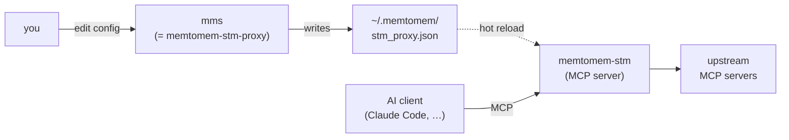
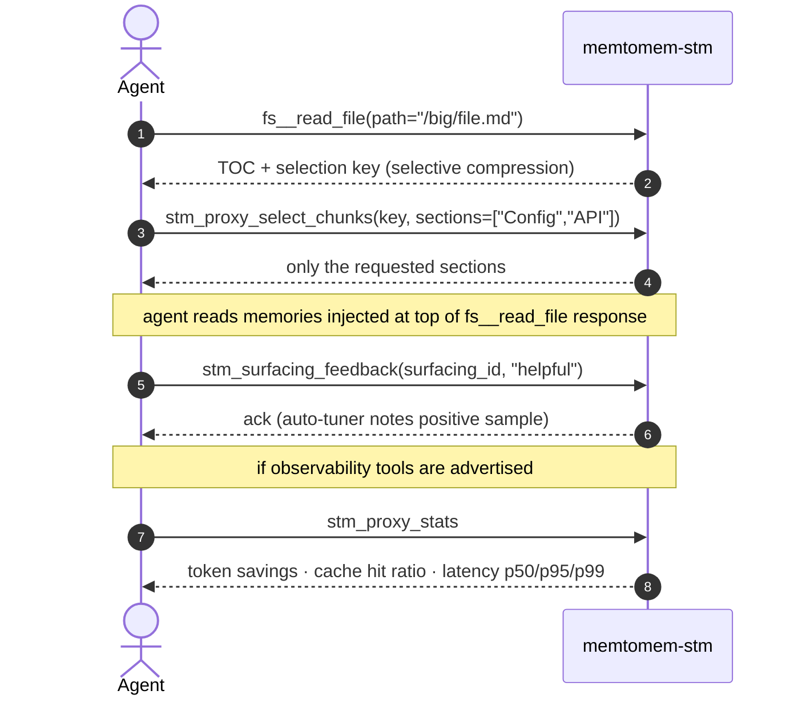

# CLI Reference

memtomem-stm ships three console scripts:

| Script | Purpose |
|--------|---------|
| `memtomem-stm` | The MCP server itself. Add this to your AI client's MCP config. |
| `memtomem-stm-proxy` | Management CLI for editing `~/.memtomem/stm_proxy.json`. |
| `mms` | Short alias for `memtomem-stm-proxy` — identical behavior. |



The `mms` short form pairs with memtomem core's `mm` CLI: `mm` for long-term memory, `mms` for the STM proxy. Use whichever name you prefer; the docs below use `mms` for brevity.

Bare invocation dispatches on stdin: from a terminal it prints CLI help, while
piped stdin starts the MCP server. This lets `memtomem-stm`,
`memtomem-stm-proxy`, and `mms` all work as MCP server commands.

## `mms` (= `memtomem-stm-proxy`)

```
Usage: mms [OPTIONS] COMMAND [ARGS]...

  memtomem-stm proxy gateway management.

Options:
  --version   Show the version and exit.
  -h, --help  Show this message and exit.

Commands:
  add       Add an upstream MCP server to the proxy configuration.
  daemon    Manage the local surfacing daemon.
  health    Check upstream server connectivity.
  hook      Compress and/or surface for a host's built-in tool call.
  host      Host-config inspection and sync.
  import    Import MCP definitions from host configs into the mms registry.
  init      Guided first-time setup for memtomem-stm.
  list      List configured upstream servers.
  project   Project-scoped MCP management (RFC §7.1).
  prune     Remove dual-registered upstreams from source MCP clients.
  register  Register memtomem-stm with an MCP client.
  remove    Remove an upstream MCP server from the proxy configuration.
  status    Show proxy gateway configuration and server list.
  version   Show the installed memtomem-stm version.
```

All commands accept `--config TEXT` (default `~/.memtomem/stm_proxy.json`).

`mms --version` and `mms version` both print `memtomem-stm X.Y.Z` — the flag is the idiomatic Click form, the subcommand is kept for backwards compatibility.

Output is colorized when writing to a terminal; set `NO_COLOR=1` to disable. JSON output (`--json`) and non-TTY streams (pipes, CI) are never colored.

### `init`

```
Usage: mms init [OPTIONS]

Options:
  --config TEXT             [default: ~/.memtomem/stm_proxy.json]
  --no-validate             Skip the connectivity probe entirely (default:
                            prompt, probe on yes).
  --mcp [claude|json|skip]  Pre-answer the MCP-registration prompt for
                            scripted runs: 'claude' = `claude mcp add`,
                            'json' = write .mcp.json, 'skip' = no
                            registration. Omit the flag for the interactive
                            prompt.
  --prune-originals         After a successful import + registration, remove
                            the direct registrations from source MCP clients
                            so tools route through STM only. TTY callers get
                            a single y/N prompt (default No); non-TTY
                            scripted callers must pass the flag explicitly.
  --lang [en|ko]            Primary content language preset for token-aware
                            budgets. 'en' writes no language-specific fields.
                            'ko' sets the calibrated Korean budget preset.
```

Interactive wizard for the first-time setup. Prompts for a single upstream server (name, prefix, transport, command/URL), optionally probes connectivity, writes the config, then offers a 3-way MCP-client registration prompt:

1. **Add to Claude Code** — shells out to `claude mcp add` for you.
2. **Generate `.mcp.json`** — writes a project-scoped snippet in the current directory, then prints per-client paste targets for Cursor, Windsurf, Claude Desktop (OS-appropriate path), and Gemini CLI.
3. **Skip** — prints a manual-registration cheat sheet (`claude mcp add` one-liner plus a generic `mcpServers` JSON stanza) so you can wire it up by hand later.

Use `--mcp claude|json|skip` to pre-answer the prompt from scripts, CI, or any caller where stdin isn't a TTY — interactive callers should omit the flag.

Aborts if the config file already exists — use [`register`](#register) to re-run the registration prompt, [`add`](#add) to register additional servers, or [`list`](#list) to inspect the current state. This makes `init` safe to run without clobbering existing configuration.

Validation is **advisory**: probe failures are reported as warnings but the config is still written. That way a flaky network or a cold upstream doesn't block setup; re-run `mms health` later once things are up.

When you import servers that were already directly registered in a source MCP client (`~/.claude.json`, `.mcp.json`, Claude Desktop), `init` leaves the direct registrations in place by default — source-client configs are read-only unless you opt in. Pass `--prune-originals` to collapse the dual-path in the same session; on a TTY you instead get a single y/N prompt (default No). Skipped the prompt or didn't pass the flag? Run [`prune`](#prune) afterwards to clean up without re-running the wizard.

```bash
mms init                          # interactive wizard
mms init --no-validate            # skip the connectivity probe prompt entirely
mms init --mcp claude             # scripted: auto-register with Claude Code
mms init --mcp skip               # scripted: write config, print paste hints, exit
mms init --mcp claude --prune-originals  # scripted: import, register, and remove direct registrations
mms init --lang ko                # Korean-content preset for token-aware budgets
```

### `register`

```
Usage: mms register [OPTIONS]

Options:
  --config TEXT             Path to the proxy config (must already exist —
                            run `mms init` first).  [default:
                            ~/.memtomem/stm_proxy.json]
  --mcp [claude|json|skip]  Pre-answer the registration prompt for scripted
                            runs: 'claude' = `claude mcp add`, 'json' =
                            write .mcp.json, 'skip' = print manual hints.
                            Omit for the interactive prompt.
```

Re-runs the 3-way MCP-client registration prompt from `init` without re-entering the first-time setup wizard. Use this after `mms init` if you initially picked "skip", or when registering the same STM install with a second client.

Requires that `mms init` has already been run so the config file exists — otherwise exits with an error and a hint. Safe to re-run: pre-checks existing Claude Code registration and defaults to **keep** when already registered (no-op — existing registration is preserved even with `--mcp claude`).

```bash
mms register              # interactive prompt
mms register --mcp json   # scripted: write .mcp.json in CWD, exit
mms register --mcp skip   # scripted: print manual paste hints, exit
```

### `add`

```
Usage: mms add [OPTIONS] [NAME]

Options:
  --config TEXT                   [default: ~/.memtomem/stm_proxy.json]
  --command TEXT                  Executable command (stdio).
  --args TEXT                     Space-separated arguments.
  --prefix TEXT                   Tool namespace (e.g. 'fs' -> tools appear
                                  as fs__read_file). Required unless
                                  --from-clients is used.
  --transport [stdio|sse|streamable_http]
                                  stdio for local processes,
                                  sse/streamable_http for remote.
                                  [default: stdio]
  --url TEXT                      Endpoint URL (SSE / HTTP).
  --env KEY=VALUE
  --compression [auto|none|truncate|selective|hybrid]
                                  'auto' picks strategy per response by
                                  content type.  [default: auto]
  --max-chars INTEGER RANGE       [default: 8000; x>=1]
  --validate                      Probe the server (MCP initialize +
                                  list-tools) before saving; abort on
                                  failure.
  --timeout INTEGER RANGE         Connection timeout (seconds) when
                                  --validate is set.  [default: 10; x>=1]
  --from-clients, --import        Import additional servers interactively
                                  from existing MCP clients (Claude
                                  Desktop / Code, project .mcp.json).
                                  Reuses init's discovery + TUI flow.
                                  Skips candidates already registered.
                                  Incompatible with NAME / --prefix /
                                  --command / --args / --url / --env.
  --prune                         After a successful --import, remove the
                                  direct registrations from source MCP
                                  clients so tools are reachable via STM
                                  only. TTY callers get a (name, source)
                                  confirm prompt (default No); non-TTY
                                  callers must pass the flag explicitly.
                                  Requires --from-clients / --import.
```

Use `--validate` to catch typos and misconfigurations at registration time instead of the next time the proxy starts. Without it `add` only writes the config — bad entries are discovered later via `mms health` or when the proxy fails to spawn.

Use `--from-clients` (alias `--import`) to bulk-pick additional servers from the same MCP clients `mms init` scans: `~/.claude.json`, project `.mcp.json`, and `~/Library/Application Support/Claude/claude_desktop_config.json`. Claude Desktop discovery is **macOS-only** — on Linux/Windows the Claude Desktop file isn't scanned, so register those servers with `mms add` instead (paste hints elsewhere in the wizard are OS-aware; only the Desktop scan path is pinned to macOS). This is the post-init equivalent of the `init` discovery step — servers already registered in this config are filtered out by name and by `(transport, command, args)` / `(transport, url)` signature before the selection UI. `--validate` and `--timeout` work on the selected subset.

To remove the original direct registrations after a successful import, pass `--prune`. On a TTY you get a `(name, source)` confirm prompt that defaults to **No** before any file edits; in non-TTY callers (CI, scripts) you must pass `--prune` explicitly — the flag never auto-fires on inferred consent. A candidate registered in more than one source client is pruned from every source, not just the one it was imported from. Prune failures are non-fatal: the import stays, and each failed entry prints the exact manual `claude mcp remove` or Claude Desktop edit to retry. `--prune` without `--from-clients` is a usage error rather than a silent no-op.

> **Note**: The CLI's `--compression` flag exposes 5 of the 10 strategies. The remaining five (`extract_fields`, `schema_pruning`, `skeleton`, `progressive`, `llm_summary`) are configured by editing `stm_proxy.json` directly. See [Compression Strategies](compression.md).

### `list`

```
Usage: mms list [OPTIONS]

Options:
  --config TEXT  [default: ~/.memtomem/stm_proxy.json]
  --json         Output as JSON for scripting.
```

Prints the configured upstream servers in a table — name, prefix, transport, compression strategy, and the command (stdio) or URL (SSE / HTTP). Reads the config only; does not probe connectivity (use `mms health` for that). With `--json` the output becomes `{"config_path": ..., "servers": {...}}` for scripting; a missing config file returns `{"error": "config_not_found", "path": ...}` instead of a text fallthrough so callers can branch on shape.

### Examples

```bash
# Filesystem server
mms add filesystem \
  --command npx \
  --args "-y @modelcontextprotocol/server-filesystem /home/user/projects" \
  --prefix fs

# GitHub server with env var
mms add github \
  --command npx \
  --args "-y @modelcontextprotocol/server-github" \
  --prefix gh \
  --env GITHUB_TOKEN=ghp_xxx

# SSE transport
mms add docs \
  --transport sse \
  --url https://docs.example.com/mcp \
  --prefix docs

# Validate connectivity at registration time (rejects bad entries up front)
mms add filesystem \
  --command npx \
  --args "-y @modelcontextprotocol/server-filesystem /home/user/projects" \
  --prefix fs \
  --validate

# Bulk-import servers already configured in Claude Desktop / Code / .mcp.json
mms add --import            # or --from-clients; skips anything already registered

# Import AND prune originals from source clients
mms add --import --prune    # TTY: per-entry confirm prompt (default No)
                            # non-TTY: unconditional — pass --prune to opt in

# List configured upstreams
mms list
mms list --json            # machine-readable: {config_path, servers}

# Show full status
mms status

# Remove a server
mms remove github

# Check upstream connectivity (probes each server)
mms health
mms health --json          # machine-readable output
mms health --timeout 5     # 5s per-server timeout (default: 10)
```

### `prune`

```
Usage: mms prune [OPTIONS] [NAMES]...

Options:
  --config TEXT  [default: ~/.memtomem/stm_proxy.json]
  --all          Prune every dual-registered upstream. Required when no NAMES
                 given.
  -y, --yes      Skip the confirm prompt (scripts / CI / non-TTY callers).
  --dry-run      Print what would be pruned; no writes.
```

Removes direct registrations for STM upstreams that are still registered in a source MCP client (`~/.claude.json`, `.mcp.json`, Claude Desktop). Use this to collapse the dual-path state that `mms init` and `mms add --import` leave behind when you didn't opt into pruning at import time — the tools then route through STM only, picking up compression, caching, and LTM surfacing.

Scope selection is explicit by design: pass `--all` to act on every dual-registered upstream, or pass one or more `NAMES` to limit the action. Running `mms prune` with no arguments is a usage error rather than defaulting to "everything" — this is a destructive operation against external config files and the default should be visible.

"Dual-registered" requires both the name **and** the identity to match: the source-client entry must share the STM upstream's `(transport, command, args)` or `(transport, url)` signature. If you've edited either side to point at a different server that happens to share a name, `mms prune` skips it rather than clobbering the unrelated entry.

STM's own config (`stm_proxy.json`) is never modified. Only source-client files change. Failures are surfaced via non-zero exit and the exact manual `claude mcp remove` command for each failed entry, so scripting callers can retry.

```bash
mms prune --all              # remove every dual-registered upstream (TTY: confirm prompt)
mms prune --all --yes        # same, skip the prompt (CI / scripts)
mms prune --all --dry-run    # preview without writes
mms prune docs-langchain     # target specific upstreams
```

### `health`

```
Usage: mms health [OPTIONS]

Options:
  --config TEXT            [default: ~/.memtomem/stm_proxy.json]
  --json                   Output as JSON for scripting.
  --timeout INTEGER RANGE  Per-server connection timeout in seconds.
                           [default: 10; x>=1]
  --names                  Also report any upstream tool whose composed
                           proxied name (`mcp__<server>__<prefix>__<tool>`)
                           would exceed the 64-char MCP limit. Useful when one
                           tool from an upstream silently went missing after
                           registration (#261).
```

Connects to each configured upstream server (MCP initialize + list-tools) and reports whether it's reachable and how many tools it exposes. Unlike `stm_proxy_health` (the MCP tool), this command probes servers directly — the proxy does not need to be running. It also prints a **Surfacing Bootstrap** section that checks surfacing config, feedback DB readiness, and the configured LTM MCP server.

`--names` re-runs the same composed-name overflow check the proxy applies at boot (#261), so an operator diagnosing "one tool from server X went silently missing after registration" can answer the question without restarting STM. The flag uses the default client server name `memtomem-stm` (12 chars) for the `mcp__<client-server>__…` template; if you registered STM under a shorter alias like `mms`, set `MMS_CLIENT_SERVER_NAME=mms` so the budget calculation matches the surface name your client actually composes.

The LTM probe honors the same `--timeout` budget, supports `stdio`, `sse`, and
`streamable_http`, and requires the target server to advertise `mem_search`.
When `mem_do` is available, the version probe is best-effort and does not
decide readiness.

## `mms hook` — Claude Code built-in tool bridge

```
Usage: mms hook [OPTIONS]
```

Reads a Claude Code-compatible `PostToolUse` hook payload from stdin and prints
a hook response. It can add LTM surfacing through `additionalContext` for
read-like built-ins (`Read`, `Grep`, `Glob`, `Bash`). Bash stdout compression is
separate and opt-in via `MEMTOMEM_STM_HOOK__COMPRESSION__ENABLED=1`, returning
`updatedToolOutput` while preserving stderr, exit status, interruption state,
and image markers.

Register it in Claude Code settings with a PostToolUse matcher:

```json
{
  "hooks": {
    "PostToolUse": [
      {
        "matcher": "Read|Grep|Glob|Bash",
        "hooks": [{ "type": "command", "command": "mms hook" }]
      }
    ]
  }
}
```

The hook always exits `0` and emits `{}` on malformed input, timeout, disabled
surfacing, or internal errors so the host keeps the original tool output. By
default it uses the local daemon path; set `MEMTOMEM_STM_HOOK__USE_DAEMON=0`
for the legacy cold in-process path.

## `mms daemon` — warm surfacing process

`mms daemon` keeps an LTM connection warm for `mms hook`, avoiding a cold LTM
startup on every built-in tool call.

```
Usage: mms daemon [OPTIONS] COMMAND [ARGS]...

Commands:
  start    Spawn the daemon detached if one is not already running.
  status   Report pid/port/uptime/LTM warmth; accepts --json.
  restart  Stop this config's daemon, then start a fresh one.
  stop     Ask a running daemon to shut down gracefully.
  run      Run the long-lived daemon server loop.
```

Daemons are keyed by config, so starting a daemon for one config does not stop a
daemon serving another config.

## `mms project` — project-scoped MCP management

`mms project` is a Click subgroup that manages **which MCP servers a given project sees**, separately from the STM proxy gateway config. It writes to a new dotdir, `~/.mms/`, so it doesn't interfere with `~/.memtomem/stm_proxy.json` (the STM proxy bootstrap) — see RFC §5 for the full data model.

W1 ships five subcommands. State lives in three TOML files:

| Path | Purpose | Commit? |
|------|---------|---------|
| `~/.mms/registry.toml` | Global MCP definition catalog (filled by `mms import`; not by `mms add` in W1) | **No** — gitignore |
| `~/.mms/projects.toml` | Auto-managed projects index (path + last_seen) | **No** — gitignore |
| `<project>/.mms/project.toml` | Per-project enabled MCP names | **Yes** |

```
Usage: mms project [OPTIONS] COMMAND [ARGS]...

  Project-scoped MCP management (RFC §7.1).

Commands:
  init     Create <path>/.mms/project.toml (default path = cwd) and add to index.
  show     Show the detected (or named) project, with init hints when no marker.
  list     List known projects from the index. Mark current cwd's project with `*`.
  enable   Add MCP names to the project's enabled list (RFC §7.1).
  disable  Remove MCP names from the project's enabled list.
```

### `mms project init`

```
Usage: mms project init [OPTIONS] [PATH]

Options:
  --name TEXT   Override project name (default: dir basename).
  --force       Overwrite an existing .mms/project.toml.
```

Creates `<PATH>/.mms/project.toml` (default: cwd) and appends the project to `~/.mms/projects.toml`. Aborts if the marker exists, unless `--force` is passed.

### `mms project show`

```
Usage: mms project show [OPTIONS] [NAME]

Options:
  --json   Machine-readable output.
```

Without `NAME`: runs the §6 detection algorithm against cwd (marker walk-up → git walk-up → cwd fallback). With `NAME`: looks up the project in the index and shows its marker. When no marker is detected, prints an init hint pointing at `mms project init`.

### `mms project list`

```
Usage: mms project list [OPTIONS]

Options:
  --prune  Remove entries whose path no longer exists.
  --json   Machine-readable output.
```

Prints all known projects with the current cwd's project marked `*`. `--prune` removes entries whose `path` no longer points at a directory and reports each pruned entry by name.

### `mms project enable` / `mms project disable`

```
Usage: mms project enable [OPTIONS] MCPS...
Usage: mms project disable [OPTIONS] MCPS...

Options:
  --project TEXT  Target project (default: detect from cwd).
```

`enable` adds MCP names to the project's `[mcp].enabled` list; `disable` removes them. Both require either a marker at cwd (or up the tree) or an explicit `--project NAME`. `enable` additionally requires a non-empty `~/.mms/registry.toml` — populate it with `mms import` first. `disable` works regardless of registry state since it only mutates project state.

The MCP-name validity check (does this name actually exist in the registry?) is intentionally deferred to sync time (W2) per RFC §7.1, so `enable` accepts any name as long as the registry is non-empty.

## `mms import` — populate the registry from host configs

`mms import` reads MCP definitions out of your existing host configs (Claude Code, Cursor, Codex CLI, Claude Desktop) and writes them to `~/.mms/registry.toml`. This is the **only** W1 path that mutates the registry — `mms add` writes to `~/.memtomem/stm_proxy.json` (the STM proxy bootstrap), not the mms registry.

```
Usage: mms import [OPTIONS]

Options:
  --from [claude-code|cursor|codex|claude-desktop|all]
                          Host config to scan.  [default: all]
  --plan / --apply        --plan (default) prints what would be imported with
                          secrets REDACTED. --apply writes ~/.mms/registry.toml.
  --show-imported         In --plan mode, reveal secret values instead of redacting.
```

Where each host config lives:

| Host | Path(s) |
|------|---------|
| `claude-code` | `~/.claude.json` (user + per-project under `projects.<cwd>.mcpServers`) and `<cwd>/.mcp.json` |
| `cursor` | `~/.cursor/mcp.json` (user) and `<cwd>/.cursor/mcp.json` (project) |
| `codex` | `~/.codex/config.toml` under `[mcp_servers.<name>]` |
| `claude-desktop` | macOS only — `~/Library/Application Support/Claude/claude_desktop_config.json` |

Linux and Windows host paths are out of W1 scope; missing configs are silently treated as "no candidates" so `--from all` always works as long as at least one host has something to import.

### Secret classification

The env block of each entry runs through a two-signal classifier (RFC §7.2.1):

1. **Key pattern** (case-insensitive substring): `*TOKEN*`, `*KEY*`, `*SECRET*`, `*PASSWORD*`, `*PASS*`, `*AUTH*`, `*CREDENTIAL*`, `*API_KEY*`. Hits even if the value is short (`API_KEY=test` is still classified — pattern beats value).
2. **Value heuristic**: length ≥ 32 AND the value is mostly base64- or hex-charset (catches opaque tokens stored under unusual key names).

`--plan` prints `<REDACTED>` for any value matching either signal, with the classification reason next to it (e.g. `GITHUB_TOKEN=<REDACTED> ← secret (matches *TOKEN*)`). `--show-imported` reveals the actual values for the user who wants to verify before `--apply`.

### Conflict resolution

When the same name shows up in two places (two hosts in `--from all`, or already in the registry):

* If the entry is **identical** (same `command`, `args`, `env`), it's an idempotent no-op and `--apply` reports `Already up to date.`
* If the entry **differs**, **first-import-wins** — the existing registry entry is kept, the new one is reported as a conflict and skipped. The scanner order for `--from all` is `claude-code → cursor → codex → claude-desktop`.

A future `--force` flag for refresh-on-rerun is W2/W3.

### Dangerous env keys

A small set of env keys that could enable code injection through the proxied subprocess (`LD_PRELOAD`, `DYLD_INSERT_LIBRARIES`, `PYTHONPATH`, `NODE_OPTIONS`, etc.) are filtered from every imported entry — they never reach `~/.mms/registry.toml` regardless of which host they came from.

## `mms host` — host-config drift inspection and sync

`mms host` compares the global `~/.mms/registry.toml` catalog and its sidecar
baseline against MCP entries currently present in host configs.

```
Usage: mms host [OPTIONS] COMMAND [ARGS]...

Commands:
  scan    List MCP entries discovered across host configs.
  status  Show drift state of every registry entry vs sidecar baseline.
  sync    Reconcile registry + sidecar with the union of host scans.
```

`scan` is host-anchored and read-only; it can be limited with
`--from claude-code|cursor|codex|claude-desktop|all` and supports `--json`.
`status` is registry-anchored, read-only, and always exits `0`; drift is an
observation rather than a CI failure signal. `sync` is the ongoing
reconciliation path: `--plan` previews, `--apply` writes, `--force` adopts
entries marked changed, and `--yes` bypasses confirmation prompts for scripts.

## MCP Tools (4 default + 8 opt-in + proxied)

These are exposed by the `memtomem-stm` MCP server and become available to your agent once it's connected.

The four model-facing tools are advertised by default:

| Tool | Arguments | Description |
|------|-----------|-------------|
| `stm_proxy_select_chunks` | `key`, `sections[]` | Retrieve sections from a selective/hybrid TOC response |
| `stm_proxy_read_more` | `key`, `offset`, `limit?` | Read next chunk from a progressive delivery response |
| `stm_surfacing_feedback` | `surfacing_id`, `rating?`, `memory_id?`, `ratings?` | Rate surfaced memories (`helpful` / `partially_helpful` / `not_relevant` / `already_known`); `ratings=[{memory_id, rating}]` for batched per-memory feedback |
| `stm_compression_feedback` | `server`, `tool`, `missing`, `kind?`, `trace_id?` | Report missing info from a compressed response (learning signal) |

Eight observability/admin tools are hidden unless
`MEMTOMEM_STM_ADVERTISE_OBSERVABILITY_TOOLS=true` is set before server start:

| Tool | Arguments | Description |
|------|-----------|-------------|
| `stm_proxy_stats` | — | Token savings, compression stats, cache hit/miss ratio |
| `stm_proxy_cache_clear` | `server?`, `tool?` | Clear response cache (all, by server, by tool, or by server+tool) |
| `stm_proxy_health` | — | Upstream server connectivity and circuit breaker status |
| `stm_surfacing_stats` | `tool?` | Surfacing event counts, feedback breakdown, helpfulness %, plus per-tool skip reasons / outcomes / cache hit ratio (since process start) |
| `stm_index_stats` | `tool?` | INDEX attempt/outcome counts for extraction and auto-index paths |
| `stm_compression_stats` | `tool?` | Compression feedback counts by kind and tool |
| `stm_progressive_stats` | `tool?` | Progressive-delivery follow-up rate, coverage, and per-tool breakdown |
| `stm_tuning_recommendations` | `since_hours?`, `tool?` | Per-tool compression tuning recommendations from the auto-tuner |

Plus all proxied tools named `{prefix}__{original_tool_name}` (e.g. `fs__read_file`, `gh__search_repositories`).

Proxied tool **titles** — the `annotations.title` field rendered by MCP tool-pickers (e.g. Claude Code's `/mcp`) — are automatically prefixed with `[{server}]` for attribution: a `filesystem` server's `Read file` tool appears as `[filesystem] Read file`. This is separate from the `{prefix}__{tool}` name used when calling the tool, and it kicks in only when the upstream tool already provides an `annotations.title`; tools without one are unaffected.

A typical agent session uses a mix of proxied tools and STM-specific control tools:



## Logging

Log level is controlled via environment variable (no CLI flag):

```bash
export MEMTOMEM_STM_LOG_LEVEL=DEBUG   # DEBUG | INFO | WARNING | ERROR | CRITICAL
```

See [Configuration → General](configuration.md#general) for details.

## Trimming the advertised MCP tool surface

STM advertises four model-facing MCP tools by default (progressive-delivery
unlocks and feedback channels). Eight additional tools are operator-facing
(observability / admin). On clients that eager-load MCP tool schemas into
the model context at session start, the eight observability tools would
pay schema tokens for calls the model rarely makes.

Set the following and restart STM to advertise them over MCP:

```bash
export MEMTOMEM_STM_ADVERTISE_OBSERVABILITY_TOOLS=true
```

- **Claude Code**: no effect needed — Claude Code lazy-loads MCP
  tool schemas via `ToolSearch`, so advertised count is
  near-free.
- **OpenAI Codex CLI** and other eager-loading clients: leave this
  unset/`false`, or use the downstream per-server filter if your
  client supports one. For Codex:

  ```toml
  # ~/.codex/config.toml
  [mcp_servers.memtomem-stm]
  disabled_tools = [
    "stm_proxy_stats", "stm_proxy_health", "stm_proxy_cache_clear",
    "stm_surfacing_stats", "stm_index_stats", "stm_compression_stats",
    "stm_progressive_stats", "stm_tuning_recommendations",
  ]
  ```

The STM-side flag is a convenience that keeps the list in one
place; the downstream filter is equivalent at the wire level.
