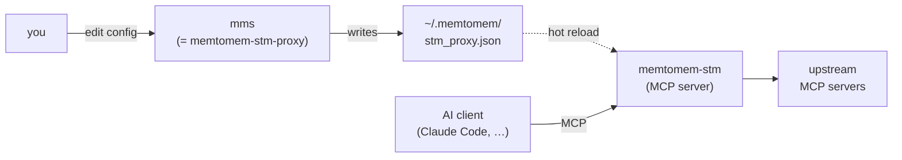
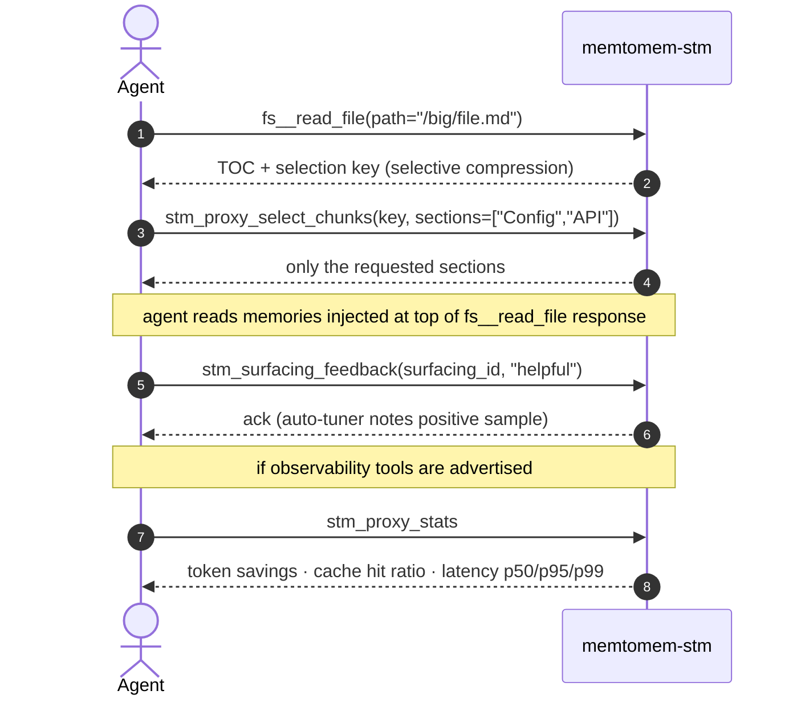

# CLI Reference

memtomem-stm ships three interchangeable console scripts. All three resolve to
the same Click group; a TTY invocation prints management help and a piped-stdin
invocation starts the MCP server:

| Script | Purpose |
|--------|---------|
| `memtomem-stm` | Full product-name entrypoint |
| `memtomem-stm-proxy` | Compatibility entrypoint |
| `mms` | Short entrypoint recommended for client registration |



The `mms` short form pairs with memtomem core's `mm` CLI: `mm` for long-term memory, `mms` for the STM proxy. Use whichever name you prefer; the docs below use `mms` for brevity.

Bare invocation dispatches on stdin: from a terminal it prints CLI help, while
piped stdin starts the MCP server. This lets `memtomem-stm`,
`memtomem-stm-proxy`, and `mms` all work as MCP server commands.

## Choose a reference

- [Gateway commands](reference/cli-gateway.md): setup, registration,
  diagnostics, statistics, and tuning
- [Hook and daemon commands](reference/cli-hooks.md): native PostToolUse bridge
- [Project and host commands](reference/cli-projects.md): registry and
  project-scoped MCP management
- [STM MCP tools](reference/mcp-tools.md): default and opt-in tool schemas

This page retains the detailed command sections and legacy anchors used by
existing links. The split references above are the faster entrypoints for new
readers.

## `mms` (= `memtomem-stm-proxy`)

```
Usage: mms [OPTIONS] [COMMAND] [ARGS]...

  memtomem-stm proxy gateway management.

Options:
  --version   Show the version and exit.
  -h, --help  Show this message and exit.

Commands:
  add        Add an upstream MCP server to the proxy configuration.
  config     Inspect and validate the proxy config file.
  daemon     Manage the shared local surfacing daemon.
  doctor     Diagnose the proxy setup end-to-end (passive unless measuring LTM).
  eject      Restore imported upstream(s) to their host MCP client, then...
  gateway    Inspect and configure Toolgraph-backed gateway policy.
  health     Check upstream server connectivity.
  hook       Bridge a host's built-in tool calls into STM (PostToolUse...
  host       Host-config inspection and sync.
  import     Import MCP definitions from host configs into the mms registry.
  init       Guided first-time setup for memtomem-stm.
  list       List configured upstream servers.
  project    Project-scoped MCP management.
  prune      Remove direct registrations for STM upstreams that are...
  register   Register memtomem-stm with an MCP client.
  remove     Remove an upstream MCP server from the proxy configuration.
  selection  Replay, evaluate, and label tool-selection telemetry.
  stats      Show proxy compression and surfacing stats from the...
  status     Show proxy gateway config summary (path, enabled flag,...
  surfacing  Toggle proactive memory surfacing for an upstream server.
  tune       Preview and apply per-tool compression tuning recommendations.
  version    Show the installed memtomem-stm version.
```

Commands that operate on the proxy configuration accept `--config TEXT`. An
untyped flag resolves `MEMTOMEM_STM_PROXY__CONFIG_PATH` — the same variable
the proxy server reads — before falling back to `~/.memtomem/stm_proxy.json`,
so precedence is: explicit `--config` > env `CONFIG_PATH` > default. Registry,
project, host, hook, and version commands have their own option surfaces; use
each command's `--help` output as the source of truth.

`mms --version` and `mms version` both print `memtomem-stm X.Y.Z` — the flag is the idiomatic Click form, the subcommand is kept for backwards compatibility.

Output is colorized when writing to a terminal; set `NO_COLOR=1` to disable. JSON output (`--json`) and non-TTY streams (pipes, CI) are never colored.

The `--json` single-document contract covers well-formed invocations: success and operational failures (including a config write-lock timeout) emit exactly one JSON object on stdout. **Usage errors are outside it** — a malformed invocation (unknown flag, missing argument, an incompatible flag combination such as `add --json --from-clients` without `--all`/`--select`, or `tune --json --apply`) gets Click's standard plain-text usage message on stderr with exit 2 and an empty stdout, same as every read-only `--json` command today. One precedence note: the config write lock wraps the whole command (as it does for every mutator), so under contention a malformed invocation can surface the exit-1 lock-timeout error before argument validation ever runs. For the four mutating result-summary commands (`add` / `remove` / `prune` / `eject`) that timeout is itself rendered in `--json` mode as the JSON envelope (`"error": "config_lock_timeout"`); `tune --json` is a preview-only mode and keeps the plain-text timeout rendering.

### `init`

```
Usage: mms init [OPTIONS]

Options:
  --config TEXT             [default: (~/.memtomem/stm_proxy.json)]
  --no-validate             Skip the connectivity probe entirely (default:
                            prompt, probe on yes).
  --mcp [claude|json|skip]  Pre-answer the MCP-registration prompt for
                            scripted runs: 'claude' = `claude mcp add`,
                            'json' = write .mcp.json, 'skip' = no
                            registration. Omit the flag for the interactive
                            prompt.
  --client [auto|claude|codex|json|skip]
                            Select a downstream client. --mcp remains as a
                            backwards-compatible alias for older scripts.
  --resume                  Continue registration when config already exists.
  --demo                    Use the bundled deterministic read-only demo.
  --freshness [live|balanced|reuse]
                            Cache freshness preset. [default: balanced]
  --allow-project-configs  Acknowledge project-local discovery.
  --replace-registration   Replace an existing selected-client registration.
  --save-unverified        Explicitly acknowledge saving after a failed probe.
  --json                   Emit one secret-safe JSON result document.
  --prune-originals         After a successful import + registration, remove
                            the direct registrations from the source MCP
                            clients mms can write, so tools route through STM
                            only; a Cursor registration is reported with the
                            manual edit instead. TTY callers get
                            a single y/N prompt (default No); non-TTY
                            scripted callers must pass the flag explicitly.
  --lang [en|ko]            Primary content language preset for token-aware
                            budgets. 'en' writes no language-specific fields.
                            'ko' sets the calibrated Korean budget preset.
```

Interactive wizard for the first-time setup. Prompts for a single upstream server (name, prefix, transport, command/URL), optionally probes connectivity, writes the config, then offers a 3-way MCP-client registration prompt:

1. **Add to Claude Code** — shells out to `claude mcp add` for you.
2. **Generate `.mcp.json`** — writes a project-scoped snippet in the current directory, then prints per-client paste targets for Cursor, Windsurf, Claude Desktop (OS-appropriate path), and Gemini CLI.
3. **Skip** — prints a manual-registration cheat sheet (`claude mcp add` one-liner plus a generic `mcpServers` JSON stanza) so you can wire it up by hand later.

Use `--mcp claude|json|skip` to pre-answer the prompt from scripts, CI, or any caller where stdin isn't a TTY — interactive callers should omit the flag.

Without `--resume`, aborts if the config file already exists. `--resume`
preserves the config and re-enters client registration; use [`register`](#register)
to run registration directly, [`add`](#add) to add servers, or [`list`](#list)
to inspect the current state. No path silently clobbers existing configuration.

`--freshness` picks the response cache's global TTL (`cache.default_ttl_seconds`) for the new config:

| Preset | TTL written | Meaning |
|--------|-------------|---------|
| `live` | `0` | never serve a cached response — every call hits the upstream |
| `balanced` (default) | *(none written)* | schema default of 3600 s (1 h) applies |
| `reuse` | `86400` | serve cached responses for up to a day — cheapest, staleness-tolerant |

It only seeds the initial value; edit `cache.default_ttl_seconds` (or per-tool/per-server `cache_ttl_seconds`) later — see [caching](caching.md).

Validation is **advisory**: probe failures are reported as warnings but the config is still written. That way a flaky network or a cold upstream doesn't block setup; re-run `mms health` later once things are up.

When you import servers that were already directly registered in a source MCP client (`~/.claude.json`, `.mcp.json`, Claude Desktop, Cursor), `init` leaves the direct registrations in place by default — and for Cursor it always does, since `mms` never writes those files: `--prune-originals` reports them with the manual edit to make — source-client configs are read-only unless you opt in. Pass `--prune-originals` to collapse the dual-path in the same session; on a TTY you instead get a single y/N prompt (default No). Skipped the prompt or didn't pass the flag? Run [`prune`](#prune) afterwards to clean up without re-running the wizard.

```bash
mms init                          # interactive wizard
mms init --no-validate            # skip the connectivity probe prompt entirely
mms init --mcp claude             # scripted: auto-register with Claude Code
mms init --mcp skip               # scripted: write config, print paste hints, exit
mms init --mcp claude --prune-originals  # scripted: import, register, and remove direct registrations
mms init --lang ko                # Korean-content preset for token-aware budgets
mms init --demo --client auto     # shortest native Windows/macOS/Linux path
mms init --resume --client codex  # continue an existing setup
```

### `register`

```
Usage: mms register [OPTIONS]

Options:
  --config TEXT             Path to the proxy config (must already exist —
                            run `mms init` first).  [default:
                            (~/.memtomem/stm_proxy.json)]
  --mcp [claude|json|skip]  Pre-answer the registration prompt for scripted
                            runs: 'claude' = `claude mcp add`, 'json' =
                            write .mcp.json, 'skip' = print manual hints.
                            Omit for the interactive prompt.
  --client [auto|claude|codex|json|skip]
                            Select the downstream client explicitly.
  --replace-registration   Replace an existing selected-client registration.
  --json                   Emit one secret-safe JSON result document.
```

Re-runs the 3-way MCP-client registration prompt from `init` without re-entering the first-time setup wizard. Use this after `mms init` if you initially picked "skip", or when registering the same STM install with a second client.

Requires that `mms init` has already been run so the config file exists — otherwise exits with an error and a hint. Safe to re-run: pre-checks existing Claude Code registration and defaults to **keep** when already registered (no-op — existing registration is preserved even with `--mcp claude`).

```bash
mms register              # interactive prompt
mms register --mcp json   # scripted: write .mcp.json in CWD, exit
mms register --mcp skip   # scripted: print manual paste hints, exit
```

### `add`

```
Usage: mms add [OPTIONS] [NAME]

Options:
  --config TEXT                   [default: (~/.memtomem/stm_proxy.json)]
  --command TEXT                  Executable command (stdio).
  --args TEXT                     Space-separated arguments.
  --prefix TEXT                   Tool namespace (e.g. 'fs' -> tools appear
                                  as fs__read_file). Required unless
                                  --from-clients is used.
  --transport [stdio|sse|streamable_http]
                                  stdio for local processes,
                                  sse/streamable_http for remote.
                                  [default: stdio]
  --url TEXT                      Endpoint URL (SSE / HTTP).
  --env KEY=VALUE
  --header KEY=VALUE              HTTP header for sse/streamable_http
                                  transports (repeatable). Values are stored
                                  in plaintext in the config file (0600
                                  perms).
  --compression [auto|none|truncate|selective|hybrid]
                                  'auto' picks strategy per response by
                                  content type.  [default: auto]
  --max-chars INTEGER RANGE       [default: 8000; x>=1]
  --validate                      Probe the server (MCP initialize +
                                  list-tools) before saving; abort on
                                  failure.
  --save-unverified               With --from-clients --validate, save the
                                  entire import even if one or more probes
                                  fail. Validation is otherwise all-or-nothing.
  --timeout INTEGER RANGE         Connection timeout (seconds) when
                                  --validate is set.  [default: 10; x>=1]
  --from-clients, --import        Import additional servers interactively
                                  from existing MCP clients (Claude
                                  Desktop / Code, Cursor, project .mcp.json
                                  / .cursor/mcp.json). Reuses init's
                                  discovery + TUI flow.
                                  Skips candidates already registered.
                                  Incompatible with NAME / --prefix /
                                  --command / --args / --url / --env /
                                  --header.
  --all                           With --from-clients/--import: import every
                                  newly discovered server without prompting,
                                  assigning each a suggested prefix. Non-
                                  interactive even on a TTY. Mutually
                                  exclusive with --select.
  --select NAME[,NAME...]         With --from-clients/--import: import only
                                  the named discovered servers, without
                                  prompting. Repeatable and comma-separated.
                                  A name no client advertises is an error;
                                  one already registered here is skipped.
  --prune                         After a successful --import, remove the
                                  direct registrations from each source MCP
                                  client mms can write, so tools are only
                                  reachable via STM. A Cursor registration is
                                  reported with the manual edit instead. TTY
                                  callers get a (name, source)
                                  confirm prompt (default No); non-TTY
                                  callers must pass the flag explicitly.
                                  Requires --from-clients / --import.
  --allow-project-configs         Acknowledge importing MCP entries from a
                                  project-local .mcp.json or .cursor/mcp.json.
  --json                          Output as JSON for scripting.
```

Use `--validate` to catch typos and misconfigurations at registration time instead of the next time the proxy starts. Without it `add` only writes the config — bad entries are discovered later via `mms health` or when the proxy fails to spawn.

For `sse`/`streamable_http` servers that need HTTP authentication, pass `--header KEY=VALUE` (repeatable). The same headers are sent on the `--validate` / `mms health` probes and on every runtime connection, so a header-authenticated server validates with exactly the credentials it will run with. Header values are written to the config file in **plaintext** — the file is chmod `0600` best-effort, but treat it as secret-bearing; `--json` output masks the values (keys preserved). `--header` with `--transport stdio` is rejected (`header_requires_http`): the runtime would silently ignore it.

A `--prefix` already used by another registered server is rejected before anything is written (`duplicate_prefix`): the proxy's config loader refuses duplicate prefixes, so saving one would leave a config the server can't start with. The interactive flows (`mms init`, `add --from-clients`) re-prompt on a colliding prefix for the same reason.

With `--json`, stdout carries a single result document — `{"action": "add", "ok": true, "config_path": ..., "name": ..., "prefix": ..., "server": {...}, "validated": ..., "tools_reachable": ..., "warnings": [...]}` — and progress/success text is suppressed (warnings still print to stderr as well). The `server` block is redacted the same way as [`mms list --json`](#list) (all `env`/`headers` values masked). Failures keep exit 1 and emit `{"action": "add", "ok": false, "error": "<code>", "message": ...}` on stdout, where `<code>` is a stable identifier (`already_exists`, `invalid_prefix`, `prefix_too_long`, `duplicate_prefix`, `stdio_requires_command`, `url_required`, `header_requires_http`, `malformed_args`, `invalid_env`, `invalid_header`, `validation_failed`). With `--from-clients`, `--json` requires `--all` or `--select` (see below) and emits the bulk-import shape instead — `{"action": "add", "ok": true, "mode": "from_clients", "config_path": ..., "imported": [{"name", "prefix", "source", "server", …}], "skipped": [{"name", "reason"}], "validated": ..., "warnings": [...], "prune": null | {"pruned": [...], "failed": [...]}}` — with `unknown_server` as its one additional failure code. Bare `--from-clients --json` stays a usage error: a formatting flag must not turn the selection prompt into a guess about what to import.

Use `--from-clients` (alias `--import`) to bulk-pick additional servers from
the same MCP clients `mms init` scans: `~/.claude.json`, project `.mcp.json`,
Cursor's `~/.cursor/mcp.json` and the checkout's `.cursor/mcp.json`,
and the OS-specific Claude Desktop config — macOS
`~/Library/Application Support/Claude/claude_desktop_config.json`, Windows
`%APPDATA%\Claude\claude_desktop_config.json`, or Linux
`~/.config/Claude/claude_desktop_config.json`. This is the post-init equivalent
of the `init` discovery step — servers already registered in this config are
filtered out by name and by `(transport, command, args)` / `(transport, url)`
signature before the selection UI. `--validate` and `--timeout` work on the
selected subset.

A selected entry from a project-local file in the current checkout —
`.mcp.json` or `.cursor/mcp.json` — is refused before probing, saving, or
pruning unless `--allow-project-configs` is passed. Selecting a repository
file is not by itself consent to adopt a command supplied by that checkout.

Cursor entries are discovered and reported but never written: `prune` refuses
them with the manual edit to make instead, and `eject` does not accept a
`cursor-*` target. Only the Claude sources have a writer.

Bulk validation is atomic by default: if any selected server fails its probe,
none of the imported servers are written and the command exits 1
(`validation_failed`). Pass `--save-unverified` together with `--validate`
only when you intentionally want the complete selected batch saved despite
those failures; the flag never saves a partial subset.

For scripts and CI, `--all` (import everything newly discovered) or `--select
NAME[,NAME...]` (import only the named servers, repeatable and comma-separated)
replaces both prompts. Either flag makes the whole run non-interactive — even
on a TTY, and including the `--prune` confirmation, where the flag then becomes
the only way to consent. Each prefix comes from the same suggestion the
interactive flow offers as a default: the server name with non-alphanumerics
folded to `_`, plus a numeric suffix (`filesystem2`) when that collides with a
prefix already in the config, truncated if it would not fit the 64-char MCP
tool-name budget. To choose a prefix yourself, use the interactive flow or
register the server with `mms add NAME --prefix ...`. `--select` treats its two
failure modes differently: a name no MCP client advertises is a typo, so the
run exits 1 (`unknown_server`) before writing anything, while a name already
registered here is skipped with a warning and exit 0 — re-running the same
scripted import stays idempotent.

To remove the original direct registrations after a successful import, pass `--prune`. On a TTY you get a `(name, source)` confirm prompt that defaults to **No** before any file edits; in non-TTY callers (CI, scripts) you must pass `--prune` explicitly — the flag never auto-fires on inferred consent. A candidate registered in more than one source client is pruned from every source `mms` can write, not just the one it was imported from. Prune failures are non-fatal: the import stays, and each failed entry prints the exact manual `claude mcp remove` or config edit to retry — which is also how a Cursor entry is reported, since `mms` never writes those files. `--prune` without `--from-clients` is a usage error rather than a silent no-op.

The import→prune transition is reversible: every import records an `origin` provenance block per entry (the structured source plus the verbatim host entry), and every prune backs the deleted host entry up to `~/.memtomem/pruned_upstreams.json` before removing it (a Cursor source is neither backed up nor removed — nothing deletes it to back up). [`mms eject`](#eject) walks the whole path back — it restores the captured host entry to where it came from (or, for a `cursor-*` origin, to a `--to` target you name) and removes the entry from STM.

> **Note**: The CLI's `--compression` flag exposes 5 of the 10 strategies. The remaining five (`extract_fields`, `schema_pruning`, `skeleton`, `progressive`, `llm_summary`) are configured by editing `stm_proxy.json` directly. See [Compression Strategies](compression.md).

### `list`

```
Usage: mms list [OPTIONS]

Options:
  --config TEXT  [default: (~/.memtomem/stm_proxy.json)]
  --json         Output as JSON for scripting.
```

Prints the configured upstream servers in a table — name, prefix, transport, compression strategy, surfacing toggle, origin, and the command (stdio) or URL (SSE / HTTP). This is the per-server view; [`mms status`](#status) is the config summary (#614). The SURFACING column is the visible home of the per-server [`mms surfacing`](#surfacing) toggle. `max_result_chars` deliberately has no column — the effective value is per-tool once [`mms tune --apply`](#tune) writes `tool_overrides`, so read it via `--json` or the config file. Reads the config only; does not probe connectivity (use `mms health` for that). With `--json` the output becomes `{"config_path": ..., "config_valid": ..., "config_error": ..., "servers": {...}}` for scripting; a missing config file returns `{"error": "config_not_found", "path": ...}` instead of a text fallthrough so callers can branch on shape. `config_valid` / `config_error` mirror [`mms status --json`](#status), including the env overlay — a file that only validates once `MEMTOMEM_STM_PROXY__*` vars are applied reports valid here, because the warning is about what a running server does.

The ORIGIN column summarizes import provenance: `-` for entries added manually (or imported before provenance capture), otherwise the recorded source kind (`claude-user`, `claude-project`, `mcp-json`, `claude-desktop`, `cursor-user`, `cursor-project`). A trailing `*` marks an entry whose recorded host sources — the primary origin **and** any duplicate registrations — were all pruned: it now exists only behind STM, and [`mms eject`](#eject) can restore it. A `cursor-*` origin never reaches that state on its own, because nothing here prunes one; eject refuses those targets for the same reason. The same condition drives the [`mms remove`](#remove) hint, so the two surfaces never disagree about which entries removal would orphan. In `--json` output the `origin` block appears with `origin.original` redacted (`has_original` tells you whether one was captured) because the verbatim host entry may carry secrets. Every server's own active `env` and `headers` values are also masked (`<REDACTED>`, keys preserved) in `--json` output, since that output is routinely piped to scripts, CI logs, or issue comments.

### `remove`

```
Usage: mms remove [OPTIONS] NAME

Options:
  --config TEXT  [default: (~/.memtomem/stm_proxy.json)]
  -y, --yes      Skip confirmation.
  --json         Output as JSON for scripting (requires --yes).
```

Removes an upstream MCP server from the proxy configuration by name. Prompts for confirmation on a TTY unless `-y` or `--yes` is passed.

With `--json`, stdout carries a single result document (`{"action": "remove", "ok": true, "config_path": ..., "name": ..., "removed": true, "warnings": [...]}`; the orphaning note below moves into `warnings`). `--json` never prompts: without `--yes` the command refuses with exit 2 and `{"error": "confirmation_required", ...}` — a formatting flag doesn't authorize a destructive write (same contract as [`mms host sync --json`](#mms-host--host-config-drift-inspection-and-sync)). Operational failures keep exit 1 with `{"error": "config_not_found" | "server_not_found", ...}`.

`remove` only edits the STM config — it never touches host configs. If the entry was imported and every host original was pruned, removing it would leave the server registered **nowhere**, so the command prints a note (before the confirmation prompt) pointing at [`mms eject`](#eject), which restores the host entry instead. The hint is advisory; the removal itself is never blocked.

### Examples

```bash
# Filesystem server
mms add filesystem \
  --command npx \
  --args "-y @modelcontextprotocol/server-filesystem /home/user/projects" \
  --prefix fs

# GitHub server with env var
mms add github \
  --command npx \
  --args "-y @modelcontextprotocol/server-github" \
  --prefix gh \
  --env GITHUB_TOKEN=ghp_xxx

# SSE transport
mms add docs \
  --transport sse \
  --url https://docs.example.com/mcp \
  --prefix docs

# Validate connectivity at registration time (rejects bad entries up front)
mms add filesystem \
  --command npx \
  --args "-y @modelcontextprotocol/server-filesystem /home/user/projects" \
  --prefix fs \
  --validate

# Bulk-import servers already configured in Claude Desktop / Code / Cursor / .mcp.json
mms add --import            # or --from-clients; skips anything already registered

# Import AND prune originals from source clients
mms add --import --prune    # TTY: per-entry confirm prompt (default No)
                            # non-TTY: unconditional — pass --prune to opt in

# Scripted bulk-import: no prompts, machine-readable result
mms add --import --all --json
mms add --import --select filesystem,github

# List configured upstreams (per-server detail: prefix, transport, surfacing, origin)
mms list
mms list --json            # machine-readable: {config_path, config_valid, config_error, servers}

# Config summary (path, enabled flag, server count)
mms status

# Remove a server (STM config only)
mms remove github

# Stop proxying an imported server WITHOUT losing it: restore the captured
# host entry to where it came from, then remove it from STM
mms eject github

# Toggle proactive surfacing for an upstream (persisted in stm_proxy.json)
mms surfacing context7 off  # `on` to re-enable; omit the state to show it

# Check upstream connectivity (probes each server)
mms health
mms health --json          # machine-readable output
mms health --timeout 5     # 5s per-server timeout (default: 10)
```

### `prune`

```
Usage: mms prune [OPTIONS] [NAMES]...

Options:
  --config TEXT  [default: (~/.memtomem/stm_proxy.json)]
  --all          Prune every dual-registered upstream. Required when no NAMES
                 given.
  -y, --yes      Skip the confirm prompt (scripts / CI / non-TTY callers).
  --dry-run      Print what would be pruned; no writes.
  --json         Output as JSON for scripting (requires --yes, or --dry-run).
```

Removes direct registrations for STM upstreams that are still registered in a source MCP client (`~/.claude.json`, `.mcp.json`, Claude Desktop). Cursor entries are reported rather than removed — `mms` never writes a Cursor config, so each one prints the manual edit to make. Use this to collapse the dual-path state that `mms init` and `mms add --import` leave behind when you didn't opt into pruning at import time — the tools then route through STM only, picking up compression, caching, and LTM surfacing.

Scope selection is explicit by design: pass `--all` to act on every dual-registered upstream, or pass one or more `NAMES` to limit the action. Running `mms prune` with no arguments is a usage error rather than defaulting to "everything" — this is a destructive operation against external config files and the default should be visible.

"Dual-registered" requires both the name **and** the identity to match: the source-client entry must share the STM upstream's `(transport, command, args)` or `(transport, url)` signature. If you've edited either side to point at a different server that happens to share a name, `mms prune` skips it rather than clobbering the unrelated entry.

STM's own config (`stm_proxy.json`) is never modified. Only source-client files change. Failures are surfaced via non-zero exit and the exact manual `claude mcp remove` command for each failed entry, so scripting callers can retry.

Before deleting a host entry, every prune path appends the verbatim entry (with its source and timestamp) to `~/.memtomem/pruned_upstreams.json` (mode `0600`) — backup-before-delete, so a crash mid-prune never loses the only copy. The log is append-only and advisory: [`mms eject`](#eject) suggests it when an entry has no recorded origin, but never restores from it without your confirmation.

With `--json`, stdout carries a single result document: `{"action": "prune", "ok": ..., "dry_run": ..., "config_path": ..., "planned": [{"name", "source"}], "manual": [{"name", "source", "hint"}], "pruned": [...], "failed": [{"name", "source", "error", "hint"}]}` — `planned` is built from the same iteration as the human preview and holds only sources `mms` can write; `manual` holds the rest (today, Cursor) with the edit to make, and each `failed` row's `hint` is the exact manual removal command. `--json` never prompts: without `--yes` (or `--dry-run`) it refuses with exit 2 and `{"error": "confirmation_required", ...}`. Partial failures keep `ok: false` + exit 1, with the human diagnostics still on stderr.

```bash
mms prune --all              # remove every dual-registered upstream (TTY: confirm prompt)
mms prune --all --yes        # same, skip the prompt (CI / scripts)
mms prune --all --dry-run    # preview without writes
mms prune docs-langchain     # target specific upstreams
mms prune --all --yes --json # machine-readable result summary
```

### `eject`

```
Usage: mms eject [OPTIONS] NAMES...

Options:
  --config TEXT         [default: (~/.memtomem/stm_proxy.json)]
  --to TARGET           Restore target for entries without a usable origin:
                        claude-user | claude-project[:PATH] | mcp-json[:PATH]
                        | claude-desktop. Entries with a usable, writable
                        recorded origin
                        ignore this.
  --keep                Restore to the host but keep the STM entry (dual
                        registration).
  --force               Overwrite a same-name host entry whose identity
                        differs.
  --allow-argv-secrets  Permit `claude mcp add-json` shell-outs whose payload
                        carries secret-classified values (argv is visible in
                        the process list). The only override for the secret
                        gate — --yes does not bypass it.
  --accept-schema-loss  Proceed with STM removal even when the restored host
                        entry does not structurally match the original (the
                        claude CLI strips fields it does not know). Default is
                        to keep the STM entry and fail.
  --dry-run             Print the plan; no writes.
  -y, --yes             Skip the confirm prompt (scripts / CI / non-TTY
                        callers).
  --json                Output as JSON for scripting (requires --yes, or
                        --dry-run).
```

The reverse of `mms add --import --prune`: stop proxying a server **without losing it**. Imports capture an `origin` provenance block per entry in `stm_proxy.json` — the structured source (`claude-user`, `claude-project`, `mcp-json`, `claude-desktop`, `cursor-user`, `cursor-project`) plus the verbatim host entry as it existed at import time. `eject` writes that original back to where it came from — or, where that origin is one nothing here writes (`cursor-*`), to a target you name — verifies the restore by re-reading the host config, and only then removes the entry from STM. The order is the safety invariant: host write first, STM removal second — any failure leaves the server registered in at least one place (worst case dual registration, never disappearance).

`origin.original` may carry secrets (`env`, `headers`), so `mms list --json` / `mms status --json` redact it — the summary keys stay, plus `has_original` so scripts can tell a redacted block from one that never captured an original.

Key semantics:

- **Targets.** Entries restore to their recorded origin. Claude Code scopes go through `claude mcp add-json` (the project scope runs at the recorded project path); `.mcp.json` and Claude Desktop are direct atomic JSON edits. A `cursor-*` origin is not a target — nothing here writes a Cursor config — so those entries need an explicit `--to` naming one of the four writable kinds, and `--to cursor-user` / `--to cursor-project` are rejected outright. Entries without a usable origin (manual `mms add`, imports predating provenance capture, a vanished project directory) need an explicit `--to`. Choosing a target does not change the payload: a captured `origin.original` is still restored verbatim, whatever the destination. Only an entry with no captured original is reconstructed, with warnings for what import-time normalization lost (filtered env keys, HTTP headers).
- **No-clobber.** A same-name entry already at the target is compared structurally: identical → idempotent skip; different or not comparable → that entry fails with a hint unless `--force` (which replaces it).
- **Verified release.** The STM entry is only removed once the host entry deep-equals the restore payload. The claude CLI re-serializes through its own schema and silently drops fields it doesn't know, so a clean `add-json` exit isn't proof; on mismatch the entry stays in STM (dual registration) unless you pass `--accept-schema-loss`.
- **Secret gate.** Payloads with secret-classified `env`/`headers` values would appear on the `claude` argv (visible in the process list). On a TTY you get an explicit per-entry confirmation; non-TTY callers must pass `--allow-argv-secrets`. `--yes` never bypasses this gate.
- **Failures are per-entry and non-fatal.** Each failed entry keeps its STM registration and prints an exact manual restore command; the run exits 1 if anything failed. When an entry has no origin, the [prune backup log](#prune) (`~/.memtomem/pruned_upstreams.json`) is suggested as a starting point for `--to` — verify it's current first; eject never auto-adopts it.
- **`--json`.** stdout carries a single result document: `{"action": "eject", "ok": ..., "dry_run": ..., "keep": ..., "config_path": ..., "plan": [...], "restored": [...], "removed_from_stm": [...], "failed": [{"name", "error", "hint"}]}`, mirroring the human plan display per entry (`target`, `write`, `verbatim`, `warnings`, `pruned_duplicates`, `error`). The captured host original itself is never serialized into `plan` rows; each `failed` row's `hint` is the same manual restore command the terminal prints — like that stderr hint, it embeds the restore payload (secrets included), so treat failed-eject `--json` output like the config file itself. `--json` never prompts: without `--yes` (or `--dry-run`) it refuses with exit 2 and `{"error": "confirmation_required", ...}`, and the secret gate fails the entry at plan time instead of confirming (pass `--allow-argv-secrets` to proceed).

```bash
mms eject github                   # restore to its recorded origin, then remove from STM
mms eject github --keep            # restore but keep proxying (dual registration)
mms eject legacy --to claude-user  # no recorded origin: pick the restore target
mms eject github --dry-run         # preview the per-entry plan; no writes
```

### `surfacing`

```
Usage: mms surfacing NAME [on|off]

Options:
  --config TEXT  [default: (~/.memtomem/stm_proxy.json)]
```

Toggles `surfacing_enabled` on an upstream in `stm_proxy.json` (default `on`). With no state it prints the current value; `mms list` shows it per server (SURFACING column). A running proxy hot-reloads the change without a restart. Because the flag lives in the shared proxy config — not per-client `env` — every MCP client that proxies through this `mms` sees the same scope. When off, surfacing is skipped before the LTM search for every tool on that server (counted as `upstream_disabled` in `stm_surfacing_stats`). For tool-grained or cross-server glob scope, use the `MEMTOMEM_STM_SURFACING__EXCLUDE_TOOLS` env glob instead (matches `server__tool`). See [surfacing.md](surfacing.md#scoping-surfacing-per-upstream).

### `health`

```
Usage: mms health [OPTIONS]

Options:
  --config TEXT            [default: (~/.memtomem/stm_proxy.json)]
  --json                   Output as JSON for scripting.
  --timeout INTEGER RANGE  Per-server connection timeout in seconds.
                           [default: 10; x>=1]
  --names                  Also report any upstream tool whose composed
                           proxied name (`mcp__<server>__<prefix>__<tool>`)
                           would exceed the 64-char MCP limit. Useful when one
                           tool from an upstream silently went missing after
                           registration (#261).
```

Connects to each configured upstream server (MCP initialize + list-tools) and reports whether it's reachable and how many tools it exposes. Unlike `stm_proxy_health` (the MCP tool), this command probes servers directly — the proxy does not need to be running. It also prints a **Surfacing Bootstrap** section that checks surfacing config, feedback DB readiness, and the configured LTM MCP server.

Probe results are **staged**: a failing server's `DISCONNECTED` line names the last stage that completed (`configured → transport connected → MCP initialized → tools discovered`), so a dead binary, a broken MCP handshake, and a failing `tools/list` are distinguishable at a glance. `--json` server entries carry the additive `stage` / `failed_stage` / `transport` keys next to the unchanged `connected` / `tools` / `overflowing` / `error` fields. Probe error strings are sanitized before rendering — configured `env` / `headers` values and URL credentials are replaced with `<REDACTED>` even when an upstream echoes them back in an exception message. For a pass/fail verdict with next actions instead of raw connectivity detail, use [`mms doctor`](#doctor).

`--names` re-runs the same composed-name overflow check the proxy applies at boot (#261), so an operator diagnosing "one tool from server X went silently missing after registration" can answer the question without restarting STM. The flag uses the default client server name `memtomem-stm` (12 chars) for the `mcp__<client-server>__…` template; if you registered STM under a shorter alias like `mms`, set `MMS_CLIENT_SERVER_NAME=mms` so the budget calculation matches the surface name your client actually composes.

The LTM probe honors the same `--timeout` budget, supports `stdio`, `sse`, and
`streamable_http`, and requires the target server to advertise `mem_search`.
When `mem_do` is available, the version probe is best-effort and does not
decide readiness.

### `doctor`

```
Usage: mms doctor [OPTIONS]

Options:
  --config TEXT            [default: (~/.memtomem/stm_proxy.json)]
  --json                   Output as JSON for scripting.
  --timeout INTEGER RANGE  Per-connection probe timeout in seconds.
                           [default: 10; x>=1]
  --measure-ltm            Run five synthetic searches against an existing
                           shared daemon to refresh latency advice. A cold
                           daemon may receive one additional prime search.
```

One read-only diagnostic pass over the whole setup, designed for "I just installed this — why isn't it working?". Every check prints `PASS` / `WARN` / `FAIL`, a short cause, and — for anything that isn't a `PASS` — a `next:` line you can run as-is. **Exit code is 1 when any check FAILs; WARN-only runs exit 0.** That makes `mms doctor` the scriptable success gate for a fresh install: [`health`](#health) stays the always-exit-0 connectivity inspection, [`config validate`](#config-validate) stays the strict schema lint.

The server-shaped checks (`proxy enabled`, `server transports`, `prefixes`, `upstream: <name>`, and the `upstreams` warning) read an **env-overlaid** config rather than the file alone, so `MEMTOMEM_STM_PROXY__UPSTREAM_SERVERS__<NAME>__<FIELD>` servers are counted, validated and probed like file-declared ones, and an env override of a file-declared field is what gets probed. Only a schema-invalid config falls back to the raw file, since no effective snapshot exists to trust. JSON-valued vars are read the way the server reads them, so the aggregate `MEMTOMEM_STM_PROXY__UPSTREAM_SERVERS='{…}'` and JSON leaves like `…__ARGS='["--one"]'` are decoded rather than reported as schema failures (#834). The remaining config checks (`cache policy`, `compression tuning`) still read the file as written.

Checks, in order:

| check | reuses | FAIL / WARN when |
|---|---|---|
| `config file` | same path resolution as `status`/`health` | FAIL: file missing → `next: mms init` (short-circuits the report) |
| `config JSON` | the `config validate` parse guard | FAIL: unparseable / non-object root (short-circuits) |
| `config schema` | the `status`/`health` schema check | FAIL: valid JSON, invalid schema — a running server would silently fall back to env/defaults |
| `proxy enabled` | the shared inert-state predicate (`config validate` + the runtime load advisory) | FAIL: upstream servers configured but top-level `enabled` unset — the silent `false` default advertises none of them to clients while each server still probes green; WARN: explicitly disabled (control-only mode). Omitted when no upstreams are configured |
| `server transports` | the `add` VAL-3/VAL-4 rule | FAIL: stdio server without `command`, network server without `url` |
| `prefixes` | the shared `proxy/prefixes.py` validators the runtime load path enforces | FAIL: empty or duplicate prefixes (same wording as the server's load rejection) |
| `upstream: <name>` | the same staged probe as `health` | FAIL: probe failed — names the stage reached; a dead stdio binary gets a `command -v <cmd>` next action |
| `LLM compression` | effective global → server → tool compression inheritance | FAIL: an active `llm_summary` site has no effective `llm` block |
| `Ollama endpoint` | env-overlaid active model config + read-only `/api/tags` inventory | FAIL: endpoint timeout/error/malformed inventory, or a configured model is missing |
| `host registration` | Codex, Claude Code, and project `.mcp.json` discovery | WARN: STM registration not detected |
| `cache policy` | the `config validate` advisory predicate | WARN: cache enabled but `tool_annotation_policy` unset (conservative default caches unclassified tools) |
| `compression tuning` | proxy metrics sample inventory | PASS with readiness or collection status; never writes tuning |
| `ltm server` | the `health` LTM probe | WARN: LTM unconfigured/unreachable — **never FAIL**; only LTM-dependent features are disabled |
| `ltm runtime profile` / `dependencies` | Core runtime-profile schema 1 | FAIL when active dense/rerank dependencies are missing or Core cannot read effective config; older Core is WARN |
| `ltm retrieval mode` | Core configured/effective search mode | FAIL on disabled or unexpected dense-to-BM25 degradation; intentional BM25-only is WARN |
| `ltm score scale` | feedback diagnostics | FAIL while a recent score-scale mismatch episode remains unrecovered |
| `ltm measurement` / timeout checks | daemon latency telemetry | WARN when measurement cannot run or configured surfacing/hook deadlines are too small |

`--json` emits a single document: `{"config_path", "status": "pass"|"warn"|"fail", "checks": [{"id", "label", "status", "detail", "next_action"}, ...]}` plus, once probing ran, the staged `servers` map (same shape as `health --json`) and the `surfacing` bootstrap payload. Active Ollama dependencies add one grouped `ollama_endpoint:<digest>` check per unique base URL (the digest covers the credential-stripped URL; a credentialed endpoint appends a digest of its own use sites, so credential-only twins stay distinct and IDs never depend on a secret); duplicate models and use sites share its single inventory request. Short-circuited runs contain only the checks that executed. Secrets never appear: probe errors are pre-sanitized, URL credentials are removed, and `env`/`headers` values are never printed.

The default doctor run is passive: it performs no search or inference and changes no state. It may issue a read-only Ollama `/api/tags` GET for an active embedding or LLM-compression dependency; it never starts Ollama or pulls a model. See [Local Ollama setup](compression.md#local-ollama-setup).
`--measure-ltm` explicitly performs five synthetic searches against an already
running shared daemon (plus one prime search when cold), discards their content,
and updates daemon latency telemetry. It never starts a missing daemon and never
edits STM configuration or LTM content.

### `status`

```
Usage: mms status [OPTIONS]

Options:
  --config TEXT  [default: (~/.memtomem/stm_proxy.json)]
  --json         Output as JSON for scripting.
```

Shows a config summary: the configuration file path, enabled flag, schema-validation warning, and the server count (with a host-pruned count when any entry exists only behind STM). Per-server detail — prefix, transport, command/URL, compression, surfacing — lives in [`mms list`](#list); `status` answers "is the proxy set up and pointed at the right config", `list` answers "what servers are behind it". (#614 — the two commands used to print near-identical output.)

`status --json` is unchanged by that split: it still carries the full redacted `servers` map (plus additive `server_count` / `pruned_count` keys), so scripted consumers keep working. Every server's `env` and `headers` values are masked (`<REDACTED>`, keys preserved); the human output never prints those fields at all, so read the on-disk config directly when a value is genuinely needed.

When the file is valid JSON but fails schema validation (the state a running server silently degrades to env/defaults on), `status`, `list`, and `health` print a warning naming the first error — exit code unchanged. All three validate the file *with* the `MEMTOMEM_STM_PROXY__*` env overlay applied, so the warning matches what a running server would actually do rather than firing on a file an env var already repairs. Use `mms config validate` for the strict check.

### `config validate`

```
Usage: mms config validate [OPTIONS]

Options:
  --config TEXT  Path to the proxy config JSON.  [default: (~/.memtomem/stm_proxy.json)]
  --json         Output as JSON for scripting.
```

Strictly validates the config file *as written* — no `MEMTOMEM_STM_PROXY__*` env overlay, since this lints the artifact you edit and commit, not the runtime composite. Reports, with non-zero exit on any of them:

- JSON parse errors and non-object roots,
- schema validation errors (dotted location + message, one line each),
- **unknown keys at every nesting level** (dotted paths like `upstream_servers.gh.tool_overides`). The runtime load deliberately keeps pydantic's `extra="ignore"` for forward compatibility, so a typo'd key silently vanishes there; this command is where typos fail loudly. The load path also logs one aggregated unknown-key warning per load,
- a missing file (`status: "missing"` — a strict validator with nothing to validate fails, which is what a CI gate wants).

Group/world-readable file permissions produce a warning line but exit 0 on their own. `--json` emits `{"config_path", "status": "ok"|"invalid"|"missing", "errors": [...], "unknown_keys": [...], "warnings": [...]}`.

### `stats`

```
Usage: mms stats [OPTIONS]

Options:
  --config TEXT              [default: (~/.memtomem/stm_proxy.json)]
  --tool TEXT                Filter to one upstream tool name.
  --source [mcp|hook]        Filter compression rows by provenance: 'mcp'
                             (proxied upstream tools) or 'hook' (native
                             built-in tools recorded by 'mms hook').
  --json                     Output as JSON for scripting.
```

Shows proxy compression and surfacing statistics from the persistent databases (`proxy_metrics.db` and `stm_feedback.db`). `--source mcp` limits the compression rows to proxied upstream tools, `--source hook` to native built-in tools recorded by `mms hook`; omit it to include both. 

It reads these files read-only (without creating or migrating them) and reports all-time totals. Because the live MCP server keeps additional in-memory counters that a separate CLI process cannot see, the numbers here reflect only what has been successfully flushed/written to disk.

The surfacing block reports degraded-LTM faults separately from score-scale
diagnostics. After five consecutive non-empty searches for one upstream tool
whose best candidate remains below its active `min_score`, the proxy records a
`score_ceiling_below_min` diagnostic — and one on every further such search, so
the count reflects observations rather than episodes, like the fault counts
above it. This can indicate a single-leg/BM25-only
LTM (for example, missing embedding extras) or an intentionally high threshold.
The warning is advisory: inspect the LTM logs/search backend before lowering a
pinned threshold. STM never changes `min_score` in response to this diagnostic.
`--json` exposes the same signal under the additive `surfacing.diagnostics`,
`diagnostics_last_at`, and `diagnostics_window_days` fields.

### `tune`

```
Usage: mms tune [OPTIONS]

Options:
  --config TEXT        [default: (~/.memtomem/stm_proxy.json)]
  --apply              Write the accepted overrides into the config (default: preview only).
  -y, --yes            Apply all recommendations without prompting (scripts / CI / non-TTY).
  --since-hours FLOAT  Analysis window over the metrics/feedback stores.  [default: 24.0]
  --tool TEXT          Filter to one upstream tool name.
  --json               Preview as JSON for scripting.
```

Runs the same analysis as the `stm_tuning_recommendations` MCP tool against the on-disk metrics/feedback stores (no running server needed) and renders the per-tool `tool_overrides` diff it suggests — `max_result_chars` budget changes and `compression` strategy pins, with the reason and a confidence level per tool.

Three modes:

- **`mms tune`** — preview only. Shows exactly what `--apply` would write, as `field: current -> recommended` lines per tool. `--json` emits the same data as `{"config_path", "since_hours", "tool_filter", "changes": [...], "skipped": [...]}` (preview only; it cannot be combined with `--apply`).
- **`mms tune --apply`** — interactive: pick which tools to apply (all pre-selected; set `MMS_NO_TUI=1` for plain per-tool confirm prompts), then write the accepted overrides into `upstream_servers.<server>.tool_overrides.<tool>` under the config write lock. Without a TTY this errors and points at `--yes`.
- **`mms tune --apply --yes`** — apply everything without prompting.

Before writing, the config is snapshotted to a timestamped backup next to it (`stm_proxy.json.bak-<UTC>`, mode 0600); restore is `cp <backup> <config>`. A running proxy hot-reloads the new overrides without a restart. Recommendations for upstreams that exist only in metrics (env-defined or since-renamed servers) are reported as skipped rather than written.

Unlike `mms stats`, this command opens the stores read-write to run their idempotent schema migrations (the same step the server performs at startup) — but only when the DB files already exist; a preview never creates anything.

## `mms selection replay` — offline selection evaluation

```text
Usage: mms selection replay [OPTIONS]

Options:
  --config TEXT          [default: (~/.memtomem/stm_proxy.json)]
  --log FILE             Override selection_telemetry.path.
  --dataset FILE         Override the packaged labelled v1 corpus.
  --active-only          Exclude numeric rotated log backups.
  --no-telemetry         Evaluate the fixed corpus only.
  --output-dir DIRECTORY Write private report.json and summary.md artifacts.
  --json                 Output stable JSON for scripting.
```

This read-only command checks the production JSONL schema, joins selection,
execution, and feedback records, and reports observational cohorts and outcomes.
It separately runs the current eligibility filter and BM25 ranker over a
sanitized 30-case corpus, evaluates all 35 combinations of the two existing
risk-penalty weights, and emits a safety-first configuration preview. It never
applies that preview. See [Offline Tool-Selection Evaluation](selection-evaluation.md)
for metric, split, privacy, and CI-golden details.

## `mms selection feedback` — label one recorded selection

```text
Usage: mms selection feedback [OPTIONS]

Options:
  --config TEXT           [default: (~/.memtomem/stm_proxy.json)]
  --log FILE              Selection JSONL path; overrides
                          selection_telemetry.path.
  --selection-id TEXT     Label this exact selection.
  --last                  Label the most recent labellable selection (see
                          --server/--tool).
  --server TEXT           With --last: only consider selections from this
                          upstream.
  --tool TEXT             With --last: only consider this prefixed tool name.
  --user-corrected        The user corrected this selection.
  --no-user-corrected     The user did NOT correct this selection.
  --operator-override     An operator overrode this selection.
  --no-operator-override  An operator did NOT override this selection.
  -y, --yes               Confirm the --last target without prompting
                          (required off a TTY).
  --active-only           Resolve against the active log only, excluding
                          numeric rotated backups.
  --json                  Output stable JSON for scripting.
```

The one writing command in this group, and the only producer of the selection
log's `feedback` event. It appends a label that joins an existing `selection`
by id; it never edits or rewrites existing records, and never rotates the log
(the proxy owns rotation).

Pass exactly one selector. `--selection-id` names the row — `selection_id` is
not printed by any reporting command (`mms selection replay` emits aggregates
only, never per-call identifiers), so it is read out of the JSONL itself.
`--last` resolves the most recent **labellable** selection in append order,
narrowed by `--server` / `--tool` — a row the command would refuse by id (see
`unusable_record` below) is skipped rather than chosen, so the answer can be
older than the newest line in the log — prints which selection it resolved to,
and asks for confirmation before writing, so both the inference and that
fallthrough are checked by the person making the judgement. That echo is the human surface: under `--json` the resolved
target appears only in the result document, after the write, so a scripted
`--last` passes `--yes` and reads back what it got. Because that check is the only thing standing behind an
inferred target, a non-interactive `--last` (a pipe, CI, or `--json`) is
**refused** without `--yes` — exit 2, `confirmation_required` — rather than
prompting where nobody can answer or writing unasked. Both streams decide
that: with stdout piped (`mms selection feedback --last … | jq`) stdin can
still be a terminal, while the resolved selection and the question itself
disappear into the pipe. `--selection-id` names
its target explicitly and never prompts. Values shown at the confirmation are
escaped for display: `selected_tool` is upstream-controlled, and an ANSI or
bidi sequence in it could otherwise forge the very target being confirmed.

Both labels are three-valued. `--no-user-corrected` records that the selection
was **right** — a positive example, which offline evaluation needs as much as
the negative one — while omitting both forms records nothing for that field. At
least one label is required, and passing both forms of the same label is a
usage error rather than last-flag-wins. Several labels may accumulate for one
selection; per field, a later non-null value supersedes an earlier one.

With `--json`, stdout carries `{"action": "selection-feedback", "ok": true,
"selection_id": ..., "trace_id": ..., "server": ..., "selected_tool": ...,
"user_corrected": ..., "operator_override": ..., "log": ...}`. Failures keep
exit 1 and emit `{"action": "selection-feedback", "ok": false, "error":
"<code>", "message": ...}`, where `<code>` is one of:

| code | meaning |
| --- | --- |
| `no_log` | no log segment exists in the selected scope — with `--active-only` that is the active file alone, otherwise the active file and every rotated backup |
| `not_found` / `no_match` | the selector resolved to nothing, checked *before* writing, so a typo never appends a label that joins to no selection |
| `unusable_record` | the record was found but cannot carry a label: an unsupported `schema_version` (offline replay drops those records outright, so a label on one joins nothing), no `ranker_version` for the label to inherit (replay would load the selection, but under a cohort this command would have had to invent), or two copies of the `selection_id` that disagree (replay discards that selection entirely and marks the run invalid; equal copies are fine and fold to one — equal as *records*, so `1` and `1.0` are one value while `true` and `1` are not). `--last` skips such rows and resolves to the next-most-recent labellable one; if the 64 most recent matching selections are all unlabellable for the latter two reasons it reports that here, rather than as "nothing matched". A record whose `schema_version` is unsupported is dropped by the shared reader before the window is built — the same rule replay applies — so a scope containing nothing else reports `no_match` |
| `log_rotated` | the resolved selection left the log between resolution and append; nothing was written |
| `selection_changed` | the selection is still there but is no longer the record that was confirmed — a copy carrying a different `ranker_version` / `trace_id` / server / tool landed during the confirmation. Refused rather than reconciled: which of the two the judgement was about is not something the command can decide |
| `log_busy` | the rotation lock is held (by a rotating writer or another labelling run) and could not be taken; nothing was written — re-run |
| `lock_failed` | the rotation lock file beside the log could not be created (e.g. a writable log in a directory this user cannot write); nothing was written |
| `log_unreadable` | the log directory could not be listed, or a segment could not be opened or read — reported instead of `no_match`, since "I could not look there" is not "no such selection", and a segment silently skipped would promote an older row to "most recent" |
| `config_invalid` | the configured log path is unknown, by any of three routes: the config file exists but does not parse; there is no file and the `MEMTOMEM_STM_PROXY__*` overlay the operator did set fails to validate; or a bare `MEMTOMEM_STM_PROXY` was dropped entirely because it is not valid JSON or decodes to a non-null value that is not an object — that last one is reported with a config file present too, since the file then decides a path the environment was meant to override. All refuse rather than labelling whichever log is left over |
| `confirmation_required` | `--last` used non-interactively (or with `--json`) without `--yes`; exit 2, matching the CLI-wide rule that a formatting flag must not authorize a write |
| `write_failed` / `write_redacted` | no label record was written — the sink swallows write faults so a telemetry problem cannot break a proxied call, so the command checks the append outcome instead of assuming it. A write that landed short and could not be repaired leaves an unparseable fragment behind (rolling it back would mean rewinding a file the proxy appends to concurrently); readers count it as one malformed line and it joins nothing. A short write missing only its trailing newline is repaired instead and reported as a success, since the record is then complete and readable |
| `write_unconfirmed` | the label's bytes reached the log but the record could not be confirmed there — the flush proving the bytes survive a crash did not complete, or the probe for whether a rotation orphaned the file could not run. One status for both, since the operator's move is identical. Neither "written" nor "not written" is available, so the command says so — and names the row: the `--json` document carries `selection_id`, and the retry to run is `--selection-id <id>`, never another `--last`, which by then could infer a *different* selection. Re-run rather than looking to see whether the label is there — after a failed flush it is visible and still not durable. Bounded, though: each attempt appends another label, so a *persistent* storage fault turns retrying into a way to fill the log. If a second attempt does not report success, fix the fault before trying again. Repeating the label for the same selection is the accumulate-and-supersede case above |

Unlike the proxy's call-path emitters, the label is flushed to the storage
device — and its directory entry with it when the append created the log —
before the command reports success. The call path does not pay that: its
records are one sample among many, and a device flush there would be charged
to the proxied call it only accounts for.

**What the second check does and does not cover.** The window it closes is
human time: the seconds or minutes between the resolved selection being printed
and the operator answering, during which a rotation or a new copy of the id can
land. It is not a lock against the proxy's own appends, which are deliberately
lock-free — a per-record lock on the call path would be paid by every proxied
call to insure a rare event. A copy of the id landing in the moment between
that check and the append leaves a label on a selection replay then discards as
conflicting: dead weight the run reports as invalid, not a label attached to
the wrong selection.

Rotation renames every segment at once, so a scan that straddles one can miss
the newest selections — they move into a file it already passed — or resolve
one the same rotation evicts. Resolution therefore runs while holding an
advisory rotation lock (`<log>.rotate.lock`), and the target is re-checked
under it again after confirmation, since a human pause is exactly when a
rotation can land. The writer takes that lock **only when it has already
decided to rotate**, and defers rotation to its next append rather than
waiting — so the proxy's per-record append path stays lock-free and a labelling
session can never stall a proxied call.

Rotation can also destroy the file an append is *already writing to*: the
appender holds a descriptor, and rotation renames or unlinks the name it was
opened under. `max_backups: 0` unlinks immediately, and every other setting
evicts the same inode once `max_backups + 1` rotations have shifted it past the
last backup slot — a rename orphans an append just as thoroughly as an unlink,
it only takes more of them. The write then succeeds into storage no reader can
open.

The sink detects this rather than locking against it: after the write it checks
that the descriptor's inode still has a name (`st_nlink`), reporting
`write_failed` when it does not and `write_unconfirmed` when the probe itself
could not run. That is a *detector*, not a guarantee — it describes the instant
it ran, a rotation landing immediately afterwards can still evict the record,
and `st_nlink` counts any hard link rather than a name readers scan. What it
buys is that the common silent loss becomes a counted, reported one, at the cost
of one `fstat` and no lock, which is the right trade for the call path: those
records are one sample among many.

`mms selection feedback` needs a stronger statement and pays for it with the
lock it already holds. Its append, the status check, and the success report all
happen inside the rotation guard, so no rotation can run between the write and
the claim about it. What that buys is a **linearization point at the moment
success is emitted**: when the command prints `ok`, the label is in the log and
no rotation has intervened since it was written.

It is not a promise about any later instant — the guard is released as the
command returns, and a rotation immediately afterwards can evict the label like
any other record, which is what rotation is for. Nor does it bind a writer that
ignores the advisory lock; the guarantee is scoped to processes that cooperate
with it, which is every writer STM ships. The lock file is not counted as a
rotated backup.

## `mms hook` — built-in tool bridge + per-host registration

```
Usage: mms hook [OPTIONS] [COMMAND] [ARGS]...

Commands:
  install    Register STM's PostToolUse hook in a host's config.
  uninstall  Remove STM's PostToolUse hook from a host's config.
```

Bare `mms hook` (no subcommand) is the **runtime bridge**: it reads a host's
`PostToolUse` hook payload from stdin and prints a hook response. Supported
Claude and approved Codex hooks add LTM surfacing through `additionalContext`
for read-like built-ins (`Read`/`Grep`/`Glob`/`Bash` and their per-host
equivalents). Bash stdout compression is separate, Claude-only, requires Claude
Code 2.1.121+, and is opt-in via
`MEMTOMEM_STM_HOOK__COMPRESSION__ENABLED=1`, returning `updatedToolOutput` while
preserving stderr, exit status, interruption state, and image markers.

Runtime `--host TEXT` selects the adapter; `auto` (the default) recognizes
Cursor and Kimi shapes and a non-empty Codex `turn_id`. A payload that remains
Claude/Codex-ambiguous falls back to Claude. An unrecognized or bare value
warns and falls back to auto-detection instead of
exiting with a usage error, because a host treats non-zero hook exits as a
block. The operator-facing install/uninstall subcommands keep the strict
`[claude|codex|cursor|kimi]` choice. Per-host registration writes an explicit
host. The hook always exits `0` and emits `{}` (or empty stdout) on malformed
input, timeout, disabled surfacing, or internal errors. By default it uses the
local daemon path; set `MEMTOMEM_STM_HOOK__USE_DAEMON=0` for the legacy cold
in-process path.

### `install` / `uninstall` — per-host registration

`mms hook install --host <name>` writes STM's `PostToolUse` hook block into the
host's own config so the host fires `mms hook --host <name>` after each built-in
tool call. `uninstall` removes it.

| host     | config file               | format |
| -------- | ------------------------- | ------ |
| `claude` | `~/.claude/settings.json` | JSON   |
| `cursor` | `~/.cursor/hooks.json`    | JSON   |
| `kimi`   | `$KIMI_CODE_HOME/config.toml`, otherwise `~/.kimi-code/config.toml` | TOML |
| `codex`  | `~/.codex/config.toml`    | TOML   |

```
Usage: mms hook install [OPTIONS]

Options:
  --host [claude|codex|cursor|kimi]
                                  Host whose hook config to register STM's
                                  PostToolUse hook in.  [required]
  --apply                         Write the change (default: dry-run preview).
                                  Backs up any prior file to <path>.bak
                                  (.bak.1, … if one already exists).
  --surfacing-timeout SECONDS     Pin the LTM search deadline. [x>0.0]
  --daemon                        Install an explicit shared-daemon route.
  --no-daemon                     Install an explicit cold/in-process route.
  --inherit-runtime-env           Do not serialize daemon, timeout, or query-
                                  persistence settings.
```

The merge is idempotent — an existing STM block (recognized by command shape,
so a global or `uv run …` registration with any `--host` is matched) is updated
in place, never duplicated — and `uninstall` is symmetric: it removes exactly
what `install` adds, prunes the emptied containers, and leaves hand-written
hooks untouched. Both **default to a dry-run preview**; pass `--apply` to write,
which first backs up any existing file to `<path>.bak` (or `<path>.bak.1`, `.bak.2`,
… if one already exists, so a second apply never clobbers the first backup). A
config that exists but does not parse is refused, never overwritten. TOML hosts
(`codex`, `kimi`) are re-serialized, so comments/formatting in `config.toml` are
not preserved (JSON has no comments) — the original-preserving `.bak` backup is
the safety net.

Native hooks are PostToolUse observers, not full MCP proxies: they do not add
proxy response caching, upstream retries, progressive delivery, or general MCP
routing. Codex's official PostToolUse contract supports `additionalContext`,
but STM limits Codex surfacing to read-like `Bash`; `apply_patch` remains
metrics-only and output replacement/compression remains Claude-only. Codex
requires approving the hook via `/hooks`. Claude Code 2.1.121+ is required for
the output-replacement path; Claude `--bare` and `--safe-mode` can intentionally
bypass installed hooks/MCP. Cursor and Kimi are metrics-only. Current Kimi
installs use `~/.kimi-code/config.toml` (or `$KIMI_CODE_HOME/config.toml`) and
current native tool names such as `Read`, `Grep`, `Glob`, and `Bash` are
recognized.

## `mms daemon` — warm surfacing process

`mms daemon` keeps an LTM connection warm for `mms hook` and opt-in standalone
surfacing (`MEMTOMEM_STM_SURFACING__USE_DAEMON=true`). This lets concurrent
agents share one LTM child per matching configuration.

```
Usage: mms daemon [OPTIONS] COMMAND [ARGS]...

Commands:
  start    Spawn the daemon detached if one is not already running.
  status   Report pid/port/uptime/LTM warmth; accepts --json.
  restart  Stop this config's daemon, then start a fresh one.
  stop     Ask a running daemon to shut down gracefully (--all also reaps
           orphans under a stale fingerprint).
  run      Run the long-lived daemon server loop.
```

`mms daemon run` accepts `--foreground` and `--detached`; normal users should
prefer `start`, while service wrappers can choose the explicit run mode.
`start` exits 1 if the detached process does not become ready. `stop` reports
success only after the shutdown acknowledgement is followed by confirmed
removal of the daemon's handshake — the record teardown deletes last, after
closing the listener and stopping the engine and LTM child, so its absence
means the whole teardown finished. An accepted request whose teardown is still
running exits 1 instead of claiming the daemon has stopped, as does one whose
handshake is still present but unreadable. `stop` reports "no running daemon"
only when there is really no handshake for this config — a record it cannot
parse could belong to a daemon that declined the graceful shutdown, so it
exits 1 and points at `status` rather than inviting a replacement.

Daemons are keyed by config, so `start`/`stop`/`restart` for one config never
touch a daemon serving another config. The one escape hatch is `stop --all`:
when a config change — or a `PROTOCOL_VERSION` bump, which is folded into the
key — leaves an old daemon stranded under a now-stale fingerprint (most visibly
one pinned with `daemon.idle_timeout_seconds=0`, which never self-clears),
`mms daemon status` reports it and `mms daemon stop --all` SIGTERMs it. `--all`
is opt-in because a live daemon under another config may be intentional. Foreign
daemon detection combines process liveness with a protocol-neutral TCP
connect-probe, so older protocol generations are reported on supported POSIX
and Windows hosts without sending them an incompatible frame.

## `mms project` — project-scoped MCP management

`mms project` is a Click subgroup that manages **which MCP servers a given project sees**, separately from the STM proxy gateway config. It writes to a new dotdir, `~/.mms/`, so it doesn't interfere with `~/.memtomem/stm_proxy.json` (the STM proxy bootstrap).

The group ships six subcommands. State lives in three TOML files plus the
explicit route target:

| Path | Purpose | Commit? |
|------|---------|---------|
| `~/.mms/registry.toml` | Global MCP definition catalog (filled by `mms import`; not by `mms add`) | **No** — gitignore |
| `~/.mms/projects.toml` | Auto-managed projects index (path + last_seen) | **No** — gitignore |
| `<project>/.mms/project.toml` | Per-project enabled MCP names | **Yes** |

```
Usage: mms project [OPTIONS] COMMAND [ARGS]...

  Project-scoped MCP management.

Commands:
  init     Create <path>/.mms/project.toml (default path = cwd) and add to index.
  show     Show the detected (or named) project, with init hints when no marker.
  list     List known projects from the index. Mark current cwd's project with `*`.
  enable   Add MCP names to the project's enabled list.
  disable  Remove MCP names from the project's enabled list.
  route    Preview or apply selected registry entries as STM proxy upstreams.
```

### `mms project init`

```
Usage: mms project init [OPTIONS] [PATH]

Options:
  --name TEXT   Override project name (default: dir basename).
  --force       Overwrite an existing .mms/project.toml.
```

Creates `<PATH>/.mms/project.toml` (default: cwd) and appends the project to `~/.mms/projects.toml`. Aborts if the marker exists, unless `--force` is passed.

### `mms project show`

```
Usage: mms project show [OPTIONS] [NAME]

Options:
  --json   Machine-readable output.
```

Without `NAME`: runs the §6 detection algorithm against cwd (marker walk-up → git walk-up → cwd fallback). With `NAME`: looks up the project in the index and shows its marker. When no marker is detected, prints an init hint pointing at `mms project init`.

### `mms project list`

```
Usage: mms project list [OPTIONS]

Options:
  --prune  Remove entries whose path no longer exists.
  --json   Machine-readable output.
```

Prints all known projects with the current cwd's project marked `*`. `--prune` removes entries whose `path` no longer points at a directory and reports each pruned entry by name.

### `mms project enable` / `mms project disable`

```
Usage: mms project enable [OPTIONS] MCPS...
Usage: mms project disable [OPTIONS] MCPS...

Options:
  --project TEXT  Target project (default: detect from cwd).
```

`enable` adds MCP names to the project's `[mcp].enabled` list; `disable` removes them. Both require either a marker at cwd (or up the tree) or an explicit `--project NAME`. `enable` additionally requires a non-empty `~/.mms/registry.toml` — populate it with `mms import` first. `disable` works regardless of registry state since it only mutates project state.

`enable` validates every requested name against the registry and rejects unknown ones, listing the registered set as a hint — register or import the MCP first, then enable it. (The validity check was originally deferred to sync time, but no sync surface ever consumed the project enabled list, so a typo would have sat in `project.toml` and silently resolved to nothing at proxy time.) `disable` stays registry-agnostic by design.

### `mms project route`

```
Usage: mms project route [OPTIONS]

Options:
  --project TEXT  Target project (default: detect from cwd).
  --config PATH   STM proxy config target.  [default:
                  (~/.memtomem/stm_proxy.json)]
  --apply         Write the validated additive plan (preview by default).
  --json          Machine-readable output.
```

Routes enabled stdio registry definitions into the proxy. Preview and JSON
output never include entry contents, so registry `env` secrets stay out of
terminal output. Apply holds the proxy config write lock, creates a
backup of an existing config, validates the complete result, and records the
registry origin. Existing equivalent routes are unchanged; name and prefix
conflicts are reported and never overwritten. The command does not prune proxy
upstreams that are no longer selected.

## `mms import` — populate the registry from host configs

`mms import` reads MCP definitions out of your existing host configs (Claude Code, Cursor, Codex CLI, Claude Desktop) and writes them to `~/.mms/registry.toml`. `mms add` writes to `~/.memtomem/stm_proxy.json` (the STM proxy bootstrap) instead — the mms registry and the STM proxy config are separate files. `mms host sync --apply` (below) also mutates the registry, reconciling it against host config drift.

```
Usage: mms import [OPTIONS]

Options:
  --from [claude-code|cursor|codex|claude-desktop|all]
                          Host config to scan.  [default: all]
  --plan / --apply        --plan (default) prints what would be imported with
                          secrets REDACTED. --apply writes ~/.mms/registry.toml.
  --show-imported         In --plan mode, reveal secret values instead of redacting.
  --allow-project-configs
                          Acknowledge and register MCP entries discovered in
                          project-local config files (.mcp.json /
                          .cursor/mcp.json) under the current directory.
                          Without this flag, --apply refuses to register them.
```

`--apply` refuses to register candidates discovered in `<cwd>/.mcp.json` or `<cwd>/.cursor/mcp.json` unless `--allow-project-configs` is passed — a repository checkout can ship those files, so adopting them without acknowledgement would let a checkout register a command that later runs with your privileges. `~/.claude.json`-sourced entries (including the `Claude Code (project)` label) are unaffected, since they live in your home directory, not the checkout. The gate only enforces on `--apply`; `--plan` just prints a footer warning that `--apply` will require the flag.

Where each host config lives:

| Host | Path(s) |
|------|---------|
| `claude-code` | `~/.claude.json` (user + per-project under `projects.<cwd>.mcpServers`) and `<cwd>/.mcp.json` |
| `cursor` | `~/.cursor/mcp.json` (user) and `<cwd>/.cursor/mcp.json` (project) |
| `codex` | `$CODEX_HOME/config.toml` plus trusted `<cwd>/.codex/config.toml` |
| `claude-desktop` | macOS `~/Library/Application Support/Claude/...`; Windows `%APPDATA%\Claude\...`; Linux `~/.config/Claude/...` |

Missing configs are silently treated as "no candidates" so `--from all` works across native Windows, macOS, Linux, and WSL2.

### Secret classification

The env block of each entry runs through a two-signal classifier:

1. **Key pattern** (case-insensitive substring): `*TOKEN*`, `*KEY*`, `*SECRET*`, `*PASSWORD*`, `*PASS*`, `*AUTH*`, `*CREDENTIAL*`, `*API_KEY*`. Hits even if the value is short (`API_KEY=test` is still classified — pattern beats value).
2. **Value heuristic**: length ≥ 32 AND the value is mostly base64- or hex-charset (catches opaque tokens stored under unusual key names).

`--plan` prints `<REDACTED>` for any value matching either signal, with the classification reason next to it (e.g. `GITHUB_TOKEN=<REDACTED> ← secret (matches *TOKEN*)`). `--show-imported` reveals the actual values for the user who wants to verify before `--apply`.

### Conflict resolution

When the same name shows up in two places (two hosts in `--from all`, or already in the registry):

* If the entry is **identical** (same `command`, `args`, `env`), it's an idempotent no-op and `--apply` reports `Already up to date.`
* If the entry **differs**, **first-import-wins** — the existing registry entry is kept, the new one is reported as a conflict and skipped. The scanner order for `--from all` is `claude-code → cursor → codex → claude-desktop`.

`mms import` itself has no refresh-on-rerun flag; for an acknowledged restamp of a changed entry, use `mms host sync --force` (below).

### Dangerous env keys

A small set of env keys that could enable code injection through the proxied subprocess (`LD_PRELOAD`, `DYLD_INSERT_LIBRARIES`, `PYTHONPATH`, `NODE_OPTIONS`, etc.) are filtered from every imported entry — they never reach `~/.mms/registry.toml` regardless of which host they came from.

## `mms host` — host-config drift inspection and sync

`mms host` compares the global `~/.mms/registry.toml` catalog and its sidecar
baseline against MCP entries currently present in host configs.

```
Usage: mms host [OPTIONS] COMMAND [ARGS]...

Commands:
  scan    List MCP entries discovered across host configs.
  status  Show drift state of every registry entry vs sidecar baseline.
  sync    Reconcile registry + sidecar with the union of host scans.
```

`scan` is host-anchored and read-only; it can be limited with
`--from claude-code|cursor|codex|claude-desktop|all` and supports `--json`.
`status` is registry-anchored, read-only, and always exits `0`; drift is an
observation rather than a CI failure signal. `sync` is the ongoing
reconciliation path: `--plan` previews, `--apply` writes, `--force` adopts
entries marked changed, and `--yes` bypasses confirmation prompts for scripts.

`sync --apply` shares the same project-local config gate as `mms import`: new
(ADD-bucket) entries, and — only under `--force` — RESTAMP-bucket entries,
discovered in project-local config files under the current directory are
refused unless `--allow-project-configs` is passed. REMOVE and sidecar
BACKFILL are not gated, since neither adopts a new registry command.

## MCP Tools (4 default + 8 opt-in + proxied)

These are exposed by the `memtomem-stm` MCP server and become available to your agent once it's connected.

The four model-facing tools are advertised by default:

| Tool | Arguments | Description |
|------|-----------|-------------|
| `stm_proxy_select_chunks` | `key`, `sections[]` | Retrieve sections from a selective/hybrid TOC response |
| `stm_proxy_read_more` | `key`, `offset?=0`, `limit?` | Read next chunk from a progressive delivery response |
| `stm_surfacing_feedback` | `surfacing_id`, `rating?`, `memory_id?`, `ratings?` | Rate surfaced memories (`helpful` / `partially_helpful` / `not_relevant` / `already_known`); `ratings=[{memory_id, rating}]` for batched per-memory feedback |
| `stm_compression_feedback` | `server`, `tool`, `missing`, `kind?`, `trace_id?` | Report missing info from a compressed response (learning signal) |

Eight observability/admin tools are hidden unless
`MEMTOMEM_STM_ADVERTISE_OBSERVABILITY_TOOLS=true` is set before server start:

| Tool | Arguments | Description |
|------|-----------|-------------|
| `stm_proxy_stats` | — | Token savings, compression stats, cache hit/miss ratio |
| `stm_proxy_cache_clear` | `server?`, `tool?` | Clear response cache (all, by server, by tool, or by server+tool) |
| `stm_proxy_health` | — | Upstream server connectivity and circuit breaker status |
| `stm_surfacing_stats` | `tool?`, `since?`, `limit=10` | Top-line health verdict, surfacing event counts, feedback breakdown, helpfulness %, plus per-tool skip reasons / outcomes / cache hit ratio |
| `stm_selection_stats` | — | Tool-selection telemetry: live write-path counters plus persisted selections by ranker version, server/tool, execution outcomes, and reject reasons |
| `stm_compression_stats` | `tool?` | Compression feedback counts by kind and tool |
| `stm_progressive_stats` | `tool?` | Progressive-delivery follow-up rate, coverage, and per-tool breakdown |
| `stm_tuning_recommendations` | `since_hours?`, `tool?` | Per-tool compression tuning recommendations from the auto-tuner (apply them with [`mms tune --apply`](#tune)) |

Plus all proxied tools named `{prefix}__{original_tool_name}` (e.g. `fs__read_file`, `gh__search_repositories`).

Proxied tool **titles** — the `annotations.title` field rendered by MCP tool-pickers (e.g. Claude Code's `/mcp`) — are automatically prefixed with `[{server}]` for attribution: a `filesystem` server's `Read file` tool appears as `[filesystem] Read file`. This is separate from the `{prefix}__{tool}` name used when calling the tool, and it kicks in only when the upstream tool already provides an `annotations.title`; tools without one are unaffected.

A typical agent session uses a mix of proxied tools and STM-specific control tools:



## Logging

Log level is controlled via environment variable (no CLI flag):

```bash
export MEMTOMEM_STM_LOG_LEVEL=DEBUG   # DEBUG | INFO | WARNING | ERROR | CRITICAL
```

By default the server logs to **stderr**, which the launching MCP client
captures (or drops) — hard to find when you're diagnosing why the proxy did
nothing. Set `MEMTOMEM_STM_LOG_FILE` to also write to a rotating file:

```bash
export MEMTOMEM_STM_LOG_FILE=~/.memtomem/stm.log
```

The file is created `0o600` (parent dir `0o700`) and rotates at 2 MiB with 3
backups. It's opt-in and additive — stderr logging is unchanged. `mms health`
prints where a newly started server would log (the configured, probed
destination — it runs in a separate process and can't see a live server's
handler): `Logging: stderr only …`, or `Logging: stderr + file <path> …` when
the path is writable, or a `stderr only — configured log file <path> is not
writable` warning when it isn't. If the file can't be opened at startup
(read-only path), the server logs a warning to stderr and keeps running.

See [Configuration → General](configuration.md#general) for details.

## Trimming the advertised MCP tool surface

STM advertises four model-facing MCP tools by default (progressive-delivery
unlocks and feedback channels). Eight additional tools are operator-facing
(observability / admin). On clients that eager-load MCP tool schemas into
the model context at session start, the eight observability tools would
pay schema tokens for calls the model rarely makes.

Set the following and restart STM to advertise them over MCP:

```bash
export MEMTOMEM_STM_ADVERTISE_OBSERVABILITY_TOOLS=true
```

- **Claude Code**: no effect needed — Claude Code lazy-loads MCP
  tool schemas via `ToolSearch`, so advertised count is
  near-free.
- **OpenAI Codex CLI** and other eager-loading clients: leave this
  unset/`false`, or use the downstream per-server filter if your
  client supports one. For Codex:

  ```toml
  # ~/.codex/config.toml
  [mcp_servers.memtomem-stm]
  disabled_tools = [
    "stm_proxy_stats", "stm_proxy_health", "stm_proxy_cache_clear",
    "stm_surfacing_stats", "stm_selection_stats",
    "stm_compression_stats", "stm_progressive_stats",
    "stm_tuning_recommendations",
  ]
  ```

The STM-side flag is a convenience that keeps the list in one
place; the downstream filter is equivalent at the wire level.
