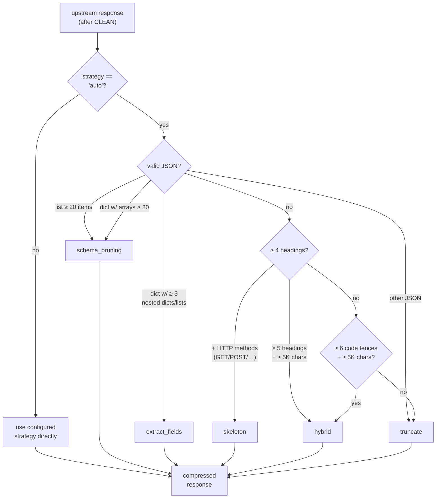
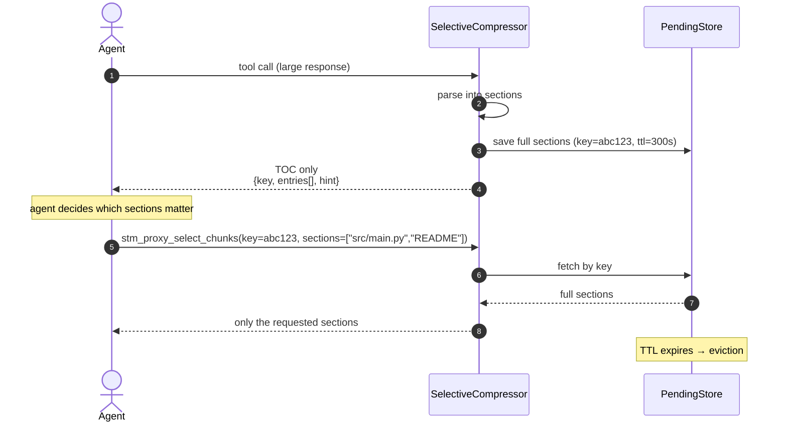
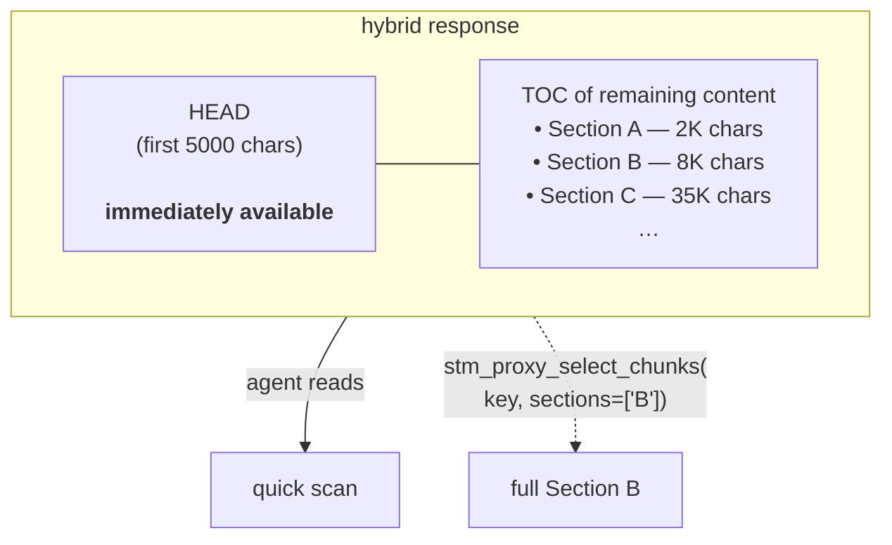
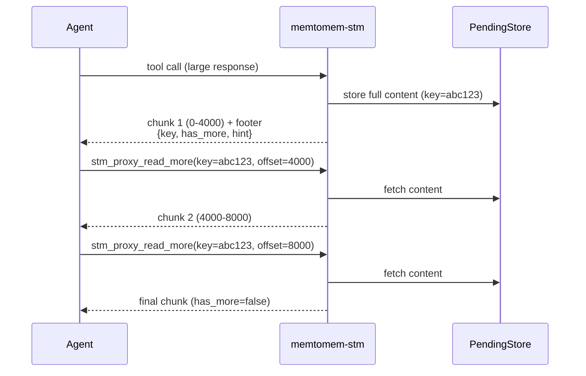
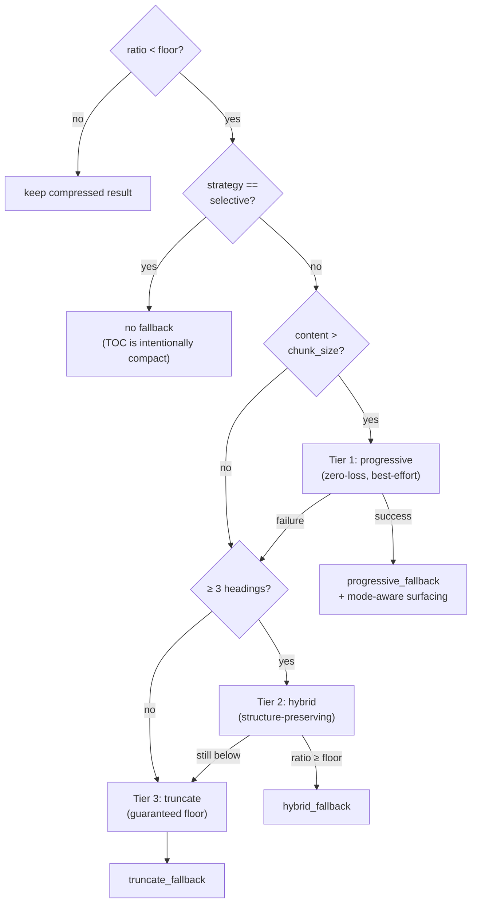

# Compression Strategies

For file-backed settings, see the
[Proxy Configuration Reference](reference/proxy-config.md). For operational
diagnostics and tuning, see [Operations](guides/operations.md).

memtomem-stm has 10 compression strategies. The CLI's `--compression` flag exposes 5 of them (`auto`, `none`, `truncate`, `selective`, `hybrid`); the remaining five are selected via the config file. The default is `auto`, which lets `auto_select_strategy()` pick per response.



> **Note**: `progressive`, `llm_summary`, and `selective` are **never** chosen by `auto` — they're opt-in only because they change the agent interaction pattern (progressive needs `stm_proxy_read_more`; selective needs `stm_proxy_select_chunks`; `llm_summary` adds external API latency).

| Strategy | Best for | Description |
|----------|----------|-------------|
| **auto** (default) | All responses | Content-aware: picks the best strategy per response based on content type |
| **hybrid** | Large structured docs | Preserves first ~5K chars + TOC for the remainder |
| **selective** | Large structured data | 2-phase: returns TOC only, then retrieve selected sections on demand |
| **truncate** | Simple limiting | Section-aware for markdown (minimum representation for ALL sections, then enriches by relevance); query-aware budget allocation when `_context_query` is provided |
| **extract_fields** | JSON configs | Preserves all top-level keys with nested structure + first values |
| **schema_pruning** | Large JSON arrays | Recursive pruning: first 2 + last 1 items sampled per array |
| **skeleton** | API docs | All headings + first content line per section |
| **progressive** | Large any-type content | Zero information loss: stores full content, delivers in chunks on demand via `stm_proxy_read_more` |
| **llm_summary** | High-value content | Calls an external LLM (OpenAI / Anthropic / Ollama) to summarize |
| **none** | Passthrough | No compression (cache only) |

JSON-aware tiers emit strict JSON after compression. If Python parses upstream
extension tokens such as `NaN`, `Infinity`, or `-Infinity`, STM maps those
non-finite numeric values to `null` before any tier re-serializes the payload.
Responses that already fit the budget still pass through unchanged.

## Selective Compression (2-phase)

**Phase 1** — STM parses the response into sections and returns a compact TOC:

```json
{
  "type": "toc",
  "selection_key": "abc123def456",
  "format": "json",
  "total_chars": 50000,
  "ttl_seconds_remaining": 300,
  "entries": [
    {"key": "README", "type": "heading", "size": 200, "preview": "..."},
    {"key": "src/main.py", "type": "heading", "size": 5000, "preview": "..."}
  ],
  "hint": "Call stm_proxy_select_chunks(key='abc123def456', sections=[...]) to retrieve."
}
```

The `ttl_seconds_remaining` field tells the agent how many seconds it has to retrieve sections before the stored content expires. Each call to `stm_proxy_select_chunks` resets the TTL.

When `compression` resolves to `selective` — set on the tool, on the server, or through a global `default_compression` the server does not override — the proxied tool description includes a convention suffix (`| TOC response: use stm_proxy_select_chunks`) so the agent knows to expect a TOC and which tool to call. The suffix is part of the advertised description and is budgeted with it: under a `max_description_chars` too small to hold it — below 54 for this suffix — it is dropped whole rather than cut. See [Advertised tool descriptions](reference/proxy-config.md#advertised-tool-descriptions).

The TOC is budget-aware on the standalone SELECTIVE path. When the full
80-character previews would exceed `max_chars`, STM shrinks only the per-entry
preview cap and keeps every entry listed so all sections remain retrievable by
key. At very high section counts, the zero-preview TOC envelope can still exceed
the budget; entries are not dropped because that would break the two-phase
selection contract.

**Phase 2** — Agent calls `stm_proxy_select_chunks` to retrieve only the sections it needs.



Auto-detects format: JSON dicts (parsed by keys), JSON arrays (parsed by index), Markdown (parsed by headings), plain text (parsed by paragraphs).

Pending selections are stored for 5 minutes (max 100 concurrent), then auto-evicted. For multi-instance deployments, switch to SQLite-backed pending storage via the `PendingStore` protocol.

## Hybrid Compression

Combines immediate access with selective retrieval:



Configurable per server:

```json
{
  "upstream_servers": {
    "docs": {
      "prefix": "docs",
      "compression": "hybrid",
      "hybrid": {
        "head_chars": 5000,
        "tail_mode": "toc",
        "head_ratio": 0.6,
        "min_toc_budget": 200,
        "min_head_chars": 100
      }
    }
  }
}
```

| Field | Default | Description |
|-------|---------|-------------|
| `head_chars` | 5000 | Target characters for the preserved head section |
| `tail_mode` | `"toc"` | How to compress the tail (`"toc"` or `"truncate"`) |
| `head_ratio` | 0.6 | Fraction of budget allocated to head when total budget is tight |
| `min_toc_budget` | 200 | Minimum characters reserved for the tail TOC/truncation |
| `min_head_chars` | 100 | Absolute minimum head size — if the budget can't fit this, falls back to truncate |

If the assembled head plus TOC tail exceeds the configured budget, Hybrid first
tries to fit the TOC tail structurally so any surviving JSON envelope remains
parseable. If no valid fitted TOC can be produced, it falls back to whole-response
truncation instead of raw-slicing the TOC mid-object.

With `tail_mode: "toc"` the proxied tool description also carries a convention
suffix (`| Head+TOC: use stm_proxy_select_chunks`), since the response can
require retrieval just as the selective path does — however `hybrid` was
*configured*, including through a global `default_compression`. (`auto`
resolving to hybrid at runtime is not configuration and carries no suffix; see
[Advertised tool descriptions](reference/proxy-config.md#advertised-tool-descriptions).)
`tail_mode: "truncate"` gets
no suffix — that response is self-contained. As on the other paths the suffix is
budgeted with the description and dropped whole under a cap too small to hold
it; see [Advertised tool
descriptions](reference/proxy-config.md#advertised-tool-descriptions).

## Progressive Delivery (cursor-based)

Inspired by how Claude Code reads files progressively (150 lines at a time), progressive delivery stores the full cleaned content and delivers it in chunks on demand — **zero information loss**.



The first chunk includes a metadata footer with remaining headings/structure hints and a `ttl` field so the agent can decide whether to continue reading and how urgently:

```
---
[progressive: chars=0-4000/50000 | remaining=46000 | has_more=True | ttl=1800s]
[Remaining: "Configuration", "API Reference", ...]
[-> stm_proxy_read_more(key="abc123", offset=4000)]
```

Each call to `stm_proxy_read_more` resets the TTL. The `ttl` field is omitted on the last chunk (`has_more=False`).

| Feature | Selective | Progressive |
|---------|-----------|-------------|
| Access pattern | By name (random) | By offset (sequential) |
| Requires structure | Yes (headings/JSON keys) | No (any content) |
| Information loss | None (section-level) | None (full content) |
| Use case | "Show me the Config section" | "Read through this file" |

```json
{
  "upstream_servers": {
    "docs": {
      "prefix": "docs",
      "compression": "progressive",
      "progressive": {
        "chunk_size": 4000,
        "max_stored": 200,
        "ttl_seconds": 1800,
        "include_structure_hint": true
      }
    }
  }
}
```

The `progressive` block is **optional**: setting `"compression": "progressive"` without it applies the defaults shown above (`chunk_size` 4000, `max_stored` 200, `ttl_seconds` 1800, `include_structure_hint` true).

Progressive is **opt-in only** — `auto` strategy never selects it because it changes the agent interaction pattern (requires calling `stm_proxy_read_more`). When it is selected — on the tool, on the server, or through a global `default_compression` — the proxied tool description includes a convention suffix (`| Chunked: use stm_proxy_read_more for more`) so the agent knows to expect chunked delivery. Like the selective suffix, it is budgeted with the description and dropped whole under a cap too small to hold it — see [Advertised tool descriptions](reference/proxy-config.md#advertised-tool-descriptions).

> **Note**: Memory surfacing (Stage 3) on progressive delivery is **mode-aware**. It runs on the first chunk when `injection_mode` is `append` or `section` — both modes preserve the `PROGRESSIVE_FOOTER_TOKEN` concat invariant that `stm_proxy_read_more` relies on. It is **skipped only for `prepend`**, which would shift character offsets for subsequent `stm_proxy_read_more` calls.

## Progressive Fallback Ladder

When the compression ratio guard detects that a strategy cut below the dynamic retention floor (`min_result_retention`), it uses a three-tier fallback ladder:



**Tier 1 — Progressive (zero-loss)**: Stores the full cleaned content and returns the first chunk with `stm_proxy_read_more` instructions and TTL. The agent can retrieve remaining content on demand. Only attempted when content exceeds `chunk_size` (default 4000 chars) — smaller content fits in one chunk and progressive adds no value.

**Tier 2 — Hybrid (structure-preserving)**: Applies `HybridCompressor` (head + TOC) at the effective budget. Fires when content has ≥ 3 markdown headings but is too small for progressive chunking. Preserves document structure (head section + table of contents) instead of a blunt truncation. If the hybrid output still falls below the retention floor, falls through to Tier 3.

**Tier 3 — Truncate (guaranteed floor)**: Falls back to boundary-aware `TruncateCompressor` at the effective budget. This is lossy but immediate, and always succeeds. Fires when progressive and hybrid aren't applicable or fail.

The metrics `compression_strategy` field records the full transition path (e.g. `"hybrid→progressive_fallback"`, `"truncate→hybrid_fallback"`, or `"skeleton→truncate_fallback"`) so the three tiers can be audited independently via SQL.

### Per-tool retention floor

By default, the retention floor scales dynamically with response size (< 1KB → 90%, < 3KB → 75%, < 10KB → 65%, else → `min_result_retention`). You can override this per server or per tool:

```json
{
  "upstream_servers": {
    "docs": {
      "prefix": "docs",
      "retention_floor": 0.5,
      "tool_overrides": {
        "get_page": { "retention_floor": 0.4 }
      }
    }
  }
}
```

The auto-tuner (`stm_tuning_recommendations`) can recommend `retention_floor` adjustments based on observed violation patterns.

## LLM Compression

Routes through an external LLM for intelligent summarization:

```json
{
  "upstream_servers": {
    "docs": {
      "prefix": "docs",
      "compression": "llm_summary",
      "llm": {
        "provider": "openai",
        "model": "gpt-4.1-mini",
        "api_key": "sk-...",
        "base_url": "",
        "max_tokens": 500,
        "llm_timeout_seconds": 60.0,
        "privacy_scan_enabled": true,
        "system_prompt": "Summarize concisely, preserving key information. Under {max_chars} chars."
      }
    }
  }
}
```

Providers: `openai`, `anthropic`, `ollama`. `base_url` (default `""`) overrides the provider endpoint — required to point `ollama` at a non-default host, and how OpenAI/Anthropic get aimed at a compatible gateway. `llm_timeout_seconds` (default 60.0) bounds the per-call LLM wait. On timeout, privacy-pattern hit, circuit-breaker open, or any other API failure, compression falls back to `TruncateCompressor` and records the strategy as `llm_summary→{timeout,privacy,circuit_breaker,llm_error}_fallback` in `proxy_metrics` for observability. A successful call whose summary still exceeds `max_chars` is clamped by the same truncation and recorded as `llm_summary→llm_overlength_fallback` — the model overshot the length instruction; the endpoint is fine, so the circuit breaker is unaffected.

### Local Ollama setup

Install Ollama using its [official platform guide](https://docs.ollama.com/quickstart), then make sure the local API is running. The macOS and Windows apps normally start it for you; otherwise run:

```bash
ollama serve
```

Pull only the models needed by the features you enable:

```bash
# relevance_scorer.scorer="embedding"
ollama pull nomic-embed-text

# example model for llm_summary compression
ollama pull qwen3:4b
```

LLM compression has no implicit Ollama configuration. Select it explicitly and name the model you pulled:

```json
{
  "upstream_servers": {
    "docs": {
      "prefix": "docs",
      "compression": "llm_summary",
      "llm": {
        "provider": "ollama",
        "model": "qwen3:4b",
        "base_url": "http://localhost:11434"
      }
    }
  }
}
```

Verify the read-only model inventory, then run the complete setup verdict:

```bash
curl http://localhost:11434/api/tags
mms doctor
```

`mms doctor` reads `/api/tags` only when an effective config enables the embedding scorer or Ollama-backed `llm_summary`. It never runs inference or pulls models. A dead endpoint or missing configured model is a `FAIL`. For a remote Ollama server, set the relevant `embedding_base_url` or `llm.base_url`, and run `ollama pull` on that remote host rather than on the STM machine.

> **`api_key` is validated eagerly.** Every `llm` block in the config is validated when the config loads — for `provider: openai` / `anthropic`, a missing `api_key` (and missing `OPENAI_API_KEY` / `ANTHROPIC_API_KEY` env var) fails the load even if nothing currently selects the `llm_summary` strategy. The same rule applies to the reserved extraction block used by custom `ProxyManager(index_engine=...)` integrations. This keeps startup fail-fast for configurations that do use an LLM. Don't leave placeholder `llm` blocks you aren't using — remove them, or point them at `provider: ollama` (no key required).

Credential-bearing content (API keys, passwords, provider tokens, JWTs, private keys) is auto-detected and **never** sent to external LLMs — falls back to local truncation. This scan is governed by `privacy_scan_enabled` (default `true`); an operator who flips `compression: llm_summary` gets the protection without remembering a second knob. Email addresses alone do **not** trigger this fallback: they appear in ordinary compressible content (git logs, issue threads, contact pages), and routing on them silently degraded the chosen strategy to truncation. Emails remain protected where storage is at stake — surfacing query persistence hashes any query matching the full sensitive set (credentials *and* emails) before it reaches disk.

> **Disabling the scan (`privacy_scan_enabled: false`) sends raw upstream responses to the LLM provider unscanned.** Set it off only when the response body is known to be sensitive-free, or for a self-hosted provider you trust (e.g. local Ollama). To catch an accidental flip, `ProxyManager.start()` logs a startup **WARNING** naming each enabled LLM site (compression and, in library mode, extraction) and the destination when the scan is off — but only for **external** destinations: OpenAI/Anthropic always qualify, Ollama only on a non-loopback `base_url`, so the common local-Ollama-with-scan-off setup stays silent (`is_external_destination()`, #610). Only an explicit `compression: llm_summary` is flagged, not `auto` (which resolves at runtime).

`LLMCompressor` holds a single `httpx.AsyncClient` for the life of the instance. `ProxyManager` caches one compressor per active `llm` config and swaps it (awaiting `close()` on the old one) whenever the config changes at runtime, so integrators generally do not need to manage it directly. If you construct an `LLMCompressor` standalone, `await compressor.close()` before discarding it to release the client.

## Query-Aware Compression

When an agent provides `_context_query` in tool arguments, compression allocates budget proportionally to section relevance instead of fixed top-down order. This preserves more information from query-relevant sections.

```json
{
  "relevance_scorer": {
    "scorer": "bm25",
    "embedding_provider": "ollama",
    "embedding_model": "nomic-embed-text",
    "embedding_base_url": "http://localhost:11434",
    "embedding_timeout": 10.0
  }
}
```

| Scorer | Latency | Cross-language | Dependencies |
|--------|---------|----------------|--------------|
| `bm25` (default) | <1ms | No | None |
| `embedding` | 5-50ms | Yes | Ollama / OpenAI |

`RelevanceScorer` protocol (`proxy/relevance.py`) enables custom scorer implementations. `EmbeddingScorer` uses sync httpx to call embedding APIs with automatic BM25 fallback on error.

> **OpenAI provider requires `OPENAI_API_KEY`.** When `embedding_provider: "openai"`, `EmbeddingScorer` reads the API key from the `OPENAI_API_KEY` environment variable. Missing or empty keys produce HTTP 401 from the OpenAI endpoint and trigger the BM25 fallback. Ollama (the default) needs no key.

## Per-Server and Per-Tool Overrides

```json
{
  "upstream_servers": {
    "github": {
      "prefix": "gh",
      "compression": "hybrid",
      "max_result_chars": 16000,
      "tool_overrides": {
        "search_code": {
          "compression": "selective",
          "max_result_chars": 8000
        },
        "get_file_contents": {
          "compression": "none"
        }
      }
    }
  }
}
```

## Model-Aware Ceilings

`consumer_model` applies conservative, one-directional ceilings. It can reduce
an effective budget for a known small-context model, but it never raises an
explicitly configured limit and does not choose a strategy or context window.

```bash
export MEMTOMEM_STM_PROXY__CONSUMER_MODEL=claude-sonnet-4
```

| Setting | Known model at ≤32K | Known model above 32K | Unknown or unset model |
|---------|---------------------|-----------------------|------------------------|
| Proxy `max_result_chars` | `min(context_tokens × context_budget_ratio × chars_per_token, configured default_max_result_chars)` | Same formula and configured ceiling | Configured `default_max_result_chars` |
| Surfacing `max_injection_chars` | `min(configured value, 1500)` | Configured value | Configured value |
| Surfacing `max_results` | `min(configured value, 2)` | Configured value | Configured value |
| `context_window_size` | Configured value | Configured value | Configured value |
| Compression strategy | Configured/content-selected value | Configured/content-selected value | Configured/content-selected value |

With the defaults (`context_budget_ratio=0.05`, `chars_per_token=3.5`, and a
16,000-character configured ceiling), a known 32K model gets a proxy budget of
5,600 characters. A 200K model remains capped at 16,000. A zero calculated
model budget falls back to the configured ceiling rather than suppressing the
response.

Model names are prefix-matched against the runtime registry, so a dated name
such as `claude-sonnet-4-20250514` can match its base entry. The proxy-level
`consumer_model` propagates to surfacing only when surfacing has no explicit
consumer model of its own.
