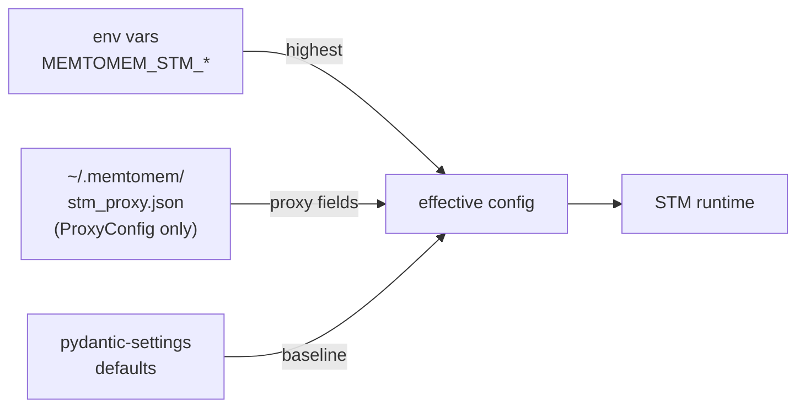

# Configuration Reference

## Choose a reference

- [Environment variables](reference/environment-variables.md): root,
  surfacing, formation, hook, daemon, Langfuse, and OTLP settings
- [Proxy JSON](reference/proxy-config.md): upstreams, compression, cache,
  telemetry, exposure, and toolgraph
- [Surfacing behavior](surfacing.md): retrieval gates, feedback, tuning, and
  diagnostics
- [Compression behavior](compression.md): strategy selection and fallback

This page retains the detailed legacy sections and anchors used by existing
links. The split references above are the faster entrypoints for new readers.

> **Configuration-source boundary:** `stm_proxy.json` is parsed strictly as a
> `ProxyConfig`. Root, surfacing, formation, hook, daemon, Langfuse, and OTLP
> settings are
> environment/default-only; adding those blocks to the JSON file has no
> effect. The proxy `consumer_model` propagation into surfacing budget
> resolution is the documented exception.

memtomem-stm combines two configuration domains:



1. **Environment variables** — root/process settings and all surfacing,
   formation, hook, daemon, Langfuse, and OTLP settings; proxy fields can also
   be overridden here.
2. **Config file** — `~/.memtomem/stm_proxy.json`, parsed as `ProxyConfig`
   only and hot-reloaded for supported fields.
3. **Defaults** — baseline values for both domains.

Layering applies per field, including inside an upstream server: setting
`MEMTOMEM_STM_PROXY__UPSTREAM_SERVERS__<NAME>__<FIELD>` overrides that one
field and the file supplies the rest of the server. See the
[environment variable reference](reference/environment-variables.md) for how
`<NAME>` is matched.

For most quick-start scenarios you can ignore the config file entirely and use the [CLI](cli.md) (`mms add ...`) plus a few env vars.

## Environment Variables

All settings use the `MEMTOMEM_STM_` prefix with `__` for nesting.

### General

```bash
export MEMTOMEM_STM_DATA_DIR=~/.memtomem  # daemon handshakes, ownership locks, detached log
export MEMTOMEM_STM_LOG_LEVEL=WARNING   # DEBUG | INFO | WARNING | ERROR | CRITICAL
```

Controls `logging.basicConfig()` level for all `memtomem_stm.*`
loggers.  Default `WARNING`.  Read once at startup — restart to
apply changes.

```bash
export MEMTOMEM_STM_LOG_FILE=~/.memtomem/stm.log   # opt-in rotating file log
```

Adds a rotating file handler alongside stderr (the server otherwise
logs to stderr only, which an MCP client captures or drops). File
created `0o600`, parent dir `0o700`; rotates at 2 MiB with 3 backups.
Unset (default) keeps stderr-only logging. `mms health` prints where a
newly started server would log (the configured, probed destination —
not the running server's live handler) and flags a configured path that
isn't writable. A path that can't be opened degrades to a stderr
warning, not a crash.

```bash
export MEMTOMEM_STM_ADVERTISE_OBSERVABILITY_TOOLS=true   # opt in
```

When unset or `false`, hides STM's eight observability / admin tools
(`stm_proxy_stats`, `stm_proxy_health`, `stm_proxy_cache_clear`,
`stm_surfacing_stats`, `stm_selection_stats`,
`stm_compression_stats`, `stm_progressive_stats`,
`stm_tuning_recommendations`) from the MCP
`tools/list` surface so eager-loading clients (e.g. OpenAI Codex CLI)
don't pay schema tokens for tools the model rarely calls. Hidden admin
tools are not registered with the MCP server while the flag is unset or
`false`.  The four model-facing tools
(`stm_proxy_read_more`, `stm_proxy_select_chunks`,
`stm_surfacing_feedback`, `stm_compression_feedback`) stay advertised
regardless.  Set this flag to `true` to advertise the admin tools over
MCP again.  Read once at import — restart to apply changes.  Claude Code
defers MCP tool schemas via its own `ToolSearch` mechanism so this flag
has no practical effect there; it's primarily useful for eager-loading
clients that lack a per-server `disabled_tools` filter of their own.

### Proxy

```bash
export MEMTOMEM_STM_PROXY__ENABLED=true
export MEMTOMEM_STM_PROXY__DEFAULT_COMPRESSION=auto
export MEMTOMEM_STM_PROXY__DEFAULT_MAX_RESULT_CHARS=16000
export MEMTOMEM_STM_PROXY__MAX_UPSTREAM_CHARS=10000000   # OOM guard before compression
export MEMTOMEM_STM_PROXY__MIN_RESULT_RETENTION=0.65
export MEMTOMEM_STM_PROXY__CONSUMER_MODEL=claude-sonnet-4
export MEMTOMEM_STM_PROXY__CONTEXT_BUDGET_RATIO=0.05
export MEMTOMEM_STM_PROXY__CHARS_PER_TOKEN=3.5
export MEMTOMEM_STM_PROXY__MAX_DESCRIPTION_CHARS=200
export MEMTOMEM_STM_PROXY__STRIP_SCHEMA_DESCRIPTIONS=false
export MEMTOMEM_STM_PROXY__LOCK_TIMEOUT_SECONDS=30.0
export MEMTOMEM_STM_PROXY__CACHE__ENABLED=true
export MEMTOMEM_STM_PROXY__CACHE__DEFAULT_TTL_SECONDS=3600
export MEMTOMEM_STM_PROXY__CACHE__DB_PATH=~/.memtomem/proxy_cache.db
export MEMTOMEM_STM_PROXY__CACHE__MAX_ENTRIES=10000
export MEMTOMEM_STM_PROXY__METRICS__ENABLED=true
export MEMTOMEM_STM_PROXY__METRICS__DB_PATH=~/.memtomem/proxy_metrics.db
export MEMTOMEM_STM_PROXY__METRICS__MAX_HISTORY=10000
export MEMTOMEM_STM_PROXY__PROGRESSIVE_READS__ENABLED=true
export MEMTOMEM_STM_PROXY__PROGRESSIVE_READS__DB_PATH=~/.memtomem/stm_feedback.db

# Relevance scorer (query-aware compression)
export MEMTOMEM_STM_PROXY__RELEVANCE_SCORER__SCORER=bm25           # "bm25" or "embedding"
export MEMTOMEM_STM_PROXY__RELEVANCE_SCORER__EMBEDDING_PROVIDER=ollama
export MEMTOMEM_STM_PROXY__RELEVANCE_SCORER__EMBEDDING_MODEL=nomic-embed-text
export MEMTOMEM_STM_PROXY__RELEVANCE_SCORER__EMBEDDING_BASE_URL=http://localhost:11434

# Required when embedding_provider="openai" — the scorer reads this from the
# environment and falls back to BM25 with an HTTP 401 if missing.
export OPENAI_API_KEY=sk-...

# Compression feedback (learning signal for auto-tuner)
export MEMTOMEM_STM_PROXY__COMPRESSION_FEEDBACK__ENABLED=true
export MEMTOMEM_STM_PROXY__COMPRESSION_FEEDBACK__DB_PATH=~/.memtomem/stm_feedback.db
```

### Surfacing

```bash
export MEMTOMEM_STM_SURFACING__ENABLED=true
export MEMTOMEM_STM_SURFACING__USE_DAEMON=false          # true = share daemon LTM across standalone mms processes
export MEMTOMEM_STM_SURFACING__WARMUP_ENABLED=true          # background LTM warm-up at startup (#664); false = lazy-only first-use start
export MEMTOMEM_STM_SURFACING__MIN_SCORE=0.03
export MEMTOMEM_STM_SURFACING__MAX_RESULTS=3
export MEMTOMEM_STM_SURFACING__MIN_RESPONSE_CHARS=5000
export MEMTOMEM_STM_SURFACING__TIMEOUT_SECONDS=3.0         # cold-start escape hatch: raise past the LTM child's model-load time (#664)
export MEMTOMEM_STM_SURFACING__RERANK=false                # per-call core rerank: false = bypass (default), true = force, none = server config decides; sent only when the core advertises it (core #1766)
export MEMTOMEM_STM_SURFACING__FEEDBACK_ENABLED=true
export MEMTOMEM_STM_SURFACING__AUTO_TUNE_ENABLED=true
export MEMTOMEM_STM_SURFACING__AUTO_TUNE_SCORE_FLOOR=0.005
export MEMTOMEM_STM_SURFACING__AUTO_TUNE_SCORE_CEILING=0.05
export MEMTOMEM_STM_SURFACING__CONTEXT_TOOLS='{}'          # per-tool query templates / fixed min_score
export MEMTOMEM_STM_SURFACING__CONTEXT_WINDOW_SIZE=0       # 0=disabled; >0 expands ±N adjacent chunks
export MEMTOMEM_STM_SURFACING__CONSUMER_MODEL=claude-sonnet-4  # auto-scales max_results + max_injection_chars
export MEMTOMEM_STM_SURFACING__DEDUP_TTL_SECONDS=604800    # 7 days; 0 to disable cross-session dedup
export MEMTOMEM_STM_SURFACING__FEEDBACK_DB_PATH=~/.memtomem/stm_feedback.db

# LTM connection (transport/command are defaults; ltm_mcp_args defaults to [] — value below is an illustrative override)
export MEMTOMEM_STM_SURFACING__LTM_MCP_TRANSPORT=stdio
export MEMTOMEM_STM_SURFACING__LTM_MCP_COMMAND=memtomem-server
export MEMTOMEM_STM_SURFACING__LTM_MCP_ARGS='["--config","/etc/memtomem.json"]'

# Network LTM service instead of stdio
export MEMTOMEM_STM_SURFACING__LTM_MCP_TRANSPORT=streamable_http
export MEMTOMEM_STM_SURFACING__LTM_MCP_URL=https://ltm.example/mcp
export MEMTOMEM_STM_SURFACING__LTM_MCP_HEADERS='{"Authorization":"Bearer ..."}'
```

See [Surfacing → Surfacing Controls](surfacing.md#surfacing-controls) for the complete table of fields and defaults.

### PostToolUse Hook

`mms hook` bridges built-in `PostToolUse` events into STM surfacing, available
for Claude Code, Codex CLI, Cursor, and Kimi Code (`mms hook --host <name>`
at runtime, or `mms hook install --host <name>` to register it with a host —
see [docs/cli.md](cli.md#mms-hook--built-in-tool-bridge--per-host-registration)).
It is independent of the MCP proxy path and is configured with
`MEMTOMEM_STM_HOOK__*`.

```bash
export MEMTOMEM_STM_HOOK__USE_DAEMON=true              # default: warm daemon path
export MEMTOMEM_STM_HOOK__COMPRESSION__MIN_RETENTION=0.65 # passthrough below 65%
export MEMTOMEM_STM_DAEMON__MAX_PENDING_REQUESTS=32    # bounded shared surfacing queue
export MEMTOMEM_STM_HOOK__DAEMON_TIMEOUT_SECONDS=2.5
export MEMTOMEM_STM_HOOK__FALLBACK=skip                # skip | cold
export MEMTOMEM_STM_HOOK__AUTO_SPAWN=true
export MEMTOMEM_STM_HOOK__METRICS_ENABLED=true          # size/timing-only rows; inspect with mms stats --source hook
export MEMTOMEM_STM_HOOK__RECORD_FEEDBACK_EVENTS=false # rating prompt / feedback loop off by default; telemetry event rows are still recorded (digest query)

# Built-in Bash stdout compression is opt-in, separate from surfacing, and
# Claude Code only — native output replacement ports to no other host. Unsafe
# or failed results and replacements retaining under 65% of the original are
# passed through unchanged.
# With defaults, replacement is therefore possible only while the compressed
# result is at least 65% of the original: approximately 16,000-24,615 chars.
# Larger output intentionally passes through because native hooks have no
# lossless `read_more` retrieval channel.
export MEMTOMEM_STM_HOOK__COMPRESSION__ENABLED=false
export MEMTOMEM_STM_HOOK__COMPRESSION__MAX_CHARS=16000

# Direct-read allowlist knob; comma-separated *canonical* tool names
# (read,grep,glob,shell,web_fetch,write,edit), not a host's native spelling.
# Each host adapter maps its native names (Claude Read/Bash) to these, so one
# allowlist works across hosts.
export MEMTOMEM_STM_HOOK_SURFACE_TOOLS=read,grep,glob,shell
```

`fallback=skip` returns `{}` immediately when the daemon is unavailable.
`fallback=cold` runs the older in-process path, which can pay LTM startup cost
inside the hook call. Surfacing (LTM context injection for read-like
built-ins) is the only capability that ports to non-Claude hosts, and each
host carries its own runtime caveat — see
[docs/cli.md → `mms hook install`](cli.md#install--uninstall--per-host-registration)
for the current per-host status. Hook compression only targets Claude Code's
Bash stdout so later `Edit` operations are not broken by replacing file
reads.

### Surfacing Daemon

`mms daemon` keeps a local LTM connection warm for `mms hook` and, when
`MEMTOMEM_STM_SURFACING__USE_DAEMON=true`, standalone proxy surfacing. The
standalone default remains a private direct adapter. Shared mode auto-spawns a
missing daemon, passes the current call through unchanged until ready, and
never falls back to a private LTM child.

```bash
export MEMTOMEM_STM_DAEMON__HOST=127.0.0.1
export MEMTOMEM_STM_DAEMON__IDLE_TIMEOUT_SECONDS=900
export MEMTOMEM_STM_DAEMON__ALLOW_NON_LOOPBACK=false     # escape hatch, see below
```

The daemon binds loopback and authenticates requests with a per-start token,
not network ACLs. A non-loopback `host` (including `0.0.0.0` and `""`, which
bind every interface) is rejected at config load unless
`allow_non_loopback=true` is set — see [SECURITY.md](../SECURITY.md) for the
rationale. `idle_timeout_seconds=0` pins the daemon until explicitly stopped.

### Langfuse Tracing (optional)

```bash
pip install "memtomem-stm[langfuse]"
# or with uv:
uv pip install "memtomem-stm[langfuse]"

export MEMTOMEM_STM_LANGFUSE__ENABLED=true
export MEMTOMEM_STM_LANGFUSE__PUBLIC_KEY=pk-lf-...
export MEMTOMEM_STM_LANGFUSE__SECRET_KEY=sk-lf-...
export MEMTOMEM_STM_LANGFUSE__HOST=https://cloud.langfuse.com   # or http://localhost:3000 for self-hosted
export MEMTOMEM_STM_LANGFUSE__SAMPLING_RATE=1.0                # 0.0–1.0, fraction of calls to trace
```

When enabled, every proxy tool invocation is wrapped in a `proxy_call` Langfuse
observation with nested clean, compress, and surface spans. A custom library
integration that supplies `ProxyManager(index_engine=...)` can additionally emit
an index span; the bundled `mms` server does not wire that stage.

Setting `MEMTOMEM_STM_LANGFUSE__ENABLED=true` without first installing the `[langfuse]` extra raises a `ValueError` at startup (fail-fast since v0.1.16) — install the extra first, or leave `enabled=false` / unset. The old silent-disable-with-WARNING behavior is gone, so a typo in your config no longer leaves tracing quietly off.

### OTLP Span Export (optional)

```bash
pip install "memtomem-stm[otlp]"
# or with uv:
uv pip install "memtomem-stm[otlp]"

export MEMTOMEM_STM_OTLP__ENABLED=true
export MEMTOMEM_STM_OTLP__ENDPOINT=http://localhost:4318   # or a full .../v1/traces URL
export MEMTOMEM_STM_OTLP__SAMPLING_RATE=1.0                # 0.0–1.0
export MEMTOMEM_STM_OTLP__FLUSH_TIMEOUT_SECONDS=5          # whole-shutdown budget
```

Exports STM's spans over OTLP/HTTP to any OpenTelemetry collector, with real
trace/span ids and real parentage (`proxy_call` → `upstream_rpc` and the
pipeline stages). Attributes are body-free by construction: no response
content, no error messages, no tool arguments.
Independent of Langfuse — both can run at once. Same fail-fast contract as
above: `ENABLED=true` without the extra, or with a malformed endpoint, raises
at startup. Full key list, attribute vocabulary and degradation policy:
[otlp-export.md](otlp-export.md).

## Config File: `~/.memtomem/stm_proxy.json`

Representative configuration (see the linked reference for omitted fields):

```json
{
  "enabled": true,
  "default_max_result_chars": 16000,
  "default_compression": "auto",
  "max_upstream_chars": 10000000,
  "min_result_retention": 0.65,
  "consumer_model": "",
  "context_budget_ratio": 0.05,
  "chars_per_token": 3.5,
  "max_description_chars": 200,
  "strip_schema_descriptions": false,
  "lock_timeout_seconds": 30.0,
  "upstream_servers": {
    "filesystem": {
      "command": "npx",
      "args": ["-y", "@modelcontextprotocol/server-filesystem", "/home/user"],
      "prefix": "fs",
      "transport": "stdio",
      "compression": "auto",
      "max_result_chars": 8000,
      "retention_floor": null,
      "max_retries": 3,
      "reconnect_delay_seconds": 1.0,
      "max_reconnect_delay_seconds": 30.0,
      "connect_timeout_seconds": 30.0,
      "call_timeout_seconds": 90.0,
      "overall_deadline_seconds": 180.0,
      "circuit_max_failures": 3,
      "circuit_reset_seconds": 60.0,
      "max_description_chars": 200,
      "strip_schema_descriptions": false,
      "cleaning": {
        "strip_html": true,
        "deduplicate": true,
        "collapse_links": true
      },
      "selective": {
        "json_depth": 1,
        "min_section_chars": 50,
        "max_pending": 100,
        "pending_ttl_seconds": 300,
        "pending_store": "memory",
        "pending_store_path": "~/.memtomem/pending_selections.db"
      },
      "hybrid": {
        "head_chars": 5000,
        "tail_mode": "toc",
        "head_ratio": 0.6
      },
      "progressive": {
        "chunk_size": 4000,
        "max_stored": 200,
        "ttl_seconds": 1800
      },
      "tool_overrides": {
        "read_file": {
          "description_override": "Read a file through the STM proxy",
          "compression": "progressive",
          "retention_floor": 0.5
        },
        "internal_debug": {
          "hidden": true
        }
      }
    },
    "github": {
      "command": "npx",
      "args": ["-y", "@modelcontextprotocol/server-github"],
      "prefix": "gh",
      "env": { "GITHUB_TOKEN": "ghp_xxx" },
      "compression": "auto",
      "max_result_chars": 16000,
      "tool_overrides": {
        "search_code": {
          "compression": "selective",
          "max_result_chars": 8000
        },
        "delete_repository": {
          "expose_in_profiles": ["explore"]
        }
      }
    }
  },
  "cache": {
    "enabled": true,
    "db_path": "~/.memtomem/proxy_cache.db",
    "default_ttl_seconds": 3600,
    "max_entries": 10000,
    "tool_annotation_policy": "conservative"
  },
  "relevance_scorer": {
    "scorer": "bm25",
    "embedding_provider": "ollama",
    "embedding_model": "nomic-embed-text",
    "embedding_base_url": null,
    "embedding_timeout": 10.0
  },
  "metrics": {
    "enabled": true,
    "max_history": 10000
  },
  "compression_feedback": {
    "enabled": true,
    "db_path": "~/.memtomem/stm_feedback.db",
    "retention_days": 90
  },
  "progressive_reads": {
    "enabled": true,
    "db_path": "~/.memtomem/stm_feedback.db",
    "retention_days": 90
  },
  "selection_telemetry": {
    "enabled": false,
    "path": "~/.memtomem/stm_selection_log.jsonl",
    "sample_rate": 1.0,
    "max_bytes": 50000000,
    "max_backups": 3
  },
  "tool_relevance": {
    "enabled": true,
    "top_n": 20
  },
  "exposure": {
    "profile": "strict",
    "health_window_hours": 24.0,
    "health_min_calls": 5,
    "health_error_rate_threshold": 0.95,
    "review_risk_penalty": 0.5
  },
  "toolgraph": {
    "enabled": false,
    "source": "stdio",
    "bundle_path": "~/.memtomem/toolgraph/policy-bundle.json",
    "command": "toolgraph",
    "args": ["serve"],
    "env": null,
    "agent_id": "stm-proxy",
    "server_name_map": {},
    "query_profile": "strict",
    "on_unreachable": "open",
    "on_agent_not_found": "fail_start",
    "on_protocol_error": "fail_start",
    "on_tool_not_found": "open",
    "risk_penalty_scale": 1.0,
    "timeout_seconds": 5.0,
    "consult_cache_enabled": true,
    "consult_cache_path": "~/.memtomem/toolgraph_consult.db",
    "consult_cache_max_scopes": 64
  }
}
```

The `auto_index` and `extraction` keys are reserved and unsupported by the
bundled mms server. They remain accepted for compatibility and are meaningful
only to custom embedders that construct `ProxyManager` with an `index_engine`.

The per-upstream timeout fields form a three-part contract:

- **Connect/discovery deadline** — `connect_timeout_seconds` is one end-to-end
  budget covering transport entry (process spawn or HTTP/SSE connect), MCP
  `initialize()`, and the `tools/list` discovery call; each phase gets whatever
  remains, so a slow phase never grants later phases a fresh window. It applies
  identically at first connect and at every reconnect. For `sse` /
  `streamable_http` the same value is also passed to the SDK client factory as
  its `timeout=` (the HTTP connect budget); the stream read timeout
  (`sse_read_timeout`) stays at the SDK default so long-lived streams don't
  inherit the connect budget.
- **Per-attempt tool-call timeout** — `call_timeout_seconds` bounds each
  `tools/call` attempt; a timed-out attempt is cancelled, the session is
  reconnected, and the retry loop proceeds (subject to the replay-safety gate).
- **Overall call deadline** — `overall_deadline_seconds` caps the total
  wall-clock across all attempts of one call: each attempt's effective timeout
  is `min(call_timeout_seconds, remaining deadline)`.

`circuit_max_failures` / `circuit_reset_seconds` configure the per-upstream
circuit breaker (#608). The breaker counts **one failure per call** that
exhausts its retry/deadline budget on a transport fault or timeout — not one
per attempt. Any completed round-trip *closes* the breaker instead — a
tool-level `isError` result and a JSON-RPC protocol error both prove the
upstream replied, so both reset the failure streak. After
`circuit_max_failures` consecutive failed calls the breaker opens: further
calls to that upstream fast-fail with a `circuit_open` error instead of
paying the full retry/deadline cost, while cached responses keep serving and
other upstreams are unaffected. After `circuit_reset_seconds` the next call
goes through as a probe — success closes the breaker, failure re-opens it.
Set `circuit_max_failures: 0` to disable the breaker for that upstream.
Per-upstream breaker state is visible in `stm_proxy_health`. Unlike
`max_retries` and the timeout knobs (read per call from the hot-reloaded
config), the `circuit_*` thresholds are baked into the breaker at connect
time: edits apply on the next restart, not via hot-reload.

`selection_telemetry` (off by default) appends one `selection` + one
`execution` JSONL record per proxied call — which tool the client picked out
of the advertised candidate set, and how the call went. The schema, the
redaction policy (no raw arguments, results, or error text ever reach the
log), and the replay-join contract are documented in
[selection-telemetry.md](selection-telemetry.md). The flag is read at
startup, like `metrics.enabled` — toggling it requires a restart.

`tool_relevance` ranks the advertised tools against each call's query signal
(deterministic BM25) and records the result into the selection event's
`candidate_features` — telemetry input only, exposure never changes. It is
inert unless `selection_telemetry` is enabled, hot-reloadable, and bounded
by `top_n`. Details in [selection-telemetry.md](selection-telemetry.md).

`exposure` configures the tool-exposure hard filter: at advertisement time
the proxy rejects tools that are config-hidden, scoped out of the active
profile via `expose_in_profiles` (per-upstream or per-tool — tool wins),
structurally broken (composed name over the 64-char MCP limit, duplicate
composed names), or — under the `strict` profile — flagged by a signal:
credential-looking text in the tool's description/schema, or a
consistently-failing recent history in `proxy_metrics.db`
(`health_error_rate_threshold` over `health_min_calls`+ calls within
`health_window_hours`; only upstream-attributable errors count). Under
`review`, signal-flagged tools stay advertised but carry
`review_risk_penalty` in tool-relevance telemetry; under `explore`, signal
rules are off. Health is evaluated once at startup, so the advertised set
is stable for the session — a health-hidden tool is re-evaluated at the
next restart and returns once its failures age out of the window. Reject
reasons land in each selection event's `reject_reasons` when
`selection_telemetry` is enabled; see
[selection-telemetry.md](selection-telemetry.md) for the reason vocabulary.

`toolgraph` (off by default) plugs an **optional external tool-graph
eligibility provider** into that same hard filter as an additional rule
source. The default `source: "stdio"` consults a separate, non-proxied
tool-graph MCP server once at startup (default command `toolgraph serve`) for
cross-server authorization / data-flow eligibility facts, and feeds its
per-candidate verdicts into `filter_tools` alongside the native rules. The
graph is *consulted, never proxied* — its tools never reach the client and STM
holds no Python-level dependency on it. Per-candidate rejects follow the
exposure profile ladder (strict rejects / review demotes / explore ignores)
under `toolgraph_*` reason codes; ranking can never resurrect them.

```json
{
  "toolgraph": {
    "enabled": true,
    "command": "toolgraph",
    "args": ["serve"],
    "agent_id": "stm-proxy",
    "server_name_map": { "docs-langchain": "langchain-docs" },
    "query_profile": "strict",
    "on_unreachable": "open",
    "on_agent_not_found": "fail_start",
    "on_protocol_error": "fail_start",
    "on_tool_not_found": "open",
    "risk_penalty_scale": 1.0,
    "timeout_seconds": 5.0,
    "consult_cache_enabled": true,
    "consult_cache_path": "~/.memtomem/toolgraph_consult.db"
  }
}
```

For the recommended local gateway workflow, publish a portable bundle and let
STM enforce it without keeping Toolgraph or its graph database in the request
path:

```bash
toolgraph policy compile --agent stm-proxy --profile review \
  --output ~/.memtomem/toolgraph/policy-bundle.json
mms gateway mode review --apply
mms gateway status
mms gateway explain github::create_issue
```

This sets `source: "bundle"`. STM computes and reports the exact byte digest,
and validates the schema, agent/profile scope, graph instance/generation, and
each live MCP tool contract fingerprint before atomically adopting the
snapshot. A changed bundle is checked whenever the proxy manager rebuilds its
filtered catalog and before each proxied call; the call gate runs before
response-cache lookup. FastMCP registers the external MCP tool list at startup, so a running
session blocks a newly denied call immediately but refreshes client-visible
tool presence after STM/the client restarts. In `strict`,
rejected, missing, drifted, or invalid policy fails closed. In `review`, the
same decision is observable as would-block while the call remains available.
`explore` leaves signal-based
policy non-enforcing. Bundle mode never starts a Toolgraph subprocess and the
`on_*` stdio failure knobs do not apply.

Use `review` first for a vibe-coding-friendly rollout, inspect decisions with
`mms gateway explain`, then switch to `strict` after the catalog and grants are
stable. `mms gateway mode` previews by default; only `--apply` writes the
configuration. Applying `strict` warns when the target bundle does not exist;
the next server start will fail closed until Toolgraph publishes it.

With `source: "stdio"`, enabling the block makes the graph's backend a startup
prerequisite. The four `on_*` knobs choose the posture when the consult
cannot produce a usable verdict:

- **`on_unreachable`** (`open` default) — the graph server is down, the consult
  times out, or a compatible Toolgraph server returns its typed
  `backend_unavailable` MCP envelope. `open` degrades to STM-native rules;
  `closed` withholds every tool (high-assurance).
- **`on_agent_not_found`** (`fail_start` default) — `agent_id` is unknown to
  the graph, almost always a typo. `fail_start` refuses startup loudly so a
  typo cannot silently disable enforcement; `open` / `closed` are explicit
  opt-ins.
- **`on_protocol_error`** (`fail_start` default) — the graph is reachable but
  returns an incompatible, untyped, unknown, or malformed error response.
  Legacy Toolgraph versions do not declare backend availability separately,
  so their backend failures still surface here and fail startup by default.
  STM never classifies errors by matching message text. Toolgraph agent,
  profile, candidate, and verdict refs are exact-match identifiers: if one
  contains a lone surrogate that cannot encode to UTF-8, STM treats it as a
  protocol error under this knob. It never escapes or rewrites the identifier,
  and validates it before both cold and cached consult paths. The response
  check is deliberately whole-payload: every identity-bearing field is
  validated, including ones this STM version does not itself read (`eligible`,
  `tool_key`). An unencodable identifier anywhere in the verdict is evidence
  the provider is emitting identities STM cannot round-trip, and a field that
  is unread today becomes load-bearing on the next schema. Under this knob's
  `fail_start` default that refuses startup — set it to `open` or `closed` if
  you would rather degrade than block on a provider you do not control.
- **`on_tool_not_found`** (`open` default) — a specific candidate was never
  crawled (the graph's blind spot). `open` keeps the working tool advertised;
  `closed` rejects uncrawled candidates.

A failure that resolves to `open` SKIPS the external rule family for the
session — so it is surfaced loudly: a startup WARNING and a `DEGRADED` line in
`stm_proxy_health`, so a one-time `open` cannot silently become a permanent
enforcement blind spot. `stm_proxy_health` also reports a `WITHHOLDING ALL`
posture (a `closed` knob fired) and, on success, the active graph generation,
the count of graph-rejected tools, and the count carrying a graph risk penalty.

The startup eligibility verdict is disk-cached when `consult_cache_enabled`
(default `true`) at `consult_cache_path` (default
`~/.memtomem/toolgraph_consult.db`). A restart reuses the prior session's
`eligible_tools`/`rank_features` evaluation only when the graph's
`graph_generation` — plus the candidate ref-set, agent, profile, and backend
fingerprint — all match a cached row; a ref-set or `server_name_map` change
invalidates the hit. A cheap `eligible_tools([])` generation probe still runs
on every start, so a degraded, unreachable, or rolled-back graph is always
re-detected (the `on_*` knobs and `DEGRADED` health line stay loud) and is
never masked by a stale cache hit. Only an agent-found full consult is written.
Set `consult_cache_enabled` to `false` to force a full consult each start.

- **`risk_penalty_scale`** (`1.0` default) — beyond the hard *reject* verdict,
  the graph assigns each *eligible* candidate a rule-based `risk_score`
  (`[0,1]`: e.g. an authorized tool whose evidence chain has unbacked edges).
  STM maps it to a tool-relevance `risk_penalty = min(risk_score * scale, 1.0)`
  that **demotes** the eligible-but-risky tool in ranking telemetry (#466) — in
  every profile, since this is a ranking signal, not an exposure one (ranking
  can neither resurrect nor hard-reject). When `> 0` the consult runs a second,
  best-effort `rank_features` batch query in the same startup session; if that
  query fails the proxy advertises normally and ranks without graph penalties
  (logged, never a startup gate). The penalty composes with the native
  `review_risk_penalty` (review profile) via a complement-product, and a
  graph-derived penalty stamps the `v3-bm25-graph-risk-penalty` ranker cohort
  (see [Selection telemetry](selection-telemetry.md)). `0` disables the signal.

`server_name_map` translates an STM upstream connection key to the
tool-graph's *crawled* server name. In the example, `docs-langchain` is the key
under STM's `upstream_servers`, while `langchain-docs` is the name recorded
when toolgraph crawled that server. STM consults candidate references as
`<graph-crawled-name>::<raw-tool-name>`.

Crawl the proxy's **upstream servers directly**, using their raw tool names.
Do not crawl `memtomem-stm` itself: that records the proxy server name and
prefixed names such as `langchain__search_docs`, which do not match the
upstream references STM sends to toolgraph. If the STM connection key differs
from the name used during the crawl, add the translation to `server_name_map`;
an empty map assumes identity.

If every candidate from an upstream comes back as `TOOL_NOT_FOUND`, check crawl
coverage and `server_name_map` before treating the result as a governance
denial. `stm_proxy_health` confirms that the provider is active and shows the
graph generation and aggregate enforced rejects; the startup warning `All N
tool(s) from upstream ... are unknown to the tool-graph` identifies the
specific unmapped upstream. Under the default `on_tool_not_found: "open"`,
unresolved candidates remain advertised. The provider runs only when
`enabled` — a disabled block is fully inert.

### Token-equivalent budgets (CJK / non-Latin workloads)

By default, every result-size budget in STM is expressed in **characters** (`max_result_chars`, `default_max_result_chars`, `head_chars`). For Latin-script content this approximates token spend reasonably — English averages ~4 characters per token in modern BPE tokenizers (GPT-3.5/4 cl100k_base, similar for Claude). For Korean, Chinese, and Japanese content it does not: Korean averages ~1.85 chars/token, so the same character budget caps roughly **half** the token spend the operator probably intended, and char-based compression gates trip on Korean responses that are token-dense but character-light.

Three opt-in fields make budgets token-aware without breaking existing char-based configs:

- **`chars_per_token`** — chars-per-token ratio used to convert a token budget to a char budget. Configurable at `ProxyConfig` (default `3.5`), per upstream server, or per tool. Lower it for non-Latin content (`~2.0` for Korean, `~1.3` for Chinese). Cascading resolution: tool override → server → proxy default.
- **`max_result_tokens`** — token-equivalent budget on `UpstreamServerConfig` and `ToolOverrideConfig`. When set, takes precedence over `max_result_chars` and is converted to a char budget at gate time via the resolved `chars_per_token`.
- **`token_estimation_mode`** — `static` (default) keeps the conversion above. `unicode` estimates the actual response at runtime, passes through responses that fit the token budget, and derives a response-specific character budget when they do not. Resolution is tool → server → proxy. Tools on the zero-loss `progressive` strategy are unaffected: chunked delivery has no result-size gate, so their budgets and metrics keep the static behavior.

Example — a Korean-content upstream (e.g. a Korean documentation MCP server):

```json
{
  "upstream_servers": {
    "ko_docs": {
      "command": "...",
      "prefix": "kr",
      "max_result_tokens": 1500,
      "chars_per_token": 1.85,
      "token_estimation_mode": "unicode",
      "tool_overrides": {
        "summarize": {
          "max_result_tokens": 500
        }
      }
    }
  }
}
```

In `static` mode the default tool gets a `1500 × 1.85 = 2775` char budget and
`summarize` gets `500 × 1.85 = 925`. In `unicode` mode STM first estimates the
actual response tokens. A fitting response stays on the no-op path; an
oversized response receives a proportional character budget before the
existing retention floor and compressor run. The estimator is calibrated
against `cl100k_base` on a paired EN/KO corpus, but remains an approximation,
not a provider billing count.

Separately, set `advertise_context_query=true` at proxy level to add the
optional proxy-only `_context_query` string to advertised upstream tool schemas.
It is disabled by default, never overwrites an upstream property of the same
name, and is stripped before the call is forwarded.

#### Token budgets bound spend, not information

A token budget caps context spend, not information throughput. Korean content encodes the same information in roughly **1.57× more tokens** than English at `cl100k_base` (PR-attached corpus measurement: 19,084 EN tokens vs 30,009 KO tokens for the same 13 doc pairs). So setting the same `max_result_tokens` on an EN upstream and a KO upstream:

- bounds context spend equally (both gate at the chosen token count), and
- delivers **less information** to the KO consumer (≈64% of EN-equivalent information at the same token target).

If your goal is equal information throughput rather than equal spend, scale KO budgets ~1.5× upward (and CJK-ideograph budgets accordingly).

#### Bootstrap shortcut: `mms init --lang ko`

For first-time setup of a Korean-content STM proxy, `mms init` accepts a `--lang` flag that writes the calibrated KO preset directly so you don't need to transcribe the numeric fields above:

```bash
mms init --lang ko
```

This writes:

- **Proxy-level**: `chars_per_token=1.85`, `default_max_result_chars=8500`
- **Per-imported-server**: `max_result_tokens=2000`, `chars_per_token=1.85`

Equivalent JSON (what ends up in `~/.memtomem/stm_proxy.json`). The server key (`<your-server-name>` below) and `prefix` come from whatever `mms init` discovered or you typed in the manual flow — `--lang ko` only adds the four token-aware fields, never invents server names:

```json
{
  "enabled": true,
  "chars_per_token": 1.85,
  "default_max_result_chars": 8500,
  "upstream_servers": {
    "<your-server-name>": {
      "prefix": "<your-prefix>",
      "command": "...",
      "max_result_tokens": 2000,
      "chars_per_token": 1.85
    }
  }
}
```

Without `--lang`, an interactive prompt fires on a TTY (questionary select; falls back to `click` Choice prompt under `MMS_NO_TUI=1`). Non-TTY callers without `--lang` get EN (no preset) silently — `--lang ko` is the scriptable opt-in. `--lang en` is supported for explicit "no preset" intent and writes nothing language-specific.

Only EN and KO are shipped: KO is the only language with empirical calibration in PR #274's measurement corpus. ZH/JA are intentionally omitted until analogous calibration lands.

### Upstream prefix invariants

Each `upstream_servers.<key>.prefix` must be **non-empty** and **unique across all upstreams** — both are enforced at config load and raise `ValidationError` on violation:

- Empty or whitespace-only prefix produces composed tool names like `__list_items` and skews the 64-char overflow guard. (#266)
- Two upstreams sharing a prefix collide on `<prefix>__<tool>` and used to silently drop the second-loaded duplicate at startup with only a `logger.warning`. The validator now names every offending upstream key in one error so the typo surfaces at config load. (#265)

Hot-reload (`ProxyConfigLoader`) keeps the previously cached config when a reloaded edit fails validation, so a running proxy stays serving its last known-good upstreams instead of going dark on a typo.

### Hot-reload

The config file is **hot-reloaded** — changes take effect on the next tool call without restarting STM. Adding or removing upstream servers still requires a server restart because transport connections are established once at startup.

| Setting group | Hot-reload? | Notes |
|---------------|-------------|-------|
| Per-server compression, cleaning, `tool_overrides` | Yes | `compression`, `max_result_chars`, `retention_floor`, `cleaning.*`, `tool_overrides.*` take effect on the next tool call |
| Per-server retry/timeout/cache knobs | Yes | `max_retries`, `call_timeout_seconds`, `overall_deadline_seconds`, `reconnect_delay_seconds`, `max_reconnect_delay_seconds`, `cache`, `cache_ttl_seconds` are read per call |
| Connection-affecting fields (`transport`, `url`, `headers`, `command`, `args`, `env`; `connect_timeout_seconds` on `sse`/`streamable_http`) | Yes (live reconnect) | Applied on the next uncached call: the replacement connection is prepared first, then swapped in. If it can't connect, the old connection keeps serving and the failed edit isn't retried until the config changes again. |
| `relevance_scorer.*` | Yes | All five fields (`scorer`, `embedding_provider`, `embedding_model`, `embedding_base_url`, `embedding_timeout`). A change in any field rebuilds the scorer instance in place. |
| `llm.*` compressor config | Yes | Changing any field closes the old `LLMCompressor` and constructs a new one lazily on the next tool call. |
| Per-server `prefix` | **No** (restart) | Part of the tool names registered with the client at startup — the advertisement is session-stable. |
| Toolgraph bundle decisions | Calls: **Yes**; advertised list: **No** | A changed strict denial gates the next call before cache/upstream access. Restart STM/the MCP client to rebuild the external `tools/list`. |
| Per-server `circuit_*` breaker thresholds | **No** (restart) | The breaker is built at connect time on the connection object (#608). |
| Adding / removing upstream servers | **No** (restart) | Transport connections are established once at startup. |

Omitting `embedding_base_url` (or setting it to `null`) lets provider-aware defaults fill it in — `ollama → http://localhost:11434`, `openai → https://api.openai.com`.

```mermaid
sequenceDiagram
    autonumber
    actor User
    participant CLI as mms
    participant File as stm_proxy.json
    participant Watcher as ConfigWatcher
    participant STM as proxy runtime
    actor Agent

    User->>CLI: mms add github --prefix gh ...
    CLI->>File: write new server entry
    Watcher-)Watcher: detect mtime change
    Watcher->>STM: reload()
    Note over STM: new ToolConfig built;<br/>existing in-flight call unaffected
    Agent->>STM: next proxied call
    STM-->>Agent: served with new config
```

## Transport Types

| Transport | Config fields | Description |
|-----------|---------------|-------------|
| `stdio` (default) | `command`, `args`, `env` | Standard subprocess MCP server |
| `sse` | `url`, `headers` | Server-Sent Events over HTTP |
| `streamable_http` | `url`, `headers` | HTTP streamable responses |

`headers` values (e.g. `Authorization`) are stored in the config file in plaintext — the file is chmod `0600` best-effort, but treat it as secret-bearing. CLI `--json` surfaces (`mms list` / `status` / `add`) mask the values, keys preserved. Register headers with `mms add --header KEY=VALUE` (repeatable).
