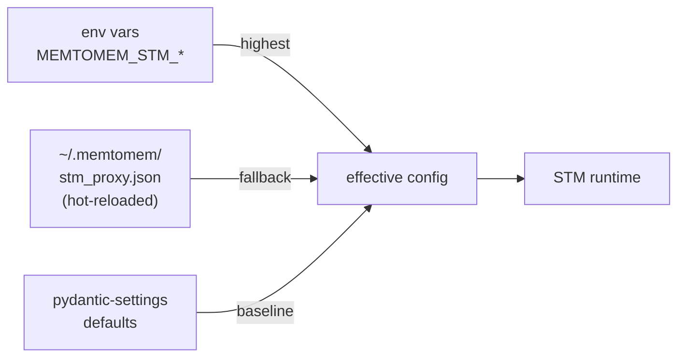

# Configuration Reference

memtomem-stm reads configuration from two sources, in order of precedence:



1. **Environment variables** — prefix `MEMTOMEM_STM_`, double-underscore (`__`) for nesting
2. **Config file** — `~/.memtomem/stm_proxy.json` (hot-reloaded; changes take effect on the next tool call without restarting)
3. **Defaults** — every setting has a sensible default in pydantic-settings, so you can run STM with zero configuration

For most quick-start scenarios you can ignore the config file entirely and use the [CLI](cli.md) (`mms add ...`) plus a few env vars.

## Environment Variables

All settings use the `MEMTOMEM_STM_` prefix with `__` for nesting.

### General

```bash
export MEMTOMEM_STM_LOG_LEVEL=WARNING   # DEBUG | INFO | WARNING | ERROR | CRITICAL
```

Controls `logging.basicConfig()` level for all `memtomem_stm.*`
loggers.  Default `WARNING`.  Read once at startup — restart to
apply changes.

```bash
export MEMTOMEM_STM_ADVERTISE_OBSERVABILITY_TOOLS=true   # opt in
```

When unset or `false`, hides STM's eight observability / admin tools
(`stm_proxy_stats`, `stm_proxy_health`, `stm_proxy_cache_clear`,
`stm_surfacing_stats`, `stm_index_stats`, `stm_compression_stats`,
`stm_progressive_stats`, `stm_tuning_recommendations`) from the MCP
`tools/list` surface so eager-loading clients (e.g. OpenAI Codex CLI)
don't pay schema tokens for tools the model rarely calls. Hidden admin
tools are not registered with the MCP server while the flag is unset or
`false`.  The four model-facing tools
(`stm_proxy_read_more`, `stm_proxy_select_chunks`,
`stm_surfacing_feedback`, `stm_compression_feedback`) stay advertised
regardless.  Set this flag to `true` to advertise the admin tools over
MCP again.  Read once at import — restart to apply changes.  Claude Code
defers MCP tool schemas via its own `ToolSearch` mechanism so this flag
has no practical effect there; it's primarily useful for eager-loading
clients that lack a per-server `disabled_tools` filter of their own.

### Proxy

```bash
export MEMTOMEM_STM_PROXY__ENABLED=true
export MEMTOMEM_STM_PROXY__DEFAULT_COMPRESSION=auto
export MEMTOMEM_STM_PROXY__DEFAULT_MAX_RESULT_CHARS=16000
export MEMTOMEM_STM_PROXY__MAX_UPSTREAM_CHARS=10000000   # OOM guard before compression
export MEMTOMEM_STM_PROXY__MIN_RESULT_RETENTION=0.65
export MEMTOMEM_STM_PROXY__CONSUMER_MODEL=claude-sonnet-4
export MEMTOMEM_STM_PROXY__CONTEXT_BUDGET_RATIO=0.05
export MEMTOMEM_STM_PROXY__MAX_DESCRIPTION_CHARS=200
export MEMTOMEM_STM_PROXY__STRIP_SCHEMA_DESCRIPTIONS=false
export MEMTOMEM_STM_PROXY__CACHE__ENABLED=true
export MEMTOMEM_STM_PROXY__CACHE__DEFAULT_TTL_SECONDS=3600
export MEMTOMEM_STM_PROXY__CACHE__DB_PATH=~/.memtomem/proxy_cache.db
export MEMTOMEM_STM_PROXY__CACHE__MAX_ENTRIES=10000
export MEMTOMEM_STM_PROXY__METRICS__ENABLED=true
export MEMTOMEM_STM_PROXY__METRICS__DB_PATH=~/.memtomem/proxy_metrics.db
export MEMTOMEM_STM_PROXY__METRICS__MAX_HISTORY=10000

# Auto-indexing (Stage 4 — save large responses to LTM)
# NOTE: In the standalone `mms` server today, `auto_index` and
# `extraction` are inert — `ProxyManager` is constructed without an
# `index_engine`, so Stage 4 is silently skipped. This covers every
# enable-path: the global ENABLED flag below, the per-upstream
# `auto_index: true` knob on `UpstreamServerConfig`, and the per-tool
# `auto_index: true` override on `ToolOverrideConfig`. All three are
# valid config but currently have no runtime effect; the proxy logs a
# "config is enabled but inert" warning at startup naming each site.
# Tracking issue for the MCP-protocol-only adapter that will unblock
# this: #288.
export MEMTOMEM_STM_PROXY__AUTO_INDEX__ENABLED=false
export MEMTOMEM_STM_PROXY__AUTO_INDEX__MIN_CHARS=2000
export MEMTOMEM_STM_PROXY__AUTO_INDEX__MEMORY_DIR=~/.memtomem/proxy_index
export MEMTOMEM_STM_PROXY__AUTO_INDEX__NAMESPACE=proxy-{server}

# Relevance scorer (query-aware compression)
export MEMTOMEM_STM_PROXY__RELEVANCE_SCORER__SCORER=bm25           # "bm25" or "embedding"
export MEMTOMEM_STM_PROXY__RELEVANCE_SCORER__EMBEDDING_PROVIDER=ollama
export MEMTOMEM_STM_PROXY__RELEVANCE_SCORER__EMBEDDING_MODEL=nomic-embed-text
export MEMTOMEM_STM_PROXY__RELEVANCE_SCORER__EMBEDDING_BASE_URL=http://localhost:11434

# Required when embedding_provider="openai" — the scorer reads this from the
# environment and falls back to BM25 with an HTTP 401 if missing.
export OPENAI_API_KEY=sk-...

# Compression feedback (learning signal for auto-tuner)
export MEMTOMEM_STM_PROXY__COMPRESSION_FEEDBACK__ENABLED=true
export MEMTOMEM_STM_PROXY__COMPRESSION_FEEDBACK__DB_PATH=~/.memtomem/stm_feedback.db
```

### Surfacing

```bash
export MEMTOMEM_STM_SURFACING__ENABLED=true
export MEMTOMEM_STM_SURFACING__MIN_SCORE=0.03
export MEMTOMEM_STM_SURFACING__MAX_RESULTS=3
export MEMTOMEM_STM_SURFACING__MIN_RESPONSE_CHARS=5000
export MEMTOMEM_STM_SURFACING__FEEDBACK_ENABLED=true
export MEMTOMEM_STM_SURFACING__AUTO_TUNE_ENABLED=true
export MEMTOMEM_STM_SURFACING__CONTEXT_WINDOW_SIZE=0       # 0=disabled; >0 expands ±N adjacent chunks
export MEMTOMEM_STM_SURFACING__CONSUMER_MODEL=claude-sonnet-4  # auto-scales max_results + max_injection_chars
export MEMTOMEM_STM_SURFACING__DEDUP_TTL_SECONDS=604800    # 7 days; 0 to disable cross-session dedup
export MEMTOMEM_STM_SURFACING__FEEDBACK_DB_PATH=~/.memtomem/stm_feedback.db

# LTM connection (defaults shown)
export MEMTOMEM_STM_SURFACING__LTM_MCP_TRANSPORT=stdio
export MEMTOMEM_STM_SURFACING__LTM_MCP_COMMAND=memtomem-server
export MEMTOMEM_STM_SURFACING__LTM_MCP_ARGS='["--config","/etc/memtomem.json"]'

# Network LTM service instead of stdio
export MEMTOMEM_STM_SURFACING__LTM_MCP_TRANSPORT=streamable_http
export MEMTOMEM_STM_SURFACING__LTM_MCP_URL=https://ltm.example/mcp
export MEMTOMEM_STM_SURFACING__LTM_MCP_HEADERS='{"Authorization":"Bearer ..."}'
```

See [Surfacing → Surfacing Controls](surfacing.md#surfacing-controls) for the complete table of fields and defaults.

### Claude Code Hook

`mms hook` bridges Claude Code built-in `PostToolUse` events into STM surfacing.
It is independent of the MCP proxy path and is configured with
`MEMTOMEM_STM_HOOK__*`.

```bash
export MEMTOMEM_STM_HOOK__USE_DAEMON=true              # default: warm daemon path
export MEMTOMEM_STM_HOOK__DAEMON_TIMEOUT_SECONDS=2.5
export MEMTOMEM_STM_HOOK__FALLBACK=skip                # skip | cold
export MEMTOMEM_STM_HOOK__AUTO_SPAWN=true
export MEMTOMEM_STM_HOOK__RECORD_FEEDBACK_EVENTS=false # no query text / rating prompt by default

# Built-in Bash stdout compression is opt-in and separate from surfacing.
export MEMTOMEM_STM_HOOK__COMPRESSION__ENABLED=false
export MEMTOMEM_STM_HOOK__COMPRESSION__MAX_CHARS=16000

# Legacy direct-read allowlist knob; comma-separated Claude Code tool names.
export MEMTOMEM_STM_HOOK_SURFACE_TOOLS=Read,Grep,Glob,Bash
```

`fallback=skip` returns `{}` immediately when the daemon is unavailable.
`fallback=cold` runs the older in-process path, which can pay LTM startup cost
inside the hook call. Hook compression only targets Bash stdout so later
`Edit` operations are not broken by replacing file reads.

### Surfacing Daemon

`mms daemon` keeps a local LTM connection warm for `mms hook`.

```bash
export MEMTOMEM_STM_DAEMON__HOST=127.0.0.1
export MEMTOMEM_STM_DAEMON__IDLE_TIMEOUT_SECONDS=900
```

The daemon binds loopback and authenticates requests with a per-start token.
`idle_timeout_seconds=0` pins it until explicitly stopped.

### Langfuse Tracing (optional)

```bash
pip install "memtomem-stm[langfuse]"
# or with uv:
uv pip install "memtomem-stm[langfuse]"

export MEMTOMEM_STM_LANGFUSE__ENABLED=true
export MEMTOMEM_STM_LANGFUSE__PUBLIC_KEY=pk-lf-...
export MEMTOMEM_STM_LANGFUSE__SECRET_KEY=sk-lf-...
export MEMTOMEM_STM_LANGFUSE__HOST=https://cloud.langfuse.com   # or http://localhost:3000 for self-hosted
export MEMTOMEM_STM_LANGFUSE__SAMPLING_RATE=1.0                # 0.0–1.0, fraction of calls to trace
```

When enabled, every proxy tool invocation is wrapped in a `proxy_call` Langfuse observation with nested sub-spans for each pipeline stage (clean, compress, surface, index).

Setting `MEMTOMEM_STM_LANGFUSE__ENABLED=true` without first installing the `[langfuse]` extra raises a `ValueError` at startup (fail-fast since v0.1.16) — install the extra first, or leave `enabled=false` / unset. The old silent-disable-with-WARNING behavior is gone, so a typo in your config no longer leaves tracing quietly off.

## Config File: `~/.memtomem/stm_proxy.json`

Full example with all options:

```json
{
  "enabled": true,
  "default_max_result_chars": 16000,
  "min_result_retention": 0.65,
  "consumer_model": "",
  "context_budget_ratio": 0.05,
  "max_description_chars": 200,
  "strip_schema_descriptions": false,
  "upstream_servers": {
    "filesystem": {
      "command": "npx",
      "args": ["-y", "@modelcontextprotocol/server-filesystem", "/home/user"],
      "prefix": "fs",
      "transport": "stdio",
      "compression": "auto",
      "max_result_chars": 8000,
      "retention_floor": null,
      "max_retries": 3,
      "reconnect_delay_seconds": 1.0,
      "max_reconnect_delay_seconds": 30.0,
      "connect_timeout_seconds": 30.0,
      "call_timeout_seconds": 90.0,
      "overall_deadline_seconds": 180.0,
      "max_description_chars": 200,
      "strip_schema_descriptions": false,
      "cleaning": {
        "strip_html": true,
        "deduplicate": true,
        "collapse_links": true
      },
      "selective": {
        "max_pending": 100,
        "pending_ttl_seconds": 300,
        "pending_store": "memory",
        "pending_store_path": "~/.memtomem/pending_selections.db"
      },
      "hybrid": {
        "head_chars": 5000,
        "tail_mode": "toc",
        "head_ratio": 0.6
      },
      "progressive": {
        "chunk_size": 4000,
        "max_stored": 200,
        "ttl_seconds": 1800
      },
      "tool_overrides": {
        "read_file": {
          "compression": "progressive",
          "retention_floor": 0.5
        },
        "internal_debug": {
          "hidden": true
        }
      }
    },
    "github": {
      "command": "npx",
      "args": ["-y", "@modelcontextprotocol/server-github"],
      "prefix": "gh",
      "env": { "GITHUB_TOKEN": "ghp_xxx" },
      "compression": "auto",
      "max_result_chars": 16000,
      "auto_index": true,
      "tool_overrides": {
        "search_code": {
          "compression": "selective",
          "max_result_chars": 8000
        }
      }
    }
  },
  "cache": {
    "enabled": true,
    "db_path": "~/.memtomem/proxy_cache.db",
    "default_ttl_seconds": 3600,
    "max_entries": 10000
  },
  "auto_index": {
    "enabled": false,
    "background": false,
    "min_chars": 2000,
    "memory_dir": "~/.memtomem/proxy_index",
    "namespace": "proxy-{server}"
  },
  "relevance_scorer": {
    "scorer": "bm25",
    "embedding_provider": "ollama",
    "embedding_model": "nomic-embed-text",
    "embedding_base_url": null,
    "embedding_timeout": 10.0
  },
  "metrics": {
    "enabled": true,
    "max_history": 10000
  },
  "compression_feedback": {
    "enabled": true,
    "db_path": "~/.memtomem/stm_feedback.db"
  }
}
```

### Token-equivalent budgets (CJK / non-Latin workloads)

By default, every result-size budget in STM is expressed in **characters** (`max_result_chars`, `default_max_result_chars`, `head_chars`). For Latin-script content this approximates token spend reasonably — English averages ~4 characters per token in modern BPE tokenizers (GPT-3.5/4 cl100k_base, similar for Claude). For Korean, Chinese, and Japanese content it does not: Korean averages ~1.85 chars/token, so the same character budget caps roughly **half** the token spend the operator probably intended, and `min_response_chars`-style gates skip compression on Korean responses that are token-dense but character-light.

Two opt-in fields make budgets token-aware without breaking existing char-based configs:

- **`chars_per_token`** — chars-per-token ratio used to convert a token budget to a char budget. Configurable at `ProxyConfig` (default `3.5`), per upstream server, or per tool. Lower it for non-Latin content (`~2.0` for Korean, `~1.3` for Chinese). Cascading resolution: tool override → server → proxy default.
- **`max_result_tokens`** — token-equivalent budget on `UpstreamServerConfig` and `ToolOverrideConfig`. When set, takes precedence over `max_result_chars` and is converted to a char budget at gate time via the resolved `chars_per_token`.

Example — a Korean-content upstream (e.g. a Korean documentation MCP server):

```json
"upstream_servers": {
  "ko_docs": {
    "command": "...",
    "prefix": "kr",
    "max_result_tokens": 1500,
    "chars_per_token": 1.85,
    "tool_overrides": {
      "summarize": {
        "max_result_tokens": 500
      }
    }
  }
}
```

The default tool gets a `1500 × 1.85 = 2775` char budget; `summarize` inherits the server's `1.85` ratio for `500 × 1.85 = 925`. The same operator on the char path would have used `max_result_chars=8000` and quietly skipped compression on most Korean responses.

Gate decisions multiply the operator-supplied `max_result_tokens` and resolved `chars_per_token` directly — no runtime text inspection happens. A codepoint-weighted approximation lives in `proxy/token_estimate.py` (calibrated against `cl100k_base` on a 13-pair EN/KO corpus, median absolute error ~13% in the over-estimate direction), but it is **not yet wired into the gate path**; it is published for a follow-up that estimates real response token counts at runtime.

#### Token budgets bound spend, not information

A token budget caps context spend, not information throughput. Korean content encodes the same information in roughly **1.57× more tokens** than English at `cl100k_base` (PR-attached corpus measurement: 19,084 EN tokens vs 30,009 KO tokens for the same 13 doc pairs). So setting the same `max_result_tokens` on an EN upstream and a KO upstream:

- bounds context spend equally (both gate at the chosen token count), and
- delivers **less information** to the KO consumer (≈64% of EN-equivalent information at the same token target).

If your goal is equal information throughput rather than equal spend, scale KO budgets ~1.5× upward (and CJK-ideograph budgets accordingly).

#### Bootstrap shortcut: `mms init --lang ko`

For first-time setup of a Korean-content STM proxy, `mms init` accepts a `--lang` flag that writes the calibrated KO preset directly so you don't need to transcribe the numeric fields above:

```bash
mms init --lang ko
```

This writes:

- **Proxy-level**: `chars_per_token=1.85`, `min_response_chars=230`, `default_max_result_chars=8500`
- **Per-imported-server**: `max_result_tokens=2000`, `chars_per_token=1.85`

Equivalent JSON (what ends up in `~/.memtomem/stm_proxy.json`). The server key (`<your-server-name>` below) and `prefix` come from whatever `mms init` discovered or you typed in the manual flow — `--lang ko` only adds the four token-aware fields, never invents server names:

```json
{
  "enabled": true,
  "chars_per_token": 1.85,
  "min_response_chars": 230,
  "default_max_result_chars": 8500,
  "upstream_servers": {
    "<your-server-name>": {
      "prefix": "<your-prefix>",
      "command": "...",
      "max_result_tokens": 2000,
      "chars_per_token": 1.85
    }
  }
}
```

Without `--lang`, an interactive prompt fires on a TTY (questionary select; falls back to `click` Choice prompt under `MMS_NO_TUI=1`). Non-TTY callers without `--lang` get EN (no preset) silently — `--lang ko` is the scriptable opt-in. `--lang en` is supported for explicit "no preset" intent and writes nothing language-specific.

Only EN and KO are shipped: KO is the only language with empirical calibration in PR #274's measurement corpus. ZH/JA are intentionally omitted until analogous calibration lands.

### Upstream prefix invariants

Each `upstream_servers.<key>.prefix` must be **non-empty** and **unique across all upstreams** — both are enforced at config load and raise `ValidationError` on violation:

- Empty or whitespace-only prefix produces composed tool names like `__list_items` and skews the 64-char overflow guard. (#266)
- Two upstreams sharing a prefix collide on `<prefix>__<tool>` and used to silently drop the second-loaded duplicate at startup with only a `logger.warning`. The validator now names every offending upstream key in one error so the typo surfaces at config load. (#265)

Hot-reload (`ProxyConfigLoader`) keeps the previously cached config when a reloaded edit fails validation, so a running proxy stays serving its last known-good upstreams instead of going dark on a typo.

### Hot-reload

The config file is **hot-reloaded** — changes take effect on the next tool call without restarting STM. Adding or removing upstream servers still requires a server restart because transport connections are established once at startup.

| Setting group | Hot-reload? | Notes |
|---------------|-------------|-------|
| Per-server compression, cleaning, `tool_overrides` | Yes | `compression`, `max_result_chars`, `retention_floor`, `cleaning.*`, `tool_overrides.*` take effect on the next tool call |
| `relevance_scorer.*` | Yes | All five fields (`scorer`, `embedding_provider`, `embedding_model`, `embedding_base_url`, `embedding_timeout`). A change in any field rebuilds the scorer instance in place. |
| `llm.*` compressor config | Yes | Changing any field closes the old `LLMCompressor` and constructs a new one lazily on the next tool call. |
| Adding / removing upstream servers | **No** (restart) | Transport connections are established once at startup. |

Omitting `embedding_base_url` (or setting it to `null`) lets provider-aware defaults fill it in — `ollama → http://localhost:11434`, `openai → https://api.openai.com`.

```mermaid
sequenceDiagram
    autonumber
    actor User
    participant CLI as mms
    participant File as stm_proxy.json
    participant Watcher as ConfigWatcher
    participant STM as proxy runtime
    actor Agent

    User->>CLI: mms add github --prefix gh ...
    CLI->>File: write new server entry
    Watcher-)Watcher: detect mtime change
    Watcher->>STM: reload()
    Note over STM: new ToolConfig built;<br/>existing in-flight call unaffected
    Agent->>STM: next proxied call
    STM-->>Agent: served with new config
```

## Transport Types

| Transport | Config fields | Description |
|-----------|---------------|-------------|
| `stdio` (default) | `command`, `args`, `env` | Standard subprocess MCP server |
| `sse` | `url`, `headers` | Server-Sent Events over HTTP |
| `streamable_http` | `url`, `headers` | HTTP streamable responses |
