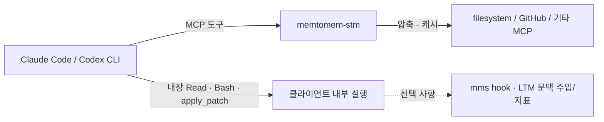

# Claude Code와 Codex CLI를 위한 시작 가이드

이 가이드는 Claude Code나 Codex CLI로 바이브코딩을 하고 있지만 MCP와
프록시는 처음인 사용자를 위한 안내서입니다. 목표는 10분 안에
memtomem-stm을 설치하고, MCP 도구 하나를 STM 경유로 호출한 뒤, 그 호출이
기록됐는지 확인하는 것입니다.

세션 간 기억은 선택 기능입니다. memtomem LTM 서버가 없어도 프록시,
응답 압축, 캐시는 사용할 수 있습니다.

## 30초 적합성 확인

memtomem-stm은 **MCP로 호출되는 도구** 앞에 놓는 프록시입니다. 이미
filesystem, GitHub, 데이터베이스, 브라우저 같은 MCP 서버를 사용한다면
가장 쉽게 효과를 확인할 수 있습니다.



내장 `Read`, `Bash`, `apply_patch` 같은 도구는 기본 프록시 경로를
우회합니다. native hook은 일부 내장 도구 이벤트를 관찰하지만 프록시를
대체하지 않으며, 캐시나 upstream 재시도를 추가하지 않습니다.

## 1. 준비하고 설치하기

이 문서는 macOS/Linux/WSL의 Bash·Zsh와 Windows 11 PowerShell을 지원합니다.
Windows와 WSL은 홈 디렉터리와 MCP 등록이 서로 다른 별도 환경입니다.
클라이언트, Python, STM을 한쪽 환경에 맞춰 설치하세요.

- Python 3.12 이상
- Claude Code 또는 Codex CLI
- `uv` 권장
- 아래 filesystem 데모를 쓸 경우 Node.js와 `npx`

```bash
python --version
uv tool install memtomem-stm
mms --version
```

PowerShell에서 `python`이나 `pip`가 보이지 않으면 `py --version`과
`py -m pip install memtomem-stm`을 사용합니다.

`mms`, `memtomem-stm`, `memtomem-stm-proxy`는 같은 패키지의 진입점입니다.
사람이 실행하는 관리 명령은 짧은 `mms`를 사용하고, MCP 클라이언트에는
서버 명령인 `memtomem-stm`을 등록합니다.

## 2. STM이 감쌀 MCP 서버 정하기

처음 설정할 때는 원본 MCP 등록을 바로 지우지 마세요. 먼저 STM 경유
도구가 정상 동작하는지 확인한 뒤 정리하는 편이 안전합니다.

처음에는 네트워크나 Node.js가 필요 없는 내장 읽기 전용 데모로 성공
경로부터 확인할 수 있습니다.

```bash
mms init --demo --lang ko --client auto
mms doctor
```

실제 upstream을 바로 설정하려면 `mms init --lang ko --client auto`를
실행합니다.

`--lang ko`는 한국어 콘텐츠에 맞춘 토큰 예산을 기록합니다. 마법사가
기존 Claude Code MCP를 찾으면 하나를 선택할 수 있습니다. 새 데모를 직접
입력하려면 다음 값을 사용하고 `/절대/경로/프로젝트`를 실제 프로젝트
경로로 바꾸세요.

| 항목 | 예시 값 |
|---|---|
| 이름 | `filesystem` |
| prefix | `fs` |
| transport | `stdio` |
| command | `npx` |
| args | `-y @modelcontextprotocol/server-filesystem /절대/경로/프로젝트` |

prefix는 공개 도구 이름이 됩니다. 예를 들어 `fs`를 사용하면
`fs__read_file` 같은 도구가 만들어집니다.

> Codex CLI: `mms import --from codex`는 `CODEX_HOME`(기본 `~/.codex`)의 기존 MCP를 탐색합니다.
> 신뢰된 프로젝트의 `.codex/config.toml`은 `--allow-project-configs`로
> 명시적으로 허용할 때만 가져옵니다. `mms import --from codex`는
> `~/.mms/registry.toml`을 채우는 별도 프로젝트 레지스트리 기능이며,
> `~/.memtomem/stm_proxy.json`에 upstream을 추가하지 않습니다.

이미 `~/.memtomem/stm_proxy.json`이 있다면 다음처럼 등록 단계를 이어갑니다.

```bash
mms init --resume --client auto
mms status
mms list
mms add --help
```

## 3. Claude Code에 연결하기

초기 설정을 끝낸 뒤 다음 명령으로 STM을 사용자 범위에 등록합니다.

```bash
mms register --client claude
claude mcp get memtomem-stm
```

수동으로 등록하려면 같은 동작을 다음처럼 실행할 수 있습니다.

```bash
claude mcp add memtomem-stm -s user -- memtomem-stm
```

Claude Code를 새로 시작하고 `/mcp`를 열어 `memtomem-stm`이 연결됐는지
확인합니다.

## 4. Codex CLI에 연결하기

Codex도 같은 등록 명령으로 연결할 수 있습니다.

```bash
mms register --client codex
codex mcp get memtomem-stm
codex mcp list
```

Codex를 새로 시작하고 `/mcp`에서 `memtomem-stm`과 그 하위 도구를
확인합니다. 같은 이름이 이미 등록돼 있다면 먼저 `codex mcp get
memtomem-stm`으로 현재 값을 확인하고, 의도적으로 교체할 때만 기존
등록을 제거하세요.

## 5. 첫 proxied tool 호출하기

클라이언트를 열기 전 터미널에서 설정 상태를 확인합니다.

```bash
mms doctor
```

`mms doctor`가 종료 코드 0이면 사용할 수 있는 상태입니다. WARN은 허용됩니다.
특히 `ltm server` WARN은 세션 간 기억만 비활성화됐다는 뜻이며 프록시,
압축, 캐시는 계속 동작합니다.

Claude Code 또는 Codex CLI에 다음처럼 요청합니다.

```text
내장 Read 대신 memtomem-stm의 fs__read_file MCP 도구를 사용해서
README.md의 첫 40줄을 읽고 핵심을 세 문장으로 정리해줘.
```

클라이언트는 전체 이름을
`mcp__memtomem-stm__fs__read_file`처럼 표시할 수도 있습니다. 핵심은
내장 파일 읽기 도구가 아니라 `memtomem-stm` 아래의 `fs__...` 도구가
실제로 호출되는 것입니다.

호출 뒤에는 durable 지표를 확인합니다.

```bash
mms stats --source mcp
```

다음 네 가지가 모두 맞으면 첫 설정이 끝났습니다.

- `mms doctor`가 종료 코드 0이다.
- 클라이언트의 `/mcp`에 `memtomem-stm`이 보인다.
- `fs__...` 같은 proxied alias로 실제 도구를 한 번 호출했다.
- `mms stats --source mcp`에 해당 MCP 호출이 기록됐다.

## 6. 검증 후 원본 MCP 정리하기

기존 MCP와 STM 경유 MCP가 동시에 등록돼 있으면 도구가 두 벌 보이고,
에이전트가 직접 경로를 선택해 STM을 우회할 수 있습니다. 먼저 정리 대상을
미리 본 뒤 적용합니다.

```bash
mms prune --all --dry-run
mms prune --all
```

가져온 서버를 원래 호스트로 복원하고 STM에서 제거하려면 `mms eject`를
사용합니다. 먼저 `mms eject <name> --dry-run`으로 계획을 확인하세요.

## 7. 선택 기능: 내장 도구 hook

hook 설치는 기본이 preview입니다. 출력 내용을 확인한 뒤 `--apply`를
붙여 실제 설정 파일에 기록합니다. 기존 파일이 있으면 `.bak` 백업이
생성됩니다.

```bash
# Claude Code
mms hook install --host claude
mms hook install --host claude --apply

# Codex CLI
mms hook install --host codex
mms hook install --host codex --apply
```

- Claude Code는 재시작 후 LTM 문맥 주입을 받을 수 있고, Bash 출력 교체는
  별도 opt-in 기능입니다.
- Codex CLI는 설치 후 `/hooks`에서 hook을 승인해야 합니다. STM의 Codex
  어댑터는 출력 교체를 지원하지 않으며, 실제 surfacing 대상은 read-like
  allowlist에 들어가는 `Bash` 호출입니다. standalone `additionalContext`
  노출은 Codex 공식 문서에 명확히 보장되지 않으므로 기억이 실제 대화에
  나타나는지 확인한 뒤 의존하세요.
- LTM 서버가 없다면 hook은 세션 간 기억을 만들지 않습니다. hook 지표는
  `mms stats --source hook`에서 따로 확인할 수 있습니다.

자세한 기능표와 제거 방법은 [Native PostToolUse Hooks](native-hooks.md)를
참고하세요.

## 8. 선택 기능: 세션 간 기억

세션 간 기억에는 별도 memtomem core/LTM 서버와 검색할 기억 데이터가
필요합니다. STM은 도구 응답을 자동으로 durable memory로 저장하지
않습니다. 먼저 [Proactive Memory Surfacing](../surfacing.md)에서 연결 구조를
확인하고, 재현 가능한 전체 예제는
[Resume a project with reviewed memory](reviewed-memory-resume.md)를 따라가세요.

## 문제 해결

| 증상 | 확인할 것 |
|---|---|
| `mms init`이 기존 설정 때문에 중단됨 | `mms list`로 확인하고 `mms add` 또는 `mms register` 사용 |
| `/mcp`에 STM이 없음 | 호스트 등록 명령 재확인, 클라이언트 재시작, `mms doctor` 실행 |
| STM은 보이지만 `fs__...`가 없음 | `mms list`, `mms health --names`, upstream command/args 확인 |
| `ltm server` WARN | 프록시에는 문제 없음; 기억 기능이 필요할 때만 LTM 설정 |
| 같은 도구가 두 벌 보임 | `mms prune --all --dry-run`으로 직접 등록 중복 확인 |
| hook이 실행되지 않음 | `mms daemon status`, 설정 파일, Codex `/hooks` 승인 여부 확인 |

운영 진단 순서와 안전한 변경 방법은
[Operations and Troubleshooting](operations.md)을 참고하세요.
