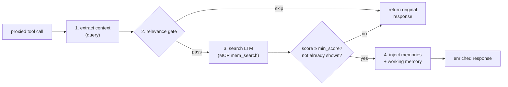
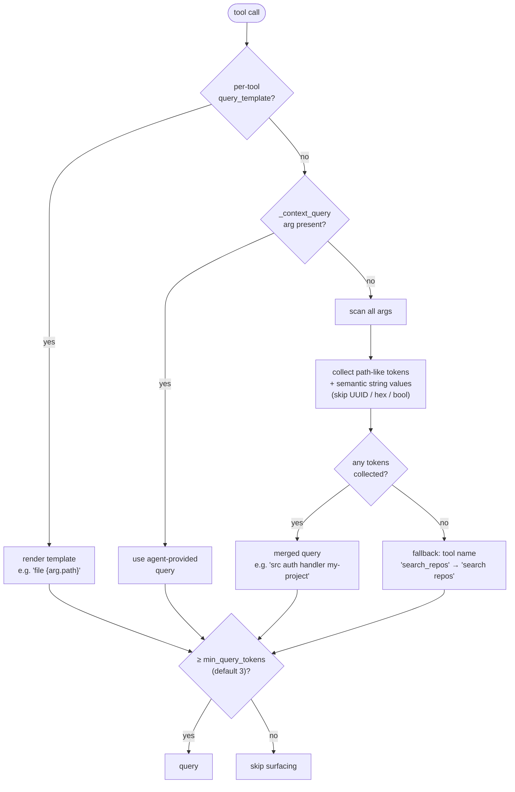
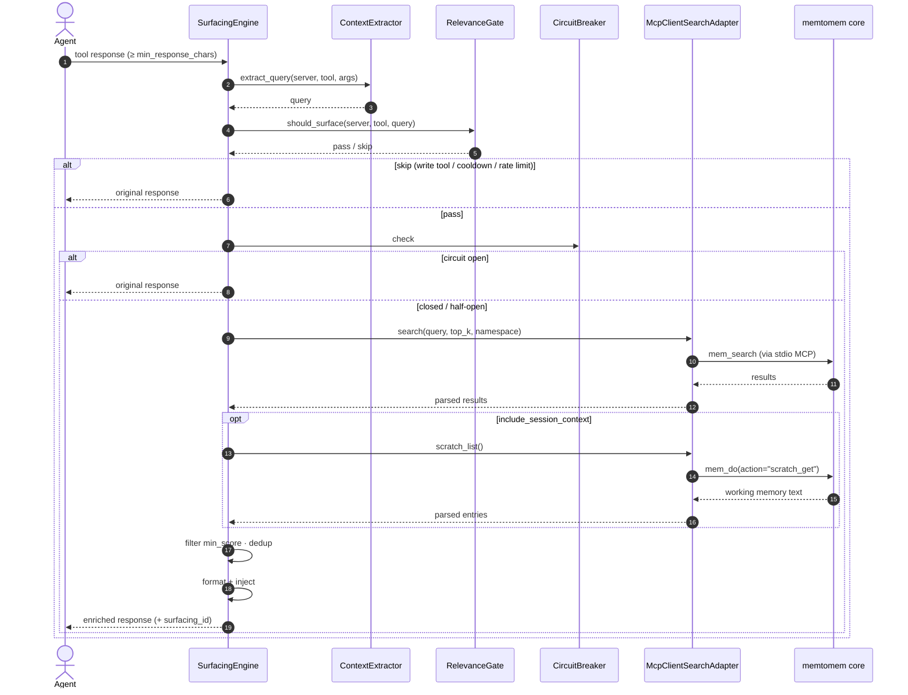
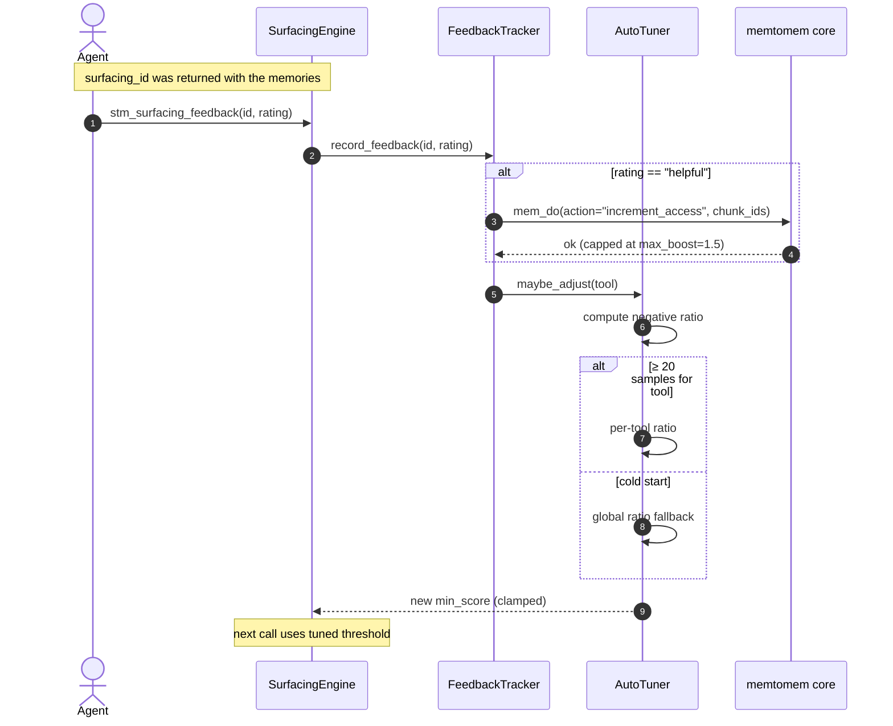
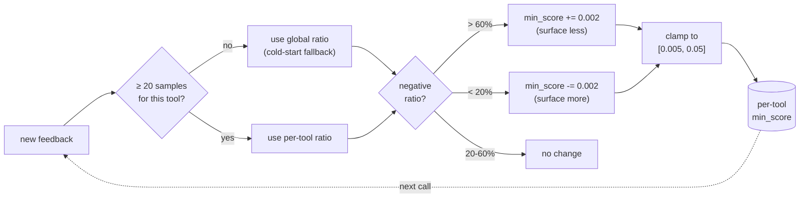

# Proactive Memory Surfacing

When your agent calls a proxied tool, STM automatically:

1. **Extracts context** from the tool name and arguments
2. **Checks relevance** (rate limit, cooldown, write-tool filter)
3. **Searches LTM** (memtomem) for related memories
4. **Injects relevant memories** at the top of the response



## How Context Extraction Works

STM extracts a search query in priority order:



> **Note**: Steps 1 (template) and 2 (`_context_query`) are "first match wins". The heuristic fallback (step 3) iterates over **all** tool arguments and collects path-like tokenizations and semantic string values together into a merged query, rather than stopping at the first match.

## What the Agent Sees

When memories are found, they're wrapped in `<surfaced-memories>` XML tags and injected after the response (default `append`):

```
(original tool response here)

<surfaced-memories>
## Relevant Memories
_surfacing_id: abc123def456_
> Rate (one of "helpful" | "not_relevant" | "already_known"): `stm_surfacing_feedback(surfacing_id="abc123def456", rating="helpful")`

- **auth_notes.md** [code-notes] (score=0.85): OAuth2 implementation uses PKCE flow...
- **api_design.md** (score=0.72): Rate limiting is handled by middleware in...
</surfaced-memories>
```

The injection mode is configurable: `append` (default), `prepend`, or `section`. `prepend` is skipped on the progressive-delivery path because it would shift character offsets and break `stm_proxy_read_more` — the skip is counted as `progressive_mode_conflict` in `stm_surfacing_stats`.

## Surfacing Controls

| Setting | Default | Description |
|---------|---------|-------------|
| `enabled` | `true` | Global on/off switch |
| `min_score` | `0.03` | Minimum search score to include a result |
| `max_results` | `3` | Maximum memories surfaced per tool call (model-scaled) |
| `max_injection_chars` | `3000` | Maximum total chars injected, truncated if exceeded (model-scaled) |
| `min_response_chars` | `5000` | Skip surfacing for small responses |
| `min_query_tokens` | `3` | Skip if extracted query has fewer tokens |
| `timeout_seconds` | `3.0` | Surfacing timeout (falls back to original response) |
| `cooldown_seconds` | `5.0` | Skip duplicate queries (Jaccard > 0.95) within this window |
| `max_surfacings_per_minute` | `15` | Global rate limit |
| `injection_mode` | `append` | Where to inject: `prepend`, `append`, `section`. `prepend` is skipped on the progressive-delivery path (would break `stm_proxy_read_more` offsets) — counted as `progressive_mode_conflict` in `stm_surfacing_stats`. |
| `section_header` | `## Relevant Memories` | Header text for injected section |
| `default_namespace` | `null` | Restrict search to a specific namespace |
| `exclude_tools` | `[]` | fnmatch patterns to never surface (e.g. `["*debug*"]`) |
| `write_tool_patterns` | `*write*`, `*create*`, `*delete*`, `*push*`, `*send*`, `*remove*` | Auto-skip write/mutation operations |
| `include_session_context` | `true` | Include working memory (scratch) items |
| `dedup_ttl_seconds` | `604800` (7d) | Cross-session dedup window; `0` to disable |
| `context_window_size` | `0` | Expand ±N adjacent chunks around search hits; `0` to disable |
| `result_content_max_chars` | `500` | Max chars retained per LTM result before the formatter sees it |
| `preview_max_chars` | `300` | Max chars per result preview in the injected memory block |
| `consumer_model` | `""` | Model name for auto-scaling `max_results` and `max_injection_chars` |
| `feedback_db_path` | `~/.memtomem/stm_feedback.db` | SQLite store for events, feedback, and cross-session dedup |
| `cache_ttl_seconds` | `60.0` | Internal surfacing result cache TTL |
| `circuit_max_failures` | `3` | Consecutive failures before circuit breaker opens |
| `circuit_reset_seconds` | `60.0` | Seconds before half-open probe after circuit opens |
| `auto_tune_enabled` | `true` | Auto-adjust `min_score` from feedback: >60% `not_relevant` raises it (stricter), <20% lowers it (more inclusive) |
| `auto_tune_min_samples` | `20` | Minimum feedback entries before adjusting per-tool score |
| `auto_tune_score_increment` | `0.002` | Step size for `min_score` adjustments |
| `feedback_enabled` | `true` | Enable the feedback recording and `stm_surfacing_feedback` tool |
| `fire_webhook` | `true` | Fire surfacing event webhooks |

## Per-tool Templates

Fine-tune surfacing behavior per tool:

```json
{
  "surfacing": {
    "context_tools": {
      "read_file": {
        "enabled": true,
        "query_template": "file {arg.path}",
        "namespace": "code-notes",
        "min_score": 0.1,
        "max_results": 5
      },
      "search_issues": {
        "min_score": 0.5,
        "max_results": 2
      },
      "get_diff": {
        "enabled": false
      }
    }
  }
}
```

Template variables: `{tool_name}`, `{server}`, `{arg.ARGUMENT_NAME}`

**`min_score` precedence (highest wins):** per-tool `context_tools.<name>.min_score` → auto-tuned value (when `auto_tune_enabled=true`) → top-level `min_score`. An explicit per-tool override always wins, even with auto-tune on — set it when you want a fixed threshold that the tuner should not move.

## End-to-end Surface Call



**Failure guard (S1).**  If `record_surfacing` fails (e.g. SQLite
contention on `stm_feedback.db`), the engine drops the
`surfacing_id` — the memory block is still injected but without a
feedback ID.  The agent cannot submit feedback for that particular
surfacing event, but the response is never blocked or corrupted.
Logged at WARNING.

## LTM Connection

STM connects to the LTM exclusively over the MCP protocol. The surfacing engine spawns (or attaches to) a memtomem MCP server using these settings:

```bash
# Default — spawns `memtomem-server` as a child process
export MEMTOMEM_STM_SURFACING__LTM_MCP_COMMAND=memtomem-server

# Pass extra arguments if needed (e.g. point at a custom config)
export MEMTOMEM_STM_SURFACING__LTM_MCP_ARGS='["--config","/etc/memtomem.json"]'
```

This makes memtomem reachable over the same MCP protocol boundary STM uses for other upstreams. Unlike a generic proxied upstream, LTM responses bypass the compression / cache pipeline — they are consumed by STM's surfacing engine (via `McpClientSearchAdapter`, see `src/memtomem_stm/surfacing/mcp_client.py`) to compose context for upstream calls, rather than being passed through to the caller. A memtomem crash never takes down STM's other upstream connections.

> **Note**: prior versions supported an in-process mode that imported memtomem directly. That path was removed so STM has a single LTM retrieval path and so core internals can evolve without breaking STM.

## Session & Cross-Session Dedup

Surfacing tracks which memory IDs have already been shown so the same content does not surface twice. Two layers work together:

| Layer | Storage | Purpose | Eviction |
|-------|---------|---------|----------|
| In-memory `_surfaced_ids` | Insertion-ordered `dict` on the `SurfacingEngine` | Skip IDs already surfaced in this process | Bulk prune to ~5,000 entries when size exceeds **10,000** (FIFO — oldest insertions go first) |
| In-memory `_boosted_event_ids` | Insertion-ordered `dict` on the `SurfacingEngine` | Ensure each surfacing event's `access_count` boost fires exactly once, even across repeated `helpful` ratings | Bulk prune to ~5,000 when size exceeds **10,000** (same FIFO as `_surfaced_ids`) |
| Persistent `seen_memories` | SQLite row in `stm_feedback.db` | Skip IDs surfaced in a prior session within `dedup_ttl_seconds` | TTL-based (default 7 days; `0` disables) |

The in-memory set is **seeded from `seen_memories`** on startup so dedup survives restarts within the TTL, and every new surfacing writes to both layers via `FeedbackStore.mark_surfaced(ids)`.

> **Why did an old memory re-surface?** Two common causes: (1) the 10k FIFO cap evicted the ID during a long session, so the in-memory layer no longer remembers it; (2) `dedup_ttl_seconds` elapsed, so the persistent row was ignored. Lower the TTL or raise it as needed — setting `dedup_ttl_seconds=0` disables cross-session dedup entirely.

## Feedback & Auto-Tuning



Rate surfaced memories to improve future relevance:

```
stm_surfacing_feedback(surfacing_id="abc123", rating="helpful")
stm_surfacing_feedback(surfacing_id="def456", rating="not_relevant")
stm_surfacing_feedback(surfacing_id="ghi789", rating="already_known")
```

Valid ratings: `helpful`, `not_relevant`, `already_known`.

When auto-tuning is enabled (default), STM adjusts `min_score` per tool based on feedback. In plain terms: **`not_relevant` and `already_known` ratings push `min_score` up** (surfacing becomes more selective), while a run of **`helpful` ratings pushes it down** (surfacing becomes more inclusive) because they keep the negative-feedback ratio low. Concretely:

| Feedback ratio | Action |
|----------------|--------|
| > 60% negative (`not_relevant` + `already_known`) | Raise `min_score` by +0.002 (surface fewer, more relevant) |
| < 20% negative | Lower `min_score` by -0.002 (surface more) |
| 20–60% negative | Hold current `min_score` |

Adjustment step is `auto_tune_score_increment` (default `0.002`) and the tuned score is clamped to `[0.005, 0.05]`.



Requires `auto_tune_min_samples` (default 20) feedback entries before adjusting. Score is capped between 0.005 and 0.05. **Cold-start fallback**: new tools with insufficient samples use the global ratio across all tools instead of waiting for 20 per-tool samples.

**Per-tool override wins:** if `context_tools.<name>.min_score` is set, auto-tune is skipped for that tool entirely — the tuner is not consulted and does not learn from its feedback (see [`min_score` precedence](#per-tool-templates)).

**Search boost from feedback**: when you rate memories as "helpful", their `access_count` is incremented in the core search index (once per surfacing event, capped at `max_boost=1.5`). This creates a positive feedback loop where useful memories rank higher in future searches.

Check effectiveness with `stm_surfacing_stats`:

```
Surfacing Stats
===============
Total surfacings: 142
Total feedback:   38

By rating:
  helpful: 28
  not_relevant: 7
  already_known: 3

Helpfulness: 73.7%

Skip reasons (since process start):
  __total__:
    response_too_short: 142
    gate_cooldown: 18
    gate_write_tool: 89
  read_file:
    response_too_short: 142
    gate_cooldown: 18
  write_file:
    gate_write_tool: 89

Outcomes (since process start):
  __total__:
    surfaced_cache_miss: 14
    surfaced_cache_hit: 9
  read_file:
    surfaced_cache_miss: 14
    surfaced_cache_hit: 9

Cache (since process start): hits 9, misses 14, hit ratio 39.1%
```

The first block (totals + ratings + helpfulness) is read from
`stm_feedback.db` and persists across restarts. The lower three
sections — `Skip reasons`, `Outcomes`, `Cache` — are in-memory
counters from `SurfacingObservability` and reset whenever the
proxy process restarts. They are suppressed entirely when the
proxy has not yet attempted any surfacing call, so the legacy
output stays byte-for-byte for zero-traffic deployments.

Each `surface()` call records exactly one skip reason **or** one
outcome (no double-counting). Cache hit/miss is incremented on
every cache lookup independently of what the lookup ultimately
renders, so the hit ratio reflects raw cache behavior rather
than post-filter results. A reject path that an operator might
hit:

- `response_too_short` — tool response below `min_response_chars`
  (default 5000).
- `gate_write_tool` / `gate_excluded_tool` / `gate_tool_disabled`
  / `gate_rate_limit` / `gate_cooldown` — a `RelevanceGate`
  reject; check the gate config for the offending bucket.
- `circuit_open` — repeated upstream failures opened the circuit
  breaker. Surfacing pauses for `circuit_reset_seconds` (default
  60s) before retrying.
- `no_query` — `ContextExtractor` could not synthesize a query
  from the tool arguments and fell below `min_query_tokens`.
- `no_results_score` — LTM returned results, none above
  `min_score`. Lower the threshold for that tool via
  `context_tools.<name>.min_score` if the tool is consistently
  missed.
- `no_results_dedup` — every result was already surfaced this
  session and dropped by `_surfaced_ids`. Distinct from
  `no_results_score` so an operator can tell whether to lower
  `min_score` or whether session-dedup is over-aggressive on
  long sessions.
- `no_results_invalidated` — every memory in a cache hit was
  rated `not_relevant` / `already_known` within the cache TTL.
- `no_results_empty_cache` — the cache stored an empty list
  (deliberate zero-result entry from a prior LTM miss) and the
  repeat call hit it.
