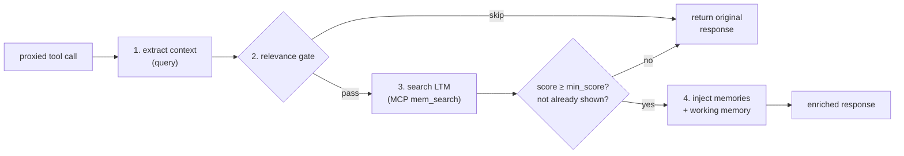
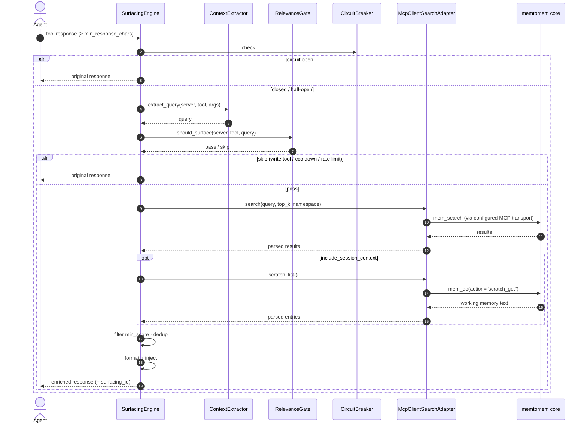
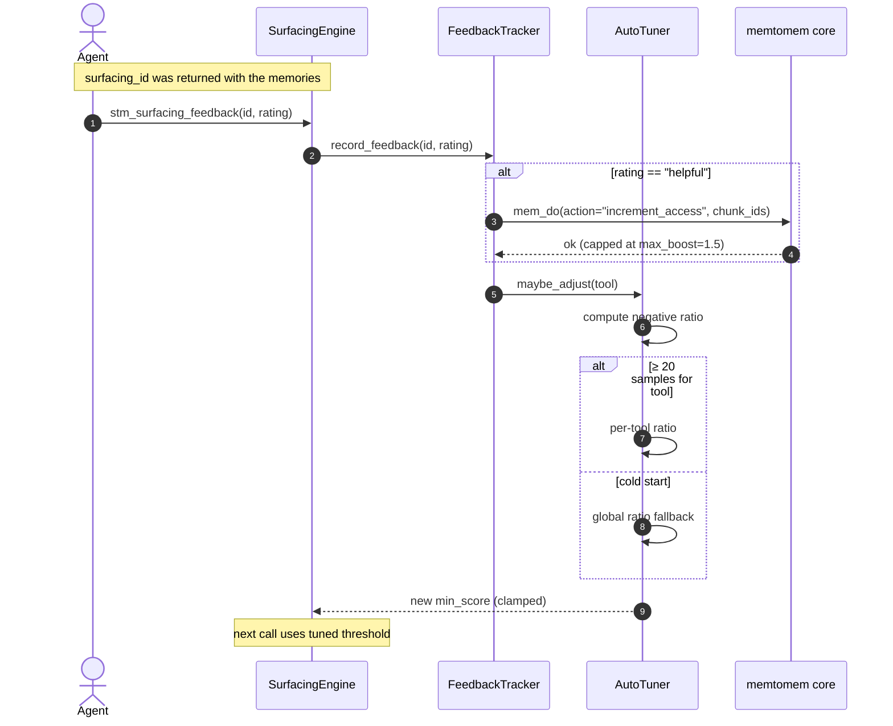
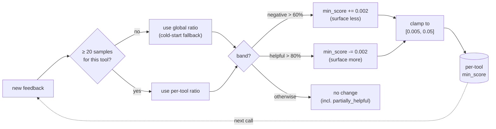

# Proactive Memory Surfacing

When your agent calls a proxied tool, STM automatically:

1. **Extracts context** from the tool name and arguments
2. **Checks relevance** (rate limit, cooldown, write-tool filter)
3. **Searches LTM** (memtomem) for related memories
4. **Injects relevant memories** at the configured position in the response



## How Context Extraction Works

STM extracts a search query in priority order:


> **Note**: Steps 1 (template) and 2 (`_context_query`) are "first match wins". The heuristic fallback (step 3) iterates over **all** tool arguments and collects path-like tokenizations and semantic string values together into a merged query, rather than stopping at the first match.

## What the Agent Sees

When memories are found, they're wrapped in `<surfaced-memories>` XML tags and injected after the response (default `append`):

```
(original tool response here)

<surfaced-memories>
## Relevant Memories
_surfacing_id: abc123def456_
> Rate (one of "helpful" | "partially_helpful" | "not_relevant" | "already_known"): `stm_surfacing_feedback(surfacing_id="abc123def456", rating="helpful")`
> Or rate specific memories: `stm_surfacing_feedback(surfacing_id="abc123def456", ratings=[{"memory_id": "<id from a bullet below>", "rating": "helpful"}])`

- **notes/auth_notes.md** [code-notes] `a1b2c3d4e5f6a7b8` [strong]: OAuth2 implementation uses PKCE flow...
- **design/api_design.md** [default] `9f8e7d6c5b4a3210` [related]: Rate limiting is handled by middleware in...
</surfaced-memories>
```

Each result line shows a relevance bucket (`[weak]`, `[related]`, or `[strong]`) instead of the raw search score. Buckets are computed across the active `[min_score, 1.0]` range, so changing `min_score` also shifts the bucket boundaries. Exact raw-score distributions remain available through `stm_surfacing_stats`.

Each bullet also carries its memory's id as a backticked token (e.g. `` `a1b2c3d4e5f6a7b8` ``). Pass it as a `memory_id` in the batched `stm_surfacing_feedback(ratings=[...])` call to rate individual memories — `not_relevant` / `already_known` then invalidate exactly those memories on the next cache hit. Under the default `result_format="compact"` this id is a content-derived surrogate (`sha256(content)[:16]`): it drives STM-side cache invalidation but not the LTM `increment_access` boost, and two memories with identical content collide on one id. Set `result_format="structured"` to carry the real `chunk_id` end to end.

The injection mode is configurable: `append` (default), `prepend`, or `section`. `prepend` is skipped on the progressive-delivery path because it would shift character offsets and break `stm_proxy_read_more` — the skip is counted as `progressive_mode_conflict` in `stm_surfacing_stats`.

## Surfacing Controls

| Setting | Default | Description |
|---------|---------|-------------|
| `enabled` | `true` | Global on/off switch |
| `min_score` | `0.03` | Minimum search score to include a result |
| `max_results` | `3` | Maximum memories surfaced per tool call (model-scaled) |
| `max_injection_chars` | `3000` | Maximum total chars injected, truncated if exceeded (model-scaled) |
| `min_response_chars` | `5000` | Skip surfacing when a tool response is shorter than this (logged as `response_too_short`). Precision/cost gate — **distinct** from the proxy-level `ExtractionConfig.min_response_chars` (`500`); see the tuning note below. |
| `min_query_tokens` | `3` | Skip if extracted query has fewer tokens |
| `timeout_seconds` | `3.0` | Surfacing timeout (falls back to original response) |
| `cooldown_seconds` | `5.0` | Skip duplicate queries (Jaccard > 0.95) within this window |
| `max_surfacings_per_minute` | `15` | Global rate limit |
| `injection_mode` | `append` | Where to inject: `prepend`, `append`, `section`. `prepend` is skipped on the progressive-delivery path (would break `stm_proxy_read_more` offsets) — counted as `progressive_mode_conflict` in `stm_surfacing_stats`. |
| `section_header` | `## Relevant Memories` | Header text for injected section |
| `default_namespace` | `null` | Restrict search to a specific namespace |
| `exclude_tools` | `[]` | fnmatch patterns to never surface, matched against **both** the bare tool name and `server__tool` — so a server-qualified glob like `["context7__*"]` disables a whole upstream (e.g. `["*debug*", "langfuse-docs__*"]`). See [Scoping surfacing per upstream](#scoping-surfacing-per-upstream). |
| `write_tool_patterns` | `*write*`, `*create*`, `*delete*`, `*push*`, `*send*`, `*remove*` | Auto-skip write/mutation operations |
| `include_session_context` | `true` | Include working memory (scratch) items |
| `dedup_ttl_seconds` | `604800` (7d) | Cross-session dedup window; `0` to disable |
| `query_retention_days` | `30` | Days to keep the raw extracted query text in `surfacing_events.query` before the opportunistic cleanup nulls it out; `0` to disable (column keeps whatever `record_surfacing` wrote, indefinitely). The event row itself is never deleted by this knob — only the column is cleared, so aggregate counts in `stm_surfacing_stats` are unaffected. |
| `persist_query_text` | `true` | When `false`, `FeedbackStore` stores `sha256:<16-hex>` instead of the raw extracted query in `surfacing_events.query`. The in-process surfacing call (relevance cooldown, formatter, MCP search) keeps the raw text — this knob only governs what gets persisted to disk. `stm_surfacing_stats` renders the hash verbatim and prints a one-line legend so the substitution is visible. |
| `context_window_size` | `0` | Expand ±N adjacent chunks around search hits; `0` to disable |
| `result_content_max_chars` | `500` | Max chars retained per LTM result before the formatter sees it |
| `preview_max_chars` | `300` | Max chars per result preview in the injected memory block |
| `consumer_model` | `""` | Model name for auto-scaling `max_results` and `max_injection_chars` |
| `feedback_db_path` | `~/.memtomem/stm_feedback.db` | SQLite store for events, feedback, and cross-session dedup |
| `ltm_mcp_transport` | `stdio` | LTM MCP transport: `stdio`, `sse`, or `streamable_http` |
| `ltm_mcp_command` | `memtomem-server` | Command used when `ltm_mcp_transport=stdio` |
| `ltm_mcp_args` | `[]` | Args passed to the stdio LTM command |
| `ltm_mcp_url` | `""` | Required endpoint when `ltm_mcp_transport` is `sse` or `streamable_http` |
| `ltm_mcp_headers` | `null` | Optional static headers for network LTM transports |
| `cache_ttl_seconds` | `60.0` | Internal surfacing result cache TTL |
| `circuit_max_failures` | `3` | Consecutive failures before circuit breaker opens |
| `circuit_reset_seconds` | `60.0` | Seconds before half-open probe after circuit opens |
| `auto_tune_enabled` | `true` | Auto-adjust `min_score` from feedback: >60% negative (`not_relevant` + `already_known`) raises it (stricter), >80% strictly `helpful` lowers it (more inclusive); `partially_helpful` is neutral |
| `auto_tune_min_samples` | `20` | Minimum feedback entries before adjusting per-tool score |
| `auto_tune_score_increment` | `0.002` | Step size for `min_score` adjustments |
| `feedback_enabled` | `true` | Enable the feedback recording and `stm_surfacing_feedback` tool |
| `feedback_demotion_enabled` | `true` | Locally filter memories that accumulated repeated negative feedback (`not_relevant` or `already_known`) before cache/injection |
| `feedback_demotion_negative_threshold` | `3` | Distinct negative surfacing events required before local STM demotion applies to a memory |
| `fire_webhook` | `true` | Fire surfacing event webhooks |

### Scoping surfacing per upstream

`exclude_tools` is global config (top-level `SurfacingConfig`), set via env.
Because its patterns match `server__tool` as well as the bare tool name, a
server-qualified glob turns surfacing off for a whole upstream:

```bash
# Per-client env: skip surfacing for every tool on these upstreams
export MEMTOMEM_STM_SURFACING__EXCLUDE_TOOLS='["context7__*","langfuse-docs__*"]'
```

For a **persistent, client-independent** toggle, set `surfacing_enabled` on the
upstream itself in `stm_proxy.json` (`UpstreamServerConfig`, default `true`).
Unlike the env glob — which each MCP client must carry in its own `env` block,
and which can drift between clients — this lives in the shared proxy config that
every client reads, hot-reloads without a restart, and shows up in `mms status`:

```bash
mms surfacing context7 off    # disable surfacing for this upstream
mms surfacing context7        # show current state
mms surfacing context7 on     # re-enable
```

When an upstream is disabled this way the skip happens *before* the LTM search
(saving the round-trip) and is enforced in `ProxyManager` — not the
`RelevanceGate` — because the engine is built once at startup from the top-level
`SurfacingConfig` and never sees per-upstream config. It is counted as
`upstream_disabled` (a healthy skip) in `stm_surfacing_stats`.

Reach for the env glob for cross-server / tool-grained scope or quick
experiments; reach for `surfacing_enabled` to durably opt one upstream out —
e.g. a third-party server whose calls never match your LTM (so the per-call
search is pure wasted latency), or a sensitive upstream whose request context
should never become an LTM query.

### Tuning `min_response_chars`

`min_response_chars` (default `5000`) gates surfacing on the **size of the
upstream tool response**: when a response is shorter than this, surfacing is
skipped before any LTM work and the call is recorded as `response_too_short`
in `stm_surfacing_stats`. The rationale is that very short responses rarely
carry enough context for `ContextExtractor` to synthesize a useful query, so
surfacing on them would spend an LTM round-trip (and a `max_surfacings_per_minute`
/ `cooldown_seconds` slot) to inject memories that are often noise relative to
the small response. The gate skips them before that cost is incurred.

The default of `5000` is deliberately conservative — it favors **precision and
cost** over **coverage**:

- **Leave it high** when surfaced memories on short responses feel like noise,
  or when you want to spend LTM round-trips only on substantial tool output.
- **Lower it** when tools you rely on return compact responses (status
  lookups, short reads, terse command output) and you want memories surfaced
  for them too. `~2000` is a reasonable floor for short-output workflows;
  going much below that surfaces on near-trivial responses and increases both
  LTM cost and low-relevance injections. Pair a lower value with `min_score`,
  `min_query_tokens`, and `exclude_tools` to widen coverage without losing
  precision.

**Not the same knob as the proxy's extraction gate.** This setting lives on
`SurfacingConfig` and decides whether to *surface LTM memories alongside* an
upstream response. It is independent of the proxy-level
`ExtractionConfig.min_response_chars` (default `500`), which decides whether a
response is large enough to *extract and index into LTM* (Stage D ingestion).
They sit on different pipelines (surfacing vs. ingestion), carry different
defaults (`5000` vs. `500`), and are tuned for different goals — don't
conflate them.

## Per-tool Templates

Fine-tune surfacing behavior per tool:

```json
{
  "surfacing": {
    "context_tools": {
      "read_file": {
        "enabled": true,
        "query_template": "file {arg.path}",
        "namespace": "code-notes",
        "min_score": 0.1,
        "max_results": 5
      },
      "search_issues": {
        "min_score": 0.5,
        "max_results": 2
      },
      "get_diff": {
        "enabled": false
      }
    }
  }
}
```

Template variables: `{tool_name}`, `{server}`, `{arg.ARGUMENT_NAME}`

**`min_score` precedence (highest wins):** per-tool `context_tools.<name>.min_score` → auto-tuned value (when `auto_tune_enabled=true`) → top-level `min_score`. An explicit per-tool override always wins, even with auto-tune on — set it when you want a fixed threshold that the tuner should not move.

## End-to-end Surface Call



**Failure guard (S1).**  If `record_surfacing` fails (e.g. SQLite
contention on `stm_feedback.db`), the engine drops the
`surfacing_id` — the memory block is still injected but without a
feedback ID.  The agent cannot submit feedback for that particular
surfacing event, but the response is never blocked or corrupted.
Logged at WARNING.

## LTM Connection

STM connects to the LTM exclusively over the MCP protocol. The surfacing engine spawns (or attaches to) a memtomem MCP server using these settings:

```bash
# Default — spawns `memtomem-server` as a child process
export MEMTOMEM_STM_SURFACING__LTM_MCP_TRANSPORT=stdio
export MEMTOMEM_STM_SURFACING__LTM_MCP_COMMAND=memtomem-server

# Pass extra arguments if needed (e.g. point at a custom config)
export MEMTOMEM_STM_SURFACING__LTM_MCP_ARGS='["--config","/etc/memtomem.json"]'

# Or connect to a long-running network MCP service over SSE
export MEMTOMEM_STM_SURFACING__LTM_MCP_TRANSPORT=sse
export MEMTOMEM_STM_SURFACING__LTM_MCP_URL=https://ltm.example/sse
export MEMTOMEM_STM_SURFACING__LTM_MCP_HEADERS='{"Authorization":"Bearer ..."}'

# Or connect over Streamable HTTP
export MEMTOMEM_STM_SURFACING__LTM_MCP_TRANSPORT=streamable_http
export MEMTOMEM_STM_SURFACING__LTM_MCP_URL=https://ltm.example/mcp
```

This makes memtomem reachable over the same MCP protocol boundary STM uses for other upstreams. Unlike a generic proxied upstream, LTM responses bypass the compression / cache pipeline — they are consumed by STM's surfacing engine (via `McpClientSearchAdapter`, see `src/memtomem_stm/surfacing/mcp_client.py`) to compose context for upstream calls, rather than being passed through to the caller. A memtomem crash never takes down STM's other upstream connections.

`mms health` includes a Surfacing Bootstrap section that probes this configured
LTM server without starting the proxy. The probe supports `stdio`, `sse`, and
`streamable_http`, honors `mms health --timeout` as an end-to-end budget, and
requires the target server to advertise `mem_search`.

> **Note**: prior versions supported an in-process mode that imported memtomem directly. That path was removed so STM has a single LTM retrieval path and so core internals can evolve without breaking STM.

## Session & Cross-Session Dedup

Surfacing tracks which memory IDs have already been shown so the same content does not surface twice. Two layers work together:

| Layer | Storage | Purpose | Eviction |
|-------|---------|---------|----------|
| In-memory `_surfaced_ids` | Insertion-ordered `dict` on the `SurfacingEngine` | Skip IDs already surfaced in this process | Bulk prune to ~5,000 entries when size exceeds **10,000** (FIFO — oldest insertions go first) |
| In-memory `_boosted_event_ids` | Insertion-ordered `dict` on the `SurfacingEngine` | Ensure each surfacing event's `access_count` boost fires exactly once, even across repeated `helpful` ratings | Bulk prune to ~5,000 when size exceeds **10,000** (same FIFO as `_surfaced_ids`) |
| Persistent `seen_memories` | SQLite row in `stm_feedback.db` | Skip IDs surfaced in a prior session within `dedup_ttl_seconds` | TTL-based (default 7 days; `0` disables) |
| Persistent negative feedback | SQLite rows in `surfacing_feedback` | Locally demote IDs with at least `feedback_demotion_negative_threshold` distinct negative surfacing events | Kept with feedback history; set `feedback_demotion_enabled=false` to disable filtering |

The in-memory set is **seeded from `seen_memories`** on startup so dedup survives restarts within the TTL, and every new surfacing writes to both layers via `FeedbackStore.mark_surfaced(ids)`.

Negative-feedback demotion is local to STM. It filters only the current candidate
set after LTM returns results and does not decrement access counts or mutate LTM
rank. Counts are based on distinct surfacing events, so repeated feedback rows for
the same event cannot demote a memory by themselves.

> **Why did an old memory re-surface?** Two common causes: (1) the 10k FIFO cap evicted the ID during a long session, so the in-memory layer no longer remembers it; (2) `dedup_ttl_seconds` elapsed, so the persistent row was ignored. Lower the TTL or raise it as needed — setting `dedup_ttl_seconds=0` disables cross-session dedup entirely.

### Query text lifecycle in `stm_feedback.db`

Every successful surfacing call writes one `surfacing_events` row containing the verbatim extracted query — typically file paths, the first sentence of a description argument, or an explicit `_context_query` from the agent. The text is kept so `stm_surfacing_stats` can render the most recent queries when an operator investigates skip-reason imbalances, and so per-tool query previews remain available for triage.

To keep the per-user DB from accumulating raw query text indefinitely, the opportunistic cleanup loop (one pass per hour from `SurfacingEngine.surface()`) clears the `query` column on rows older than `query_retention_days` (default `30`). The row itself is preserved so `SELECT COUNT(*)` aggregates in `stm_surfacing_stats` stay accurate; only the user-derived text is dropped. Set `query_retention_days=0` to disable the sweep entirely, or lower it for tighter retention. The DB path is `~/.memtomem/stm_feedback.db` by default; you can also delete the file manually to clear all history.

## Feedback & Auto-Tuning



Rate surfaced memories to improve future relevance:

```
stm_surfacing_feedback(surfacing_id="abc123", rating="helpful")
stm_surfacing_feedback(surfacing_id="def456", rating="partially_helpful")
stm_surfacing_feedback(surfacing_id="ghi789", rating="not_relevant")
stm_surfacing_feedback(surfacing_id="jkl012", rating="already_known")
```

For an event with multiple memories that deserve different ratings, send them in one call via the batched form — the engine fans out internally and collapses `helpful` boosts to a single `mem_do(increment_access)`:

```
stm_surfacing_feedback(
  surfacing_id="abc123",
  ratings=[
    {"memory_id": "m1", "rating": "helpful"},
    {"memory_id": "m2", "rating": "partially_helpful"},
    {"memory_id": "m3", "rating": "not_relevant"},
  ],
)
```

Valid ratings: `helpful`, `partially_helpful`, `not_relevant`, `already_known`. `partially_helpful` is neutral — useful context but not directly used; it counts toward the denominator of the auto-tune ratios but contributes to neither the raise nor the lower band.

When auto-tuning is enabled (default), STM adjusts `min_score` per tool based on feedback. Two independent band checks (#353 part 2): a high **negative** ratio raises `min_score` (surfacing becomes more selective); a high **helpful** ratio lowers it (surfacing becomes more inclusive). `partially_helpful` lands in the denominator only, so a tool whose feedback is mostly "useful context" stays put rather than getting pulled in either direction.

| Feedback ratio | Action |
|----------------|--------|
| > 60% negative (`not_relevant` + `already_known`) | Raise `min_score` by +0.002 (surface fewer, more relevant) |
| > 80% strictly `helpful` | Lower `min_score` by -0.002 (surface more) |
| otherwise | Hold current `min_score` |

Adjustment step is `auto_tune_score_increment` (default `0.002`) and the tuned score is clamped to `[0.005, 0.05]`.



Requires `auto_tune_min_samples` (default 20) feedback entries before adjusting. Score is capped between 0.005 and 0.05. **Cold-start fallback**: new tools with insufficient samples use the global ratio across all tools instead of waiting for 20 per-tool samples.

**Per-tool override wins:** if `context_tools.<name>.min_score` is set, auto-tune is skipped for that tool entirely — the tuner is not consulted and does not learn from its feedback (see [`min_score` precedence](#per-tool-templates)).

**Search boost from feedback**: when you rate memories as "helpful", their `access_count` is incremented in the core search index (once per surfacing event, capped at `max_boost=1.5`). This creates a positive feedback loop where useful memories rank higher in future searches.

Check effectiveness with `stm_surfacing_stats`:

```
Surfacing Stats
===============
Total surfacings: 142
Total feedback:   38

By rating:
  helpful: 28
  not_relevant: 7
  already_known: 3

Helpfulness: 73.7%

Healthy skips — gate / threshold / no-results (since process start):
  __total__:
    response_too_short: 142
    gate_write_tool: 89
    gate_cooldown: 18
  read_file:
    response_too_short: 142
    gate_cooldown: 18
  write_file:
    gate_write_tool: 89

Fault skips — LTM / circuit (since process start):
  __total__:
    ltm_unavailable: 2
  read_file:
    ltm_unavailable: 2

Outcomes (since process start):
  __total__:
    surfaced_cache_miss: 14
    surfaced_cache_hit: 9
  read_file:
    surfaced_cache_miss: 14
    surfaced_cache_hit: 9

Cache (since process start): hits 9, misses 14, hit ratio 39.1%
```

The first block (totals + ratings + helpfulness) is read from
`stm_feedback.db` and persists across restarts. When every
recorded score in the reported window is identical (10+ samples),
this block also emits a `WARNING: zero score variance` line: a
flat score distribution means the upstream relevance score
carries no ranking information, so `min_score` degenerates to a
step function and auto-tune has no gradient to move along —
check the LTM search path and `result_format` (#560, where
compact's 2-decimal rounding produced months of a constant
`0.03`). The lower
sections — `Healthy skips`, `Fault skips`, `Outcomes`, `Cache` —
are in-memory counters from `SurfacingObservability` and reset
whenever the proxy process restarts. They are suppressed
entirely when the proxy has not yet attempted any surfacing
call, so the legacy output stays byte-for-byte for zero-traffic
deployments. Skip reasons are partitioned by category so 1000
`gate_cooldown` and 1000 `ltm_unavailable` don't render
identically — healthy skips (gate / threshold / no-results) are
expected backoffs while fault skips (LTM / circuit) indicate
something is wrong with the upstream.

Each `surface()` call records exactly one skip reason **or** one
outcome (no double-counting). Cache hit/miss is incremented on
every cache lookup independently of what the lookup ultimately
renders, so the hit ratio reflects raw cache behavior rather
than post-filter results. A reject path that an operator might
hit:

- `response_too_short` — tool response below `min_response_chars`
  (default 5000).
- `gate_write_tool` / `gate_excluded_tool` / `gate_tool_disabled`
  / `gate_rate_limit` / `gate_cooldown` — a `RelevanceGate`
  reject; check the gate config for the offending bucket.
- `upstream_disabled` — the upstream's `surfacing_enabled=False`
  (set via `mms surfacing <server> off`) opted every tool on that
  server out of surfacing, short-circuited in `ProxyManager` before
  the LTM search.
- `circuit_open` — repeated upstream failures opened the circuit
  breaker. Surfacing pauses for `circuit_reset_seconds` (default
  60s) before retrying.
- `no_query` — `ContextExtractor` could not synthesize a query
  from the tool arguments and fell below `min_query_tokens`.
- `no_results_score` — LTM returned results, none above
  `min_score`. Lower the threshold for that tool via
  `context_tools.<name>.min_score` if the tool is consistently
  missed.
- `no_results_dedup` — every result was already surfaced this
  session and dropped by `_surfaced_ids`. Distinct from
  `no_results_score` so an operator can tell whether to lower
  `min_score` or whether session-dedup is over-aggressive on
  long sessions.
- `no_results_demoted` — every scored result was filtered by
  local negative-feedback demotion. Raise
  `feedback_demotion_negative_threshold` or set
  `feedback_demotion_enabled=false` if the filter is too
  aggressive.
- `no_results_invalidated` — every memory in a cache hit was
  rated `not_relevant` / `already_known` within the cache TTL.
- `no_results_empty_cache` — the cache stored an empty list
  (deliberate zero-result entry from a prior LTM miss) and the
  repeat call hit it.
